Data Screening
===============================================================================

## Initial checks


```r
library(lavaan)
library(psych)
library(lmSupport)
library(mice)
library(gvlma)

d <- lm.readDat("../data/data_apgar.dat")

# Just the modeled variables
d <- d[, c("apgar", "gestat", "smokes", "wgtgain")]
round(describe(d), 2)
```

```
##         var  n  mean    sd median trimmed  mad min max range  skew
## apgar     1 60  6.68  2.10      7    6.77 2.22   1  10     9 -0.39
## gestat    2 60 37.12  5.39     38   38.33 2.97  20  42    22 -2.10
## smokes    3 60  0.27  0.45      0    0.21 0.00   0   1     1  1.03
## wgtgain   4 60 27.08 12.59     25   25.38 9.64   8  75    67  1.51
##         kurtosis   se
## apgar      -0.37 0.27
## gestat      3.81 0.70
## smokes     -0.96 0.06
## wgtgain     2.87 1.63
```


### Positive Definite Matrix

Check for a positive definite variance-covariance matrix. All eigenvalues are greater than 0.


```r
covar <- cov(d, use = "complete")
eigen(covar)$values
```

```
## [1] 163.0304  26.9997   2.0111   0.1194
```


### Multicollinearity

Assume `apgar` is the primary outcome variable.


```r
cor(d)
```

```
##           apgar  gestat  smokes wgtgain
## apgar    1.0000  0.5254 -0.3964 -0.2653
## gestat   0.5254  1.0000 -0.5282  0.3522
## smokes  -0.3964 -0.5282  1.0000 -0.3512
## wgtgain -0.2653  0.3522 -0.3512  1.0000
```

```r
mod <- lm(apgar ~ smokes + wgtgain + gestat, data = d)
# Variance inflation factors are not inordinately high
vif(mod)
```

```
##  smokes wgtgain  gestat 
##   1.450   1.193   1.451
```


## Outliers


### Mahalanobis distance


```r
md <- mahalanobis(d, colMeans(d, na.rm = TRUE), covar)
hist(md)
```

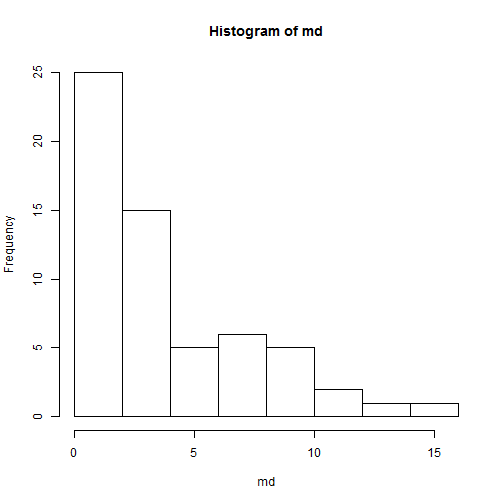 


### Studentized residuals

These are calculated by dividing the residuals from a regression model by the standard deviation calculated by omitting the observation of interest. Because these are distributed as _t_, each residual can be tested for departure from the model.


```r
rstudent(mod)
```

```
##       01       02       03       04       05       06       07       08 
##  1.52160  1.33755  0.87644  1.54782  1.64464  1.87869  1.30102  0.51621 
##       09       10       11       12       13       14       15       16 
##  0.94838  0.47040  0.40500  1.82429  0.97154  0.02997  0.75184 -0.35516 
##       17       18       19       20       21       22       23       24 
## -0.72573 -0.15062  1.61368  0.30271  0.54866  0.27643  0.25388 -0.75761 
##       25       26       27       28       29       30       31       32 
##  0.53861 -0.22835  0.13174 -0.25222  1.36444 -0.31957 -0.82141 -0.72964 
##       33       34       35       36       37       38       39       40 
## -0.27336 -0.04006  0.19011 -0.73795 -1.46534 -1.26926 -0.79961 -0.83094 
##       41       42       43       44       45       46       47       48 
## -0.08231 -0.82761 -1.08440  0.06323 -0.75745 -2.08271 -2.21073  1.19514 
##       49       50       51       52       53       54       55       56 
##  0.15802 -0.39274  0.44007  0.25749  0.07885 -0.29664 -1.71995  0.24873 
##       57       58       59       60 
##  0.07142 -0.48430 -2.34112 -1.98931
```

```r
a <- lm.caseAnalysis(mod, "RESIDUALS")
```

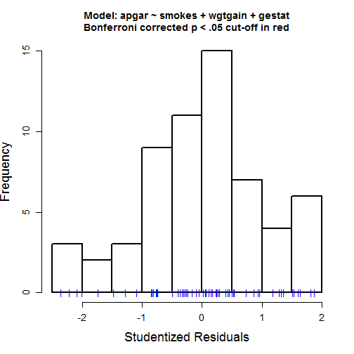 


### Cook's _d_


```r
a <- lm.caseAnalysis(mod, "cooksd")
```

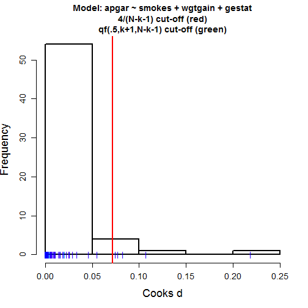 

```r
a <- lm.caseAnalysis(mod, "influenceplot")
```

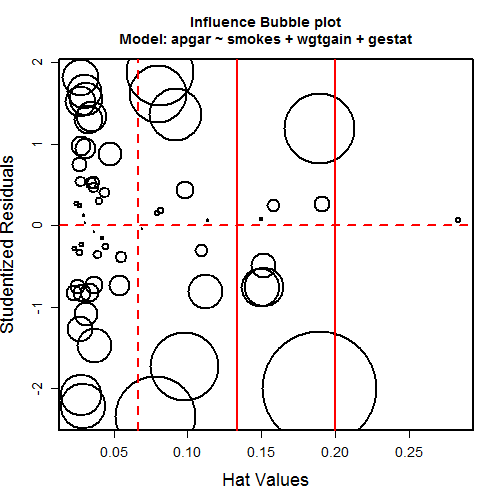 


### df Betas


```r
lm.caseAnalysis(mod, "dfbetas")
```

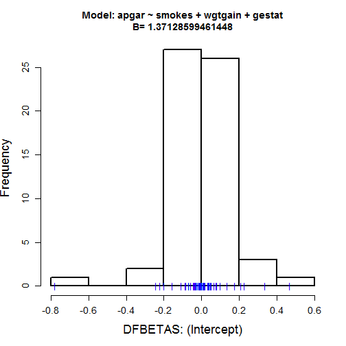 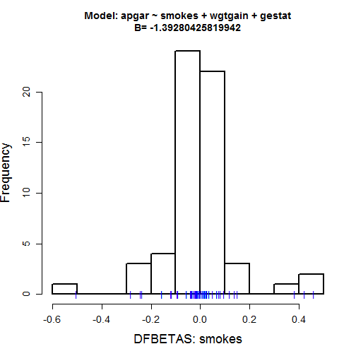 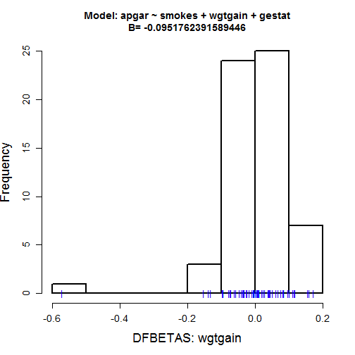 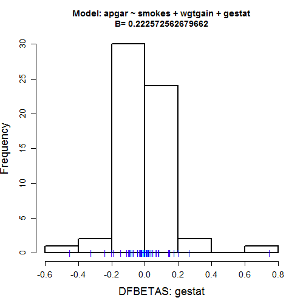 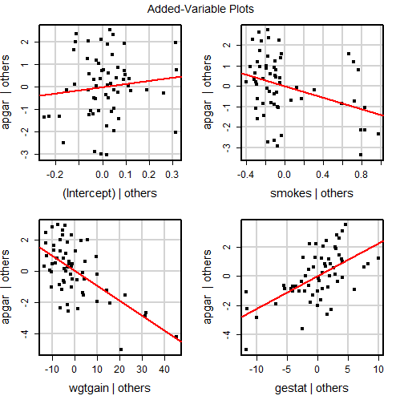 


## Missing data diagnostics

We'll randomly remove some data in a copy of the data, then inspect the missingness.


```r
d2 <- d
# Randomly select 1 to 12 rows in each column and set them to NA.
sample_rows <- function() sample(1:60, sample(1:12, 1), replace = FALSE)
for (col in seq_along(colnames(d))) {
    d2[sample_rows(), col] <- NA
}
```


### `mice` functions

`md.pairs` returns four matrices about the number of observations for which:

1. `$rr`: Both the column and the row variable are observed.
2. `$rm`: The row variable is observed, but the column is not.
3. `$mr`: The column variable is observed, but the row is not.
4. `$mm`: Neither the row nor the column is observed.


```r
md.pairs(d2)
```

```
## $rr
##         apgar gestat smokes wgtgain
## apgar      59     54     48      50
## gestat     54     55     46      48
## smokes     48     46     49      41
## wgtgain    50     48     41      51
## 
## $rm
##         apgar gestat smokes wgtgain
## apgar       0      5     11       9
## gestat      1      0      9       7
## smokes      1      3      0       8
## wgtgain     1      3     10       0
## 
## $mr
##         apgar gestat smokes wgtgain
## apgar       0      1      1       1
## gestat      5      0      3       3
## smokes     11      9      0      10
## wgtgain     9      7      8       0
## 
## $mm
##         apgar gestat smokes wgtgain
## apgar       1      0      0       0
## gestat      0      5      2       2
## smokes      0      2     11       1
## wgtgain     0      2      1       9
```


`md.pattern` displays one matrix. Each row specifies a missingness pattern, for which `1` equals observed and `0` equals missing. The final row shows the number of cases that have missing values on each variable, while the first column shows the number of people who have the missingness pattern. The last column gives the number of variables missing for the given missingness pattern.


```r
md.pattern(d2)
```

```
##    apgar gestat wgtgain smokes   
## 38     1      1       1      1  0
##  1     0      1       1      1  1
##  2     1      0       1      1  1
##  9     1      1       1      0  1
##  7     1      1       0      1  1
##  1     1      0       1      0  2
##  1     1      0       0      1  2
##  1     1      0       0      0  3
##        1      5       9     11 26
```


### Correlations with missingness

These correlations will help identify variables that will go into a multiple imputation for missing data.


```r
# Correlations among observed variables
cor(d2, use = "pairwise.complete.obs")
```

```
##           apgar  gestat  smokes wgtgain
## apgar    1.0000  0.5227 -0.3995 -0.2792
## gestat   0.5227  1.0000 -0.4481  0.3496
## smokes  -0.3995 -0.4481  1.0000 -0.2316
## wgtgain -0.2792  0.3496 -0.2316  1.0000
```

```r
# Correlations between observerd variables and missingness
cor(x = d2, y = is.na(d2), use = "pairwise.complete.obs")
```

```
##            apgar  gestat   smokes  wgtgain
## apgar         NA  0.1143 -0.06130 -0.10640
## gestat   0.09772      NA -0.16986 -0.03077
## smokes  -0.09129 -0.1615       NA  0.20953
## wgtgain -0.10071 -0.1377  0.05487       NA
```


## Model Assumptions


```r
summary(gvlma(mod))
```

```
## 
## Call:
## lm(formula = apgar ~ smokes + wgtgain + gestat, data = d)
## 
## Residuals:
##     Min      1Q  Median      3Q     Max 
## -3.0702 -0.9981  0.0859  0.7598  2.5021 
## 
## Coefficients:
##             Estimate Std. Error t value Pr(>|t|)    
## (Intercept)   1.3713     1.5889    0.86   0.3918    
## smokes       -1.3928     0.4989   -2.79   0.0072 ** 
## wgtgain      -0.0952     0.0160   -5.94  1.9e-07 ***
## gestat        0.2226     0.0413    5.39  1.5e-06 ***
## ---
## Signif. codes:  0 '***' 0.001 '**' 0.01 '*' 0.05 '.' 0.1 ' ' 1
## 
## Residual standard error: 1.42 on 56 degrees of freedom
## Multiple R-squared:  0.568,	Adjusted R-squared:  0.545 
## F-statistic: 24.5 on 3 and 56 DF,  p-value: 2.93e-10
## 
## 
## ASSESSMENT OF THE LINEAR MODEL ASSUMPTIONS
## USING THE GLOBAL TEST ON 4 DEGREES-OF-FREEDOM:
## Level of Significance =  0.05 
## 
## Call:
##  gvlma(x = mod) 
## 
##                     Value p-value                Decision
## Global Stat        0.9901   0.911 Assumptions acceptable.
## Skewness           0.3885   0.533 Assumptions acceptable.
## Kurtosis           0.3303   0.565 Assumptions acceptable.
## Link Function      0.2697   0.604 Assumptions acceptable.
## Heteroscedasticity 0.0015   0.969 Assumptions acceptable.
```


### Normality


```r
qqPlot(mod)
```

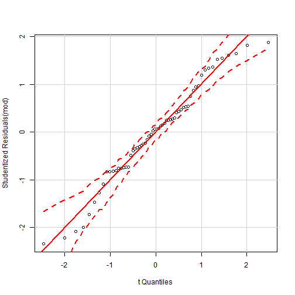 

```r
qqPlot(d$apgar)
```

 


Another approach...


```r
lm.modelAssumptions(mod, "NORMAL")
```


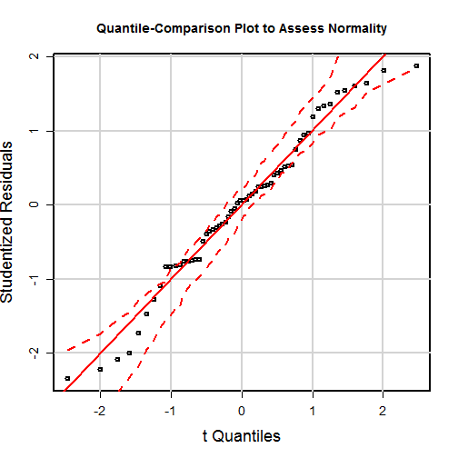  

```
## Descriptive Statistics for Studentized Residuals
```

```
##   var  n mean   sd median trimmed mad   min  max range  skew kurtosis   se
## 1   1 60    0 1.02   0.07    0.03 1.1 -2.34 1.88  4.22 -0.23    -0.37 0.13
```


### Constant Variance


```r
lm.modelAssumptions(mod, "CONSTANT")
```


 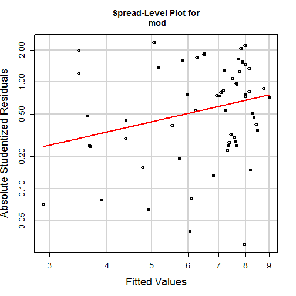 

```
## 
## Suggested power transformation:  0.01861
```

```
## Non-constant Variance Score Test 
## Variance formula: ~ fitted.values 
## Chisquare = 0.1856    Df = 1     p = 0.6666
```


### Linearity assumption


```r
scatterplotMatrix(d2)
```

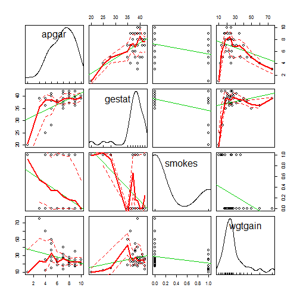 


```r
lm.modelAssumptions(mod, "LINEAR")
```


 


### Ill-scaled variances


```r
var <- diag(covar)
mat <- matrix(nrow = length(var), ncol = length(var) - 1)
# For each variance, divide all the other variances by that variance
for (i in 1:length(var)) {
    mat[i, ] <- var[-i]/var[i]
}
mat
```

```
##         [,1]      [,2]      [,3]
## [1,]  6.5605 4.496e-02 3.584e+01
## [2,]  0.1524 6.853e-03 5.462e+00
## [3,] 22.2429 1.459e+02 7.971e+02
## [4,]  0.0279 1.831e-01 1.255e-03
```

```r
# Check for values greater than 10 or less than .1
mat > 10 | mat < 0.1
```

```
##       [,1]  [,2]  [,3]
## [1,] FALSE  TRUE  TRUE
## [2,] FALSE  TRUE FALSE
## [3,]  TRUE  TRUE  TRUE
## [4,]  TRUE FALSE  TRUE
```


***


```r
sessionInfo()
```

```
## R version 3.0.2 (2013-09-25)
## Platform: x86_64-w64-mingw32/x64 (64-bit)
## 
## locale:
## [1] LC_COLLATE=English_United States.1252 
## [2] LC_CTYPE=English_United States.1252   
## [3] LC_MONETARY=English_United States.1252
## [4] LC_NUMERIC=C                          
## [5] LC_TIME=English_United States.1252    
## 
## attached base packages:
## [1] stats     graphics  grDevices utils     datasets  methods   base     
## 
## other attached packages:
##  [1] gvlma_1.0.0.1    mice_2.18        nnet_7.3-7       MASS_7.3-29     
##  [5] lattice_0.20-23  lmSupport_1.07.1 car_2.0-19       psych_1.3.10.12 
##  [9] lavaan_0.5-15    knitr_1.5       
## 
## loaded via a namespace (and not attached):
##  [1] bitops_1.0-6       caTools_1.16       evaluate_0.5.1    
##  [4] formatR_0.10       gdata_2.13.2       gplots_2.12.1     
##  [7] grid_3.0.2         gtools_3.1.1       KernSmooth_2.23-10
## [10] mnormt_1.4-7       pbivnorm_0.5-1     quadprog_1.5-5    
## [13] rpart_4.1-3        stats4_3.0.2       stringr_0.6.2     
## [16] tools_3.0.2
```

