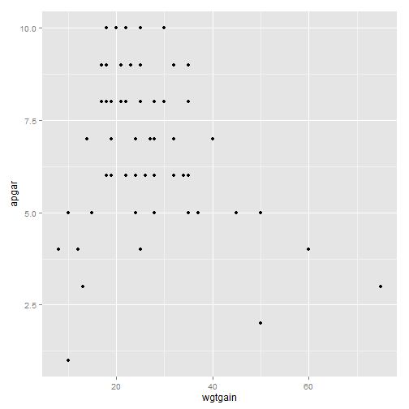
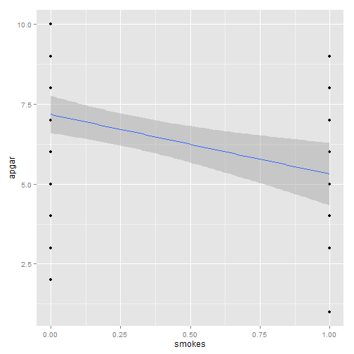
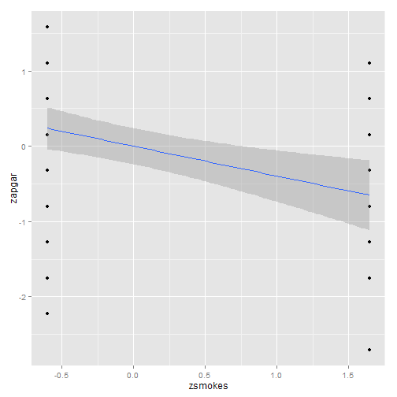

Lecture 02/03/04 -- Sept 05/10/12 2013
===============================================================================

Model the data


```r
library(lmSupport)
library(ggplot2)
library(psych)
library(lavaan)
rmsea <- function(...) fitMeasures(..., "rmsea")
chisq <- function(...) fitMeasures(..., "chisq")
# Load the apgar dataset
d <- lm.readDat("../data/data_apgar.dat")
data_subset <- d[c("apgar", "gestat", "smokes", "anninc", "prenat")]
covmatrix <- cov(data_subset)
covmatrix
```

```
##          apgar  gestat   smokes   anninc   prenat
## apgar   4.4234  5.9528 -0.37175   20.083  0.59944
## gestat  5.9528 29.0201 -1.26893   -4.144  0.12260
## smokes -0.3718 -1.2689  0.19887   -2.026 -0.09266
## anninc 20.0828 -4.1438 -2.02599 1646.410 14.75537
## prenat  0.5994  0.1226 -0.09266   14.755  0.98192
```

```r
# Predict APGAR from weight gain
m1 <- lm(apgar ~ wgtgain, d)
summary(m1)
```

```
## 
## Call:
## lm(formula = apgar ~ wgtgain, data = d)
## 
## Residuals:
##    Min     1Q Median     3Q    Max 
## -6.440 -1.121  0.069  1.379  3.446 
## 
## Coefficients:
##             Estimate Std. Error t value Pr(>|t|)    
## (Intercept)   7.8834     0.6307    12.5   <2e-16 ***
## wgtgain      -0.0443     0.0211    -2.1    0.041 *  
## ---
## Signif. codes:  0 '***' 0.001 '**' 0.01 '*' 0.05 '.' 0.1 ' ' 1
## 
## Residual standard error: 2.05 on 58 degrees of freedom
## Multiple R-squared:  0.0704,	Adjusted R-squared:  0.0543 
## F-statistic: 4.39 on 1 and 58 DF,  p-value: 0.0405
```

```r
qplot(data = d, x = wgtgain, y = apgar)
```

 


Standardize the weight gain and APGAR scores, so they are both expressed in standard deviation units. Observe that standardization did not change the _p_-values.


```r
d <- transform(d, zwgtgain = scale(wgtgain), zapgar = scale(apgar), zsmokes = scale(smokes))
describe(d)
```

```
##          var  n  mean    sd median trimmed   mad   min    max  range  skew
## apgar      1 60  6.68  2.10   7.00    6.77  2.22  1.00  10.00   9.00 -0.39
## gestat     2 60 37.12  5.39  38.00   38.33  2.97 20.00  42.00  22.00 -2.10
## smokes     3 60  0.27  0.45   0.00    0.21  0.00  0.00   1.00   1.00  1.03
## prenat     4 60  1.97  0.99   2.00    2.08  1.48  0.00   3.00   3.00 -0.55
## anninc     5 60 55.78 40.58  41.50   49.79 30.39 10.00 180.00 170.00  1.26
## wgtgain    6 60 27.08 12.59  25.00   25.38  9.64  8.00  75.00  67.00  1.51
## gender     7 60  0.50  0.50   0.50    0.50  0.74  0.00   1.00   1.00  0.00
## zwgtgain   8 60  0.00  1.00  -0.17   -0.14  0.77 -1.52   3.81   5.32  1.51
## zapgar     9 60  0.00  1.00   0.15    0.04  1.06 -2.70   1.58   4.28 -0.39
## zsmokes   10 60  0.00  1.00  -0.60   -0.13  0.00 -0.60   1.64   2.24  1.03
##          kurtosis   se
## apgar       -0.37 0.27
## gestat       3.81 0.70
## smokes      -0.96 0.06
## prenat      -0.83 0.13
## anninc       0.97 5.24
## wgtgain      2.87 1.63
## gender      -2.03 0.07
## zwgtgain     2.87 0.13
## zapgar      -0.37 0.13
## zsmokes     -0.96 0.13
```

```r
m2 <- lm(zapgar ~ zwgtgain, d)
summary(m2)
```

```
## 
## Call:
## lm(formula = zapgar ~ zwgtgain, data = d)
## 
## Residuals:
##     Min      1Q  Median      3Q     Max 
## -3.0621 -0.5328  0.0329  0.6559  1.6384 
## 
## Coefficients:
##              Estimate Std. Error t value Pr(>|t|)  
## (Intercept) -2.07e-16   1.26e-01     0.0    1.000  
## zwgtgain    -2.65e-01   1.27e-01    -2.1    0.041 *
## ---
## Signif. codes:  0 '***' 0.001 '**' 0.01 '*' 0.05 '.' 0.1 ' ' 1
## 
## Residual standard error: 0.972 on 58 degrees of freedom
## Multiple R-squared:  0.0704,	Adjusted R-squared:  0.0543 
## F-statistic: 4.39 on 1 and 58 DF,  p-value: 0.0405
```


Regress APGAR on smoking. Standardized categorical variables are hard to interpret.


```r
m3 <- lm(apgar ~ smokes, d)
summary(m3)
```

```
## 
## Call:
## lm(formula = apgar ~ smokes, data = d)
## 
## Residuals:
##    Min     1Q Median     3Q    Max 
## -5.182 -1.182 -0.182  1.687  3.687 
## 
## Coefficients:
##             Estimate Std. Error t value Pr(>|t|)    
## (Intercept)    7.182      0.294   24.46   <2e-16 ***
## smokes        -1.869      0.569   -3.29   0.0017 ** 
## ---
## Signif. codes:  0 '***' 0.001 '**' 0.01 '*' 0.05 '.' 0.1 ' ' 1
## 
## Residual standard error: 1.95 on 58 degrees of freedom
## Multiple R-squared:  0.157,	Adjusted R-squared:  0.143 
## F-statistic: 10.8 on 1 and 58 DF,  p-value: 0.00172
```

```r
qplot(data = d, x = smokes, y = apgar) + geom_smooth(method = "lm")
```

 

```r
# Standardized variables
m4 <- lm(zapgar ~ zsmokes, d)
summary(m4)
```

```
## 
## Call:
## lm(formula = zapgar ~ zsmokes, data = d)
## 
## Residuals:
##     Min      1Q  Median      3Q     Max 
## -2.4638 -0.5619 -0.0864  0.8023  1.7533 
## 
## Coefficients:
##              Estimate Std. Error t value Pr(>|t|)   
## (Intercept) -1.84e-16   1.20e-01    0.00   1.0000   
## zsmokes     -3.96e-01   1.21e-01   -3.29   0.0017 **
## ---
## Signif. codes:  0 '***' 0.001 '**' 0.01 '*' 0.05 '.' 0.1 ' ' 1
## 
## Residual standard error: 0.926 on 58 degrees of freedom
## Multiple R-squared:  0.157,	Adjusted R-squared:  0.143 
## F-statistic: 10.8 on 1 and 58 DF,  p-value: 0.00172
```

```r
qplot(data = d, x = zsmokes, y = zapgar) + geom_smooth(method = "lm")
```

 


Regress APGAR on weight-gain and smoking. The coefficient of weight-gain is predicted change in APGAR for a unit change in weight-gain, when statistically controlling for smoking. The coefficient for smoking is expected change in APGAR if the mother smokes, over and above the effect of weight-gain. Note that the individual predictors for smoking and weight-gain become more significant. By controlling for one variable, the other variable can explain a larger proportion of the variance in the dependent variable. The standardized effects allow us to coarsely compare the effects to each other.

We allow exogenous variables to be correlated, in an unanalyzed relationship. Exogenous variables do not have a cause specified in the modelling. Weight gain and smoking would be exogenous variables in these variables. Double arrow is an unanalyzed relationship. Two single arrows form a mutual influence relationship.


```r
m5 <- lm(apgar ~ wgtgain + smokes, d)
summary(m5)
```

```
## 
## Call:
## lm(formula = apgar ~ wgtgain + smokes, data = d)
## 
## Residuals:
##    Min     1Q Median     3Q    Max 
## -5.069 -1.005 -0.047  1.179  3.548 
## 
## Coefficients:
##             Estimate Std. Error t value Pr(>|t|)    
## (Intercept)   9.4728     0.6262   15.13  < 2e-16 ***
## wgtgain      -0.0771     0.0191   -4.03  0.00017 ***
## smokes       -2.6334     0.5405   -4.87  9.2e-06 ***
## ---
## Signif. codes:  0 '***' 0.001 '**' 0.01 '*' 0.05 '.' 0.1 ' ' 1
## 
## Residual standard error: 1.73 on 57 degrees of freedom
## Multiple R-squared:  0.344,	Adjusted R-squared:  0.321 
## F-statistic: 14.9 on 2 and 57 DF,  p-value: 6.13e-06
```

```r
# Standardized variables
m6 <- lm(zapgar ~ zwgtgain + zsmokes, d)
summary(m6)
```

```
## 
## Call:
## lm(formula = zapgar ~ zwgtgain + zsmokes, data = d)
## 
## Residuals:
##     Min      1Q  Median      3Q     Max 
## -2.4100 -0.4780 -0.0224  0.5608  1.6869 
## 
## Coefficients:
##              Estimate Std. Error t value Pr(>|t|)    
## (Intercept) -1.26e-16   1.06e-01    0.00  1.00000    
## zwgtgain    -4.61e-01   1.15e-01   -4.03  0.00017 ***
## zsmokes     -5.58e-01   1.15e-01   -4.87  9.2e-06 ***
## ---
## Signif. codes:  0 '***' 0.001 '**' 0.01 '*' 0.05 '.' 0.1 ' ' 1
## 
## Residual standard error: 0.824 on 57 degrees of freedom
## Multiple R-squared:  0.344,	Adjusted R-squared:  0.321 
## F-statistic: 14.9 on 2 and 57 DF,  p-value: 6.13e-06
```


Covariance is the correlation of the variable times the standard deviation of each variable. Covariance takes into account the unit of measurement of the variables. 
cov = r * SD1 * SD2


Covariance matrix has 10 pieces of information. Correlation matrix has 6 pieces of information.


```r
# Observed correlation matrix
d <- subset(d, select = c(apgar, gestat, smokes, wgtgain))
round(cor(subset(d, select = c(apgar, gestat, smokes, wgtgain))), 2)
```

```
##         apgar gestat smokes wgtgain
## apgar    1.00   0.53  -0.40   -0.27
## gestat   0.53   1.00  -0.53    0.35
## smokes  -0.40  -0.53   1.00   -0.35
## wgtgain -0.27   0.35  -0.35    1.00
```


// We randomly assign path coefficients. Then we compute correlations.

Why would variables be correlated?

1. A causes B
2. Mediation: A causes B causes C
3. Unanalyzed effects: C causes A,B; C correlates with D, C causes A, D causes B causes E

```
Assumed causal paths:

S <--a--> W
S  --b--> G
S  --c--> A
W  --d--> G
W  --e--> A
G  --f--> A
```
```
Correlation values based on the causal paths:

cor_sw = a
cor_sg = b + a*d
cor_wa = e + d*f + a*c + a*b*f
cor_sa = c + b*f + a*e + a*d*f
cor_wg = d + a*b
cor_ga = f + a*b*f + a*c*d + b*c + d*e
```

Maximum-likelihood tries to find the best values for a:f to generate the model-implied correlation matrix


```r
m1 <- '
  # regressions
  gestat ~ smokes + wgtgain
  apgar ~ smokes + wgtgain + gestat
  # residual correlations
  smokes ~~ wgtgain'
fit <- sem(m1, data = d, likelihood = "wishart")
```

```
## Warning: lavaan WARNING: model syntax contains variance/covariance/intercept formulas
##   involving (an) exogenous variable(s): [smokes wgtgain];
##   Please use fixed.x=FALSE or leave them alone
```

```r
summary(fit, standardized = TRUE)
```

```
## lavaan (0.5-15) converged normally after  38 iterations
## 
##   Number of observations                            60
## 
##   Estimator                                         ML
##   Minimum Function Test Statistic                0.000
##   Degrees of freedom                                 0
##   P-value (Chi-square)                           0.000
## 
## Parameter estimates:
## 
##   Information                                 Expected
##   Standard Errors                             Standard
## 
##                    Estimate  Std.err  Z-value  P(>|z|)   Std.lv  Std.all
## Regressions:
##   gestat ~
##     smokes           -5.574    1.395   -3.997    0.000   -5.574   -0.461
##     wgtgain           0.081    0.049    1.647    0.099    0.081    0.190
##   apgar ~
##     smokes           -1.393    0.486   -2.866    0.004   -1.393   -0.295
##     wgtgain          -0.095    0.016   -6.094    0.000   -0.095   -0.570
##     gestat            0.223    0.040    5.529    0.000    0.223    0.570
## 
## Covariances:
##   smokes ~~
##     wgtgain          -1.972    0.775   -2.545    0.011   -1.972   -0.351
## 
## Variances:
##     gestat           20.003    3.683                     20.003    0.689
##     apgar             1.912    0.352                      1.912    0.432
##     smokes            0.199    0.037                      0.199    1.000
##     wgtgain         158.518   29.186                    158.518    1.000
```

```r
inspect(fit, "sampstat")
```

```
## $cov
##         gestat  apgar   smokes  wgtgan 
## gestat   29.020                        
## apgar     5.953   4.423                
## smokes   -1.269  -0.372   0.199        
## wgtgain  23.888  -7.024  -1.972 158.518
## 
## $mean
##  gestat   apgar  smokes wgtgain 
##  37.117   6.683   0.267  27.083
```

```r
fitted(fit)
```

```
## $cov
##         gestat  apgar   smokes  wgtgan 
## gestat   29.020                        
## apgar     5.953   4.423                
## smokes   -1.269  -0.372   0.199        
## wgtgain  23.888  -7.024  -1.972 158.518
## 
## $mean
##  gestat   apgar  smokes wgtgain 
##       0       0       0       0
```

```r
# difference between the two covariance matrices
resid(fit) 
```

```
## $cov
##         gestat apgar smokes wgtgan
## gestat  0                         
## apgar   0      0                  
## smokes  0      0     0            
## wgtgain 0      0     0      0     
## 
## $mean
##  gestat   apgar  smokes wgtgain 
##       0       0       0       0
```


The model perfectly replicated the observed covariance matrix.

Minimum function test statistic is a chi-squared test statistic.

* If the p-value is significant, we reject the model.
* If the p-value is not significant, we can accept the model.

"Disturbances" are residuals of the model. They are latent variables. They contain all the other causes that were not specified in the model. Usually only have distrubances for the endogenous variables. Disturbances have the same unit of measurement as their associated variable.

The variances in the inspecti.fit give the variances in of the disturbances for the endogenous variables.


```r
# Variances of the disturbances for gestat: 20.003
var(d$gestat)  # 29.02
```

```
## [1] 29.02
```

```r
# Explaining 31% of the variance
1 - (20.003/29.02)
```

```
## [1] 0.3107
```

```r
apgar_variance <- fitted(fit)$cov["apgar", "apgar"]
# Disturbances in APGAR:
apgar_distrurbances <- 1.912
# R squared
1 - (apgar_distrurbances/apgar_variance)
```

```
## [1] 0.5678
```


### Standardized solution

Don't need to report variances in the standardized solution.

Need to footnote that you ran the model on non-standardized variables and got the values for the standardized solution for that.


```r
m1b <- '
  # regressions
  gestat ~ smokes + wgtgain
  apgar ~ smokes + wgtgain + gestat'
fit <- sem(m1b, data=d, likelihood="wishart")
summary(fit, standardized=T)
```

```
## lavaan (0.5-15) converged normally after  28 iterations
## 
##   Number of observations                            60
## 
##   Estimator                                         ML
##   Minimum Function Test Statistic                0.000
##   Degrees of freedom                                 0
##   P-value (Chi-square)                           1.000
## 
## Parameter estimates:
## 
##   Information                                 Expected
##   Standard Errors                             Standard
## 
##                    Estimate  Std.err  Z-value  P(>|z|)   Std.lv  Std.all
## Regressions:
##   gestat ~
##     smokes           -5.574    1.395   -3.997    0.000   -5.574   -0.461
##     wgtgain           0.081    0.049    1.647    0.099    0.081    0.190
##   apgar ~
##     smokes           -1.393    0.486   -2.866    0.004   -1.393   -0.295
##     wgtgain          -0.095    0.016   -6.094    0.000   -0.095   -0.570
##     gestat            0.223    0.040    5.529    0.000    0.223    0.570
## 
## Variances:
##     gestat           20.003    3.683                     20.003    0.689
##     apgar             1.912    0.352                      1.912    0.432
```


Output does not include unanalyzed relationships. 

Wishart variance divides by n-1. Normal or biased variance divides by n. i

## Weird model
4 exogenous variables, 0 endogenous variables, allowing exogenous vars to correlate. We are going to estimate the four variances.


```r
m1b <- '
  # residual correlations
  smokes ~~ wgtgain
  smokes ~~ gestat
  smokes ~~ apgar
  wgtgain ~~ gestat
  wgtgain ~~ apgar
  gestat ~~ apgar'
fit2 <- sem(m1b, d, likelihood = "wishart")
summary(fit2, standardized = TRUE)
```

```
## lavaan (0.5-15) converged normally after  69 iterations
## 
##   Number of observations                            60
## 
##   Estimator                                         ML
##   Minimum Function Test Statistic                0.000
##   Degrees of freedom                                 0
##   P-value (Chi-square)                           0.000
## 
## Parameter estimates:
## 
##   Information                                 Expected
##   Standard Errors                             Standard
## 
##                    Estimate  Std.err  Z-value  P(>|z|)   Std.lv  Std.all
## Covariances:
##   smokes ~~
##     wgtgain          -1.972    0.775   -2.545    0.011   -1.972   -0.351
##     gestat           -1.269    0.354   -3.588    0.000   -1.269   -0.528
##     apgar            -0.372    0.131   -2.830    0.005   -0.372   -0.396
##   wgtgain ~~
##     gestat           23.888    9.362    2.552    0.011   23.888    0.352
##     apgar            -7.024    3.567   -1.969    0.049   -7.024   -0.265
##   gestat ~~
##     apgar             5.953    1.666    3.573    0.000    5.953    0.525
## 
## Variances:
##     smokes            0.199    0.037                      0.199    1.000
##     wgtgain         158.518   29.186                    158.518    1.000
##     gestat           29.020    5.343                     29.020    1.000
##     apgar             4.423    0.814                      4.423    1.000
```


The weird model has 1 for all the disturbances in the standardized solution. Chi-squared = 0. 

***

Sept. 26, 2013

### Why is the dumb model dumb?

We can feed sample covariances into lavaan, so we have P=10 independent pieces of information. 


```r
cov(d)
```

```
##           apgar gestat  smokes wgtgain
## apgar    4.4234  5.953 -0.3718  -7.024
## gestat   5.9528 29.020 -1.2689  23.888
## smokes  -0.3718 -1.269  0.1989  -1.972
## wgtgain -7.0240 23.888 -1.9718 158.518
```

```r
lower.tri(cov(d), diag = TRUE)
```

```
##      [,1]  [,2]  [,3]  [,4]
## [1,] TRUE FALSE FALSE FALSE
## [2,] TRUE  TRUE FALSE FALSE
## [3,] TRUE  TRUE  TRUE FALSE
## [4,] TRUE  TRUE  TRUE  TRUE
```


But we estimate Q = 10 coefficients:

* Number of path coefficents: 5
* Unanalyzed relationships: 1
* Vars of exogenous variance: 2
* Vars of disturbances: 2

### P < Q: Under-identified models

can't even come up with path coefficients for these models.

### P = Q: Just-identified (fully saturated) models

by definition, you will fully replicate the sample covariance matrix and have chi-squared = 0. You do get path coefficients, however, and levels of statistical significance. On the other hand, you could have done this analysis from regression coefficients.

### P > Q: Over-identified models

We want this. These are more elegant, assume a reduced number of causal paths.

Model 2

Set smokes-apgar and wgtgain-gestat paths to 0.


```r
m2 <- '
  # regressions
  gestat ~ smokes
  apgar ~ wgtgain + gestat
  # residual correlations
  smokes ~~ wgtgain'
fit <- sem(m2, data = d, likelihood = "wishart")
```

```
## Warning: lavaan WARNING: model syntax contains variance/covariance/intercept formulas
##   involving (an) exogenous variable(s): [smokes wgtgain];
##   Please use fixed.x=FALSE or leave them alone
```

```r
summary(fit, standardized = TRUE)
```

```
## lavaan (0.5-15) converged normally after  35 iterations
## 
##   Number of observations                            60
## 
##   Estimator                                         ML
##   Minimum Function Test Statistic               10.341
##   Degrees of freedom                                 2
##   P-value (Chi-square)                           0.006
## 
## Parameter estimates:
## 
##   Information                                 Expected
##   Standard Errors                             Standard
## 
##                    Estimate  Std.err  Z-value  P(>|z|)   Std.lv  Std.all
## Regressions:
##   gestat ~
##     smokes           -6.381    1.335   -4.778    0.000   -6.381   -0.528
##   apgar ~
##     wgtgain          -0.086    0.016   -5.529    0.000   -0.086   -0.486
##     gestat            0.276    0.036    7.599    0.000    0.276    0.667
## 
## Covariances:
##   smokes ~~
##     wgtgain          -1.972    0.775   -2.545    0.011   -1.972   -0.351
## 
## Variances:
##     gestat           20.923    3.852                     20.923    0.721
##     apgar             2.178    0.401                      2.178    0.439
##     smokes            0.199    0.037                      0.199    1.000
##     wgtgain         158.518   29.186                    158.518    1.000
```

```r
# Data's cov
inspect(fit, "sampstat")
```

```
## $cov
##         gestat  apgar   smokes  wgtgan 
## gestat   29.020                        
## apgar     5.953   4.423                
## smokes   -1.269  -0.372   0.199        
## wgtgain  23.888  -7.024  -1.972 158.518
## 
## $mean
##  gestat   apgar  smokes wgtgain 
##  37.117   6.683   0.267  27.083
```

```r
# Model's cov
fitted(fit)
```

```
## $cov
##         gestat  apgar   smokes  wgtgan 
## gestat   29.020                        
## apgar     6.924   4.959                
## smokes   -1.269  -0.181   0.199        
## wgtgain  12.581 -10.143  -1.972 158.518
## 
## $mean
##  gestat   apgar  smokes wgtgain 
##       0       0       0       0
```

```r
# difference between the two covariance matrices
resid(fit) 
```

```
## $cov
##         gestat apgar  smokes wgtgan
## gestat   0.000                     
## apgar   -0.971 -0.536              
## smokes   0.000 -0.191  0.000       
## wgtgain 11.307  3.119  0.000  0.000
## 
## $mean
##  gestat   apgar  smokes wgtgain 
##       0       0       0       0
```


We have to reject this model because the deviance between the two covariance matrices is too big. The p-value tells us whether the deviance is significant.


```r
fitMeasures(fit, "rmsea")
```

```
## rmsea 
## 0.266
```


We are falling short of our the ideal of having 10 participants for each parameter estimated.

## Two fit indicators

RMSEA is satisfactory when under 0.05. Chi-squared is unsatisfactory when under 0.05.

## Independence Model

Four perfectly orthogonal, independent variables. Have to fix the covariances to zero.


```r
m3 <- '
  smokes ~~ 0*wgtgain
  smokes ~~ 0*gestat
  smokes ~~ 0*apgar
  wgtgain ~~ 0*gestat
  wgtgain ~~ 0*apgar
  apgar ~~ 0*gestat'
fit <- sem(m3, data = d, likelihood = "wishart")
summary(fit)
```

```
## lavaan (0.5-15) converged normally after  14 iterations
## 
##   Number of observations                            60
## 
##   Estimator                                         ML
##   Minimum Function Test Statistic               79.199
##   Degrees of freedom                                 6
##   P-value (Chi-square)                           0.000
## 
## Parameter estimates:
## 
##   Information                                 Expected
##   Standard Errors                             Standard
## 
##                    Estimate  Std.err  Z-value  P(>|z|)
## Covariances:
##   smokes ~~
##     wgtgain           0.000
##     gestat            0.000
##     apgar             0.000
##   wgtgain ~~
##     gestat            0.000
##     apgar             0.000
##   apgar ~~
##     gestat            0.000
## 
## Variances:
##     smokes            0.199    0.037
##     wgtgain         158.518   29.186
##     apgar             4.423    0.814
##     gestat           29.020    5.343
```

```r
# Data's cov
inspect(fit, "sampstat")
```

```
## $cov
##         smokes  wgtgan  apgar   gestat 
## smokes    0.199                        
## wgtgain  -1.972 158.518                
## apgar    -0.372  -7.024   4.423        
## gestat   -1.269  23.888   5.953  29.020
## 
## $mean
##  smokes wgtgain   apgar  gestat 
##   0.267  27.083   6.683  37.117
```

```r
# Model's cov
fitted(fit)
```

```
## $cov
##         smokes  wgtgan  apgar   gestat 
## smokes    0.199                        
## wgtgain   0.000 158.518                
## apgar     0.000   0.000   4.423        
## gestat    0.000   0.000   0.000  29.020
## 
## $mean
##  smokes wgtgain   apgar  gestat 
##       0       0       0       0
```

```r
# difference between the two covariance matrices
resid(fit) 
```

```
## $cov
##         smokes wgtgan apgar  gestat
## smokes   0.000                     
## wgtgain -1.972  0.000              
## apgar   -0.372 -7.024  0.000       
## gestat  -1.269 23.888  5.953  0.000
## 
## $mean
##  smokes wgtgain   apgar  gestat 
##       0       0       0       0
```

```r
rmsea(fit)
```

```
## rmsea 
## 0.455
```


```
P = 10, Q = 0 + 0 + 4 + 0, df = 6

Model                     Chi-squared
Just-identified model     0
Apgar2                    in-between the extremes
Independence model        79.20

Chi^2 = 79.20
```


```r
d <- lm.readDat("../data/data_apgar.dat")
d$anninc <- d$anninc / 10
m4 <- '
  gestat ~ smokes
  apgar ~ prenat + gestat + smokes + anninc
  prenat ~ anninc'
fit <- sem(m4, data = d, likelihood = "wishart")
fit
```

```
## lavaan (0.5-15) converged normally after  34 iterations
## 
##   Number of observations                            60
## 
##   Estimator                                         ML
##   Minimum Function Test Statistic                2.867
##   Degrees of freedom                                 3
##   P-value (Chi-square)                           0.413
```

```r
summary(fit, standardized = TRUE, fit.measures = TRUE)
```

```
## lavaan (0.5-15) converged normally after  34 iterations
## 
##   Number of observations                            60
## 
##   Estimator                                         ML
##   Minimum Function Test Statistic                2.867
##   Degrees of freedom                                 3
##   P-value (Chi-square)                           0.413
## 
## Model test baseline model:
## 
##   Minimum Function Test Statistic               58.967
##   Degrees of freedom                                 9
##   P-value                                        0.000
## 
## User model versus baseline model:
## 
##   Comparative Fit Index (CFI)                    1.000
##   Tucker-Lewis Index (TLI)                       1.008
## 
## Loglikelihood and Information Criteria:
## 
##   Loglikelihood user model (H0)               -577.460
##   Loglikelihood unrestricted model (H1)       -576.002
## 
##   Number of free parameters                          9
##   Akaike (AIC)                                1172.920
##   Bayesian (BIC)                              1191.618
##   Sample-size adjusted Bayesian (BIC)         1163.315
## 
## Root Mean Square Error of Approximation:
## 
##   RMSEA                                          0.000
##   90 Percent Confidence Interval          0.000  0.216
##   P-value RMSEA <= 0.05                          0.478
## 
## Standardized Root Mean Square Residual:
## 
##   SRMR                                           0.050
## 
## Parameter estimates:
## 
##   Information                                 Expected
##   Standard Errors                             Standard
## 
##                    Estimate  Std.err  Z-value  P(>|z|)   Std.lv  Std.all
## Regressions:
##   gestat ~
##     smokes           -6.381    1.335   -4.778    0.000   -6.381   -0.528
##   apgar ~
##     prenat            0.424    0.234    1.815    0.070    0.424    0.199
##     gestat            0.187    0.047    3.980    0.000    0.187    0.479
##     smokes           -0.390    0.572   -0.682    0.495   -0.390   -0.082
##     anninc            0.084    0.057    1.461    0.144    0.084    0.161
##   prenat ~
##     anninc            0.090    0.030    3.030    0.002    0.090    0.367
## 
## Variances:
##     gestat           20.923    3.852                     20.923    0.721
##     apgar             2.740    0.504                      2.740    0.615
##     prenat            0.850    0.156                      0.850    0.865
```

```r
inspect(fit, "sampstat")
```

```
## $cov
##        gestat apgar  prenat smokes anninc
## gestat 29.020                            
## apgar   5.953  4.423                     
## prenat  0.123  0.599  0.982              
## smokes -1.269 -0.372 -0.093  0.199       
## anninc -0.414  2.008  1.476 -0.203 16.464
## 
## $mean
## gestat  apgar prenat smokes anninc 
## 37.117  6.683  1.967  0.267  5.578
```

```r
fitted(fit)
```

```
## $cov
##        gestat apgar  prenat smokes anninc
## gestat 29.020                            
## apgar   6.093  4.451                     
## prenat  0.116  0.569  0.982              
## smokes -1.269 -0.340 -0.018  0.199       
## anninc  1.293  2.328  1.476 -0.203 16.464
## 
## $mean
## gestat  apgar prenat smokes anninc 
##      0      0      0      0      0
```

```r
resid(fit) 
```

```
## $cov
##        gestat apgar  prenat smokes anninc
## gestat  0.000                            
## apgar  -0.140 -0.028                     
## prenat  0.007  0.030  0.000              
## smokes  0.000 -0.032 -0.074  0.000       
## anninc -1.707 -0.320  0.000  0.000  0.000
## 
## $mean
## gestat  apgar prenat smokes anninc 
##      0      0      0      0      0
```

```r
rmsea(fit)
```

```
## rmsea 
##     0
```

```r
fitMeasures(fit)
```

```
##              fmin             chisq                df            pvalue 
##             0.024             2.867             3.000             0.413 
##    baseline.chisq       baseline.df   baseline.pvalue               cfi 
##            58.967             9.000             0.000             1.000 
##               tli              nnfi               rfi               nfi 
##             1.008             1.008             0.854             0.951 
##              pnfi               ifi               rni              logl 
##             0.317             1.002             1.000          -577.460 
## unrestricted.logl              npar               aic               bic 
##          -576.002             9.000          1172.920          1191.618 
##            ntotal              bic2             rmsea    rmsea.ci.lower 
##            60.000          1163.315             0.000             0.000 
##    rmsea.ci.upper      rmsea.pvalue               rmr        rmr_nomean 
##             0.216             0.478             0.451             0.451 
##              srmr       srmr_nomean             cn_05             cn_01 
##             0.050             0.050           161.813           234.457 
##               gfi              agfi              pgfi               mfi 
##             0.981             0.907             0.196             1.001 
##              ecvi 
##             0.354
```


```
Chi-squared = 2.87, p = 0.413, satisfactory model
rmsea = 0, bc chi^2 < df
```


```r
m5 <- '
  gestat ~ smokes
  apgar ~ prenat + gestat
  prenat ~ anninc'
fit_m5 <- sem(m5, data = d, likelihood = "wishart")
fit_m5
```

```
## lavaan (0.5-15) converged normally after  27 iterations
## 
##   Number of observations                            60
## 
##   Estimator                                         ML
##   Minimum Function Test Statistic                5.533
##   Degrees of freedom                                 5
##   P-value (Chi-square)                           0.354
```

```r
summary(fit_m5, standardized = TRUE)
```

```
## lavaan (0.5-15) converged normally after  27 iterations
## 
##   Number of observations                            60
## 
##   Estimator                                         ML
##   Minimum Function Test Statistic                5.533
##   Degrees of freedom                                 5
##   P-value (Chi-square)                           0.354
## 
## Parameter estimates:
## 
##   Information                                 Expected
##   Standard Errors                             Standard
## 
##                    Estimate  Std.err  Z-value  P(>|z|)   Std.lv  Std.all
## Regressions:
##   gestat ~
##     smokes           -6.381    1.335   -4.778    0.000   -6.381   -0.528
##   apgar ~
##     prenat            0.585    0.222    2.630    0.009    0.585    0.276
##     gestat            0.203    0.041    4.952    0.000    0.203    0.519
##   prenat ~
##     anninc            0.090    0.030    3.030    0.002    0.090    0.367
## 
## Variances:
##     gestat           20.923    3.852                     20.923    0.721
##     apgar             2.866    0.528                      2.866    0.648
##     prenat            0.850    0.156                      0.850    0.865
```

```r
inspect(fit_m5, "sampstat")
```

```
## $cov
##        gestat apgar  prenat smokes anninc
## gestat 29.020                            
## apgar   5.953  4.423                     
## prenat  0.123  0.599  0.982              
## smokes -1.269 -0.372 -0.093  0.199       
## anninc -0.414  2.008  1.476 -0.203 16.464
## 
## $mean
## gestat  apgar prenat smokes anninc 
## 37.117  6.683  1.967  0.267  5.578
```

```r
fitted(fit_m5)
```

```
## $cov
##        gestat apgar  prenat smokes anninc
## gestat 29.020                            
## apgar   5.949  4.422                     
## prenat  0.116  0.598  0.982              
## smokes -1.269 -0.268 -0.018  0.199       
## anninc  1.293  1.125  1.476 -0.203 16.464
## 
## $mean
## gestat  apgar prenat smokes anninc 
##      0      0      0      0      0
```

```r
resid(fit_m5) 
```

```
## $cov
##        gestat apgar  prenat smokes anninc
## gestat  0.000                            
## apgar   0.004  0.002                     
## prenat  0.007  0.001  0.000              
## smokes  0.000 -0.104 -0.074  0.000       
## anninc -1.707  0.883  0.000  0.000  0.000
## 
## $mean
## gestat  apgar prenat smokes anninc 
##      0      0      0      0      0
```

```r
rmsea(fit_m5)
```

```
## rmsea 
## 0.042
```

```r
m5c <- '
  # Regressions
  gestat ~ a*smokes
  apgar ~ d*prenat + b*gestat
  prenat ~ c*anninc
  # Define indirect effects
  ab := a*b
  cd := c*d'
fit_m5c <- sem(m5c, data = d, likelihood = "wishart")
summary(fit_m5c, standardized = TRUE, fit.measures = TRUE, rsquare = TRUE)
```

```
## lavaan (0.5-15) converged normally after  27 iterations
## 
##   Number of observations                            60
## 
##   Estimator                                         ML
##   Minimum Function Test Statistic                5.533
##   Degrees of freedom                                 5
##   P-value (Chi-square)                           0.354
## 
## Model test baseline model:
## 
##   Minimum Function Test Statistic               58.967
##   Degrees of freedom                                 9
##   P-value                                        0.000
## 
## User model versus baseline model:
## 
##   Comparative Fit Index (CFI)                    0.989
##   Tucker-Lewis Index (TLI)                       0.981
## 
## Loglikelihood and Information Criteria:
## 
##   Loglikelihood user model (H0)               -578.815
##   Loglikelihood unrestricted model (H1)       -576.002
## 
##   Number of free parameters                          7
##   Akaike (AIC)                                1171.631
##   Bayesian (BIC)                              1186.174
##   Sample-size adjusted Bayesian (BIC)         1164.161
## 
## Root Mean Square Error of Approximation:
## 
##   RMSEA                                          0.042
##   90 Percent Confidence Interval          0.000  0.190
##   P-value RMSEA <= 0.05                          0.440
## 
## Standardized Root Mean Square Residual:
## 
##   SRMR                                           0.062
## 
## Parameter estimates:
## 
##   Information                                 Expected
##   Standard Errors                             Standard
## 
##                    Estimate  Std.err  Z-value  P(>|z|)   Std.lv  Std.all
## Regressions:
##   gestat ~
##     smokes    (a)    -6.381    1.335   -4.778    0.000   -6.381   -0.528
##   apgar ~
##     prenat    (d)     0.585    0.222    2.630    0.009    0.585    0.276
##     gestat    (b)     0.203    0.041    4.952    0.000    0.203    0.519
##   prenat ~
##     anninc    (c)     0.090    0.030    3.030    0.002    0.090    0.367
## 
## Variances:
##     gestat           20.923    3.852                     20.923    0.721
##     apgar             2.866    0.528                      2.866    0.648
##     prenat            0.850    0.156                      0.850    0.865
## 
## Defined parameters:
##     ab               -1.293    0.376   -3.438    0.001   -1.293   -0.274
##     cd                0.052    0.026    1.986    0.047    0.052    0.101
## 
## R-Square:
## 
##     gestat            0.279
##     apgar             0.352
##     prenat            0.135
```


Indirect effects now show up under Defined Parameters. RSquare shows the percentage of variance explained. 1 - RSquare is given in the fifth column, in the Variances section.

```
p = 15, q = 4 + 1 + 2 + 3, df = 5
```

Chi-squared of second model increased S-A and $-A paths were forced to be 0.

### Chi-squared difference test


```r
chisq(fit_m5) - chisq(fit)
```

```
## chisq 
## 2.666
```

```r
anova(fit, fit_m5)
```

```
## Chi Square Difference Test
## 
##        Df  AIC  BIC Chisq Chisq diff Df diff Pr(>Chisq)
## fit     3 1173 1192  2.87                              
## fit_m5  5 1172 1186  5.53       2.67       2       0.26
```


The decrease in fit (increased deviance) is not significant. Conclude that m5 is more satistfacory than m4. The parameter estimates make sense. It has a non-significant chi-squared.


***


```r
sessionInfo()
```

```
## R version 3.0.1 (2013-05-16)
## Platform: x86_64-w64-mingw32/x64 (64-bit)
## 
## locale:
## [1] LC_COLLATE=English_United States.1252 
## [2] LC_CTYPE=English_United States.1252   
## [3] LC_MONETARY=English_United States.1252
## [4] LC_NUMERIC=C                          
## [5] LC_TIME=English_United States.1252    
## 
## attached base packages:
## [1] stats     graphics  grDevices utils     datasets  methods   base     
## 
## other attached packages:
## [1] lavaan_0.5-15    psych_1.3.10.12  ggplot2_0.9.3.1  lmSupport_1.07.1
## [5] car_2.0-19       knitr_1.5       
## 
## loaded via a namespace (and not attached):
##  [1] bitops_1.0-6       caTools_1.16       colorspace_1.2-4  
##  [4] dichromat_2.0-0    digest_0.6.3       evaluate_0.5.1    
##  [7] formatR_0.10       gdata_2.13.2       gplots_2.12.1     
## [10] grid_3.0.1         gtable_0.1.2       gtools_3.1.1      
## [13] gvlma_1.0.0.1      KernSmooth_2.23-10 labeling_0.2      
## [16] MASS_7.3-26        mnormt_1.4-5       munsell_0.4.2     
## [19] nnet_7.3-6         pbivnorm_0.5-1     plyr_1.8          
## [22] proto_0.3-10       quadprog_1.5-5     RColorBrewer_1.0-5
## [25] reshape2_1.2.2     scales_0.2.3       stats4_3.0.1      
## [28] stringr_0.6.2      tools_3.0.1
```

