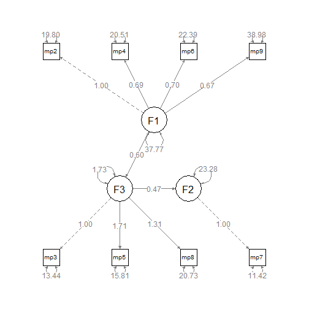

Lecture 11/14/13 - Structural Regression
===============================================================================

Make a structural regression model.


```r
options(width = 100)
library(lavaan)
library(foreign)
library(semPlot)
d <- read.spss("../data/data_carnet3.sav", to.data.frame = TRUE)
# Keep just the `mpn` columns
d <- d[, paste("mpn", 1:10, sep = "")]
m <- "
  F1 =~ mpn2 + mpn4 + mpn6 + mpn9
  F2 =~ mpn1 + mpn7 + mpn10
  F3 =~ mpn3 + mpn5 + mpn8
  F2 ~ F3 + F1
  F3 ~ F1"
fit <- sem(m, d, likelihood = "wishart")
summary(fit, standardized = TRUE, fit.measures = TRUE, rsquare = TRUE)
```

```
## lavaan (0.5-15) converged normally after  94 iterations
## 
##   Number of observations                            98
## 
##   Estimator                                         ML
##   Minimum Function Test Statistic               54.206
##   Degrees of freedom                                32
##   P-value (Chi-square)                           0.008
## 
## Model test baseline model:
## 
##   Minimum Function Test Statistic              439.029
##   Degrees of freedom                                45
##   P-value                                        0.000
## 
## User model versus baseline model:
## 
##   Comparative Fit Index (CFI)                    0.944
##   Tucker-Lewis Index (TLI)                       0.921
## 
## Loglikelihood and Information Criteria:
## 
##   Loglikelihood user model (H0)              -3042.345
##   Loglikelihood unrestricted model (H1)      -3014.963
## 
##   Number of free parameters                         23
##   Akaike (AIC)                                6130.690
##   Bayesian (BIC)                              6189.909
##   Sample-size adjusted Bayesian (BIC)         6117.283
## 
## Root Mean Square Error of Approximation:
## 
##   RMSEA                                          0.085
##   90 Percent Confidence Interval          0.043  0.122
##   P-value RMSEA <= 0.05                          0.079
## 
## Standardized Root Mean Square Residual:
## 
##   SRMR                                           0.079
## 
## Parameter estimates:
## 
##   Information                                 Expected
##   Standard Errors                             Standard
## 
##                    Estimate  Std.err  Z-value  P(>|z|)   Std.lv  Std.all
## Latent variables:
##   F1 =~
##     mpn2              1.000                               6.134    0.808
##     mpn4              0.691    0.101    6.877    0.000    4.241    0.683
##     mpn6              0.701    0.104    6.755    0.000    4.299    0.673
##     mpn9              0.676    0.125    5.409    0.000    4.149    0.554
##   F2 =~
##     mpn1              1.000                               3.940    0.686
##     mpn7              1.210    0.219    5.528    0.000    4.767    0.773
##     mpn10             1.222    0.223    5.478    0.000    4.815    0.727
##   F3 =~
##     mpn3              1.000                               3.917    0.730
##     mpn5              1.718    0.216    7.974    0.000    6.731    0.862
##     mpn8              1.312    0.187    7.030    0.000    5.138    0.750
## 
## Regressions:
##   F2 ~
##     F3                0.318    0.675    0.471    0.638    0.316    0.316
##     F1                0.063    0.433    0.145    0.884    0.098    0.098
##   F3 ~
##     F1                0.600    0.089    6.770    0.000    0.939    0.939
## 
## Variances:
##     mpn2             19.940    4.078                     19.940    0.346
##     mpn4             20.526    3.390                     20.526    0.533
##     mpn6             22.318    3.655                     22.318    0.547
##     mpn9             38.815    5.959                     38.815    0.693
##     mpn1             17.466    3.402                     17.466    0.529
##     mpn7             15.357    3.943                     15.357    0.403
##     mpn10            20.690    4.497                     20.690    0.472
##     mpn3             13.485    2.280                     13.485    0.468
##     mpn5             15.683    3.737                     15.683    0.257
##     mpn8             20.556    3.560                     20.556    0.438
##     F1               37.627    8.280                      1.000    1.000
##     F2               12.920    3.950                      0.832    0.832
##     F3                1.810    1.301                      0.118    0.118
## 
## R-Square:
## 
##     mpn2              0.654
##     mpn4              0.467
##     mpn6              0.453
##     mpn9              0.307
##     mpn1              0.471
##     mpn7              0.597
##     mpn10             0.528
##     mpn3              0.532
##     mpn5              0.743
##     mpn8              0.562
##     F2                0.168
##     F3                0.882
```


This model has the same chi-square as the `m2` model from above; it is an equivalent model. We basically turn covariance paths to causal paths. We need to check whether the structural part of the model (the paths among the factors) is just-identified or over-identified. The other part of the model is the measurement component of the model.

If we fix one path to zero in the structural part of the model, the chi-square of the model will increase. 

If you start out with a poor measurement model, your structural model can only be worse.


```r
m4 <- "
  F1 =~ mpn2 + mpn4 + mpn6 + mpn9
  F2 =~ mpn1 + mpn7 + mpn10
  F3 =~ mpn3 + mpn5 + mpn8
  F3 ~ F1
  F2 ~ F3"
fit <- sem(m4, d, likelihood = "wishart")
summary(fit, standardized = TRUE, fit.measures = TRUE, rsquare = TRUE)
```

```
## lavaan (0.5-15) converged normally after  78 iterations
## 
##   Number of observations                            98
## 
##   Estimator                                         ML
##   Minimum Function Test Statistic               54.225
##   Degrees of freedom                                33
##   P-value (Chi-square)                           0.011
## 
## Model test baseline model:
## 
##   Minimum Function Test Statistic              439.029
##   Degrees of freedom                                45
##   P-value                                        0.000
## 
## User model versus baseline model:
## 
##   Comparative Fit Index (CFI)                    0.946
##   Tucker-Lewis Index (TLI)                       0.927
## 
## Loglikelihood and Information Criteria:
## 
##   Loglikelihood user model (H0)              -3042.355
##   Loglikelihood unrestricted model (H1)      -3014.963
## 
##   Number of free parameters                         22
##   Akaike (AIC)                                6128.710
##   Bayesian (BIC)                              6185.353
##   Sample-size adjusted Bayesian (BIC)         6115.885
## 
## Root Mean Square Error of Approximation:
## 
##   RMSEA                                          0.081
##   90 Percent Confidence Interval          0.039  0.119
##   P-value RMSEA <= 0.05                          0.098
## 
## Standardized Root Mean Square Residual:
## 
##   SRMR                                           0.080
## 
## Parameter estimates:
## 
##   Information                                 Expected
##   Standard Errors                             Standard
## 
##                    Estimate  Std.err  Z-value  P(>|z|)   Std.lv  Std.all
## Latent variables:
##   F1 =~
##     mpn2              1.000                               6.140    0.809
##     mpn4              0.691    0.100    6.883    0.000    4.241    0.683
##     mpn6              0.700    0.104    6.757    0.000    4.297    0.673
##     mpn9              0.674    0.125    5.395    0.000    4.137    0.553
##   F2 =~
##     mpn1              1.000                               3.938    0.686
##     mpn7              1.210    0.219    5.526    0.000    4.765    0.772
##     mpn10             1.224    0.223    5.478    0.000    4.821    0.728
##   F3 =~
##     mpn3              1.000                               3.919    0.730
##     mpn5              1.716    0.215    7.980    0.000    6.723    0.861
##     mpn8              1.311    0.186    7.033    0.000    5.136    0.749
## 
## Regressions:
##   F3 ~
##     F1                0.600    0.088    6.794    0.000    0.941    0.941
##   F2 ~
##     F3                0.414    0.132    3.136    0.002    0.412    0.412
## 
## Variances:
##     mpn2             19.863    4.071                     19.863    0.345
##     mpn4             20.530    3.390                     20.530    0.533
##     mpn6             22.341    3.656                     22.341    0.548
##     mpn9             38.916    5.970                     38.916    0.695
##     mpn1             17.485    3.403                     17.485    0.530
##     mpn7             15.376    3.942                     15.376    0.404
##     mpn10            20.635    4.498                     20.635    0.470
##     mpn3             13.470    2.276                     13.470    0.467
##     mpn5             15.795    3.713                     15.795    0.259
##     mpn8             20.580    3.559                     20.580    0.438
##     F1               37.704    8.284                      1.000    1.000
##     F2               12.877    3.942                      0.830    0.830
##     F3                1.769    1.283                      0.115    0.115
## 
## R-Square:
## 
##     mpn2              0.655
##     mpn4              0.467
##     mpn6              0.452
##     mpn9              0.305
##     mpn1              0.470
##     mpn7              0.596
##     mpn10             0.530
##     mpn3              0.533
##     mpn5              0.741
##     mpn8              0.562
##     F2                0.170
##     F3                0.885
```


```r
m5 <- "
  F1 =~ mpn2 + mpn4 + mpn6 + mpn9
  F3 =~ mpn3 + mpn5 + mpn8
  F3 ~ F1
  mpn7 ~ F3"
fit <- sem(m5, d, likelihood = "wishart")
summary(fit, standardized = TRUE, fit.measures = TRUE, rsquare = TRUE)
```

```
## lavaan (0.5-15) converged normally after  66 iterations
## 
##   Number of observations                            98
## 
##   Estimator                                         ML
##   Minimum Function Test Statistic               36.881
##   Degrees of freedom                                19
##   P-value (Chi-square)                           0.008
## 
## Model test baseline model:
## 
##   Minimum Function Test Statistic              340.555
##   Degrees of freedom                                28
##   P-value                                        0.000
## 
## User model versus baseline model:
## 
##   Comparative Fit Index (CFI)                    0.943
##   Tucker-Lewis Index (TLI)                       0.916
## 
## Loglikelihood and Information Criteria:
## 
##   Loglikelihood user model (H0)              -2448.624
##   Loglikelihood unrestricted model (H1)      -2429.993
## 
##   Number of free parameters                         17
##   Akaike (AIC)                                4931.248
##   Bayesian (BIC)                              4975.018
##   Sample-size adjusted Bayesian (BIC)         4921.338
## 
## Root Mean Square Error of Approximation:
## 
##   RMSEA                                          0.099
##   90 Percent Confidence Interval          0.049  0.146
##   P-value RMSEA <= 0.05                          0.053
## 
## Standardized Root Mean Square Residual:
## 
##   SRMR                                           0.061
## 
## Parameter estimates:
## 
##   Information                                 Expected
##   Standard Errors                             Standard
## 
##                    Estimate  Std.err  Z-value  P(>|z|)   Std.lv  Std.all
## Latent variables:
##   F1 =~
##     mpn2              1.000                               6.145    0.810
##     mpn4              0.690    0.100    6.894    0.000    4.243    0.684
##     mpn6              0.698    0.103    6.752    0.000    4.291    0.672
##     mpn9              0.672    0.125    5.388    0.000    4.129    0.552
##   F3 =~
##     mpn3              1.000                               3.923    0.731
##     mpn5              1.713    0.215    7.982    0.000    6.721    0.861
##     mpn8              1.305    0.186    7.016    0.000    5.121    0.747
## 
## Regressions:
##   F3 ~
##     F1                0.601    0.088    6.811    0.000    0.942    0.942
##   mpn7 ~
##     F3                0.469    0.169    2.772    0.006    1.840    0.298
## 
## Variances:
##     mpn2             19.801    4.064                     19.801    0.344
##     mpn4             20.513    3.387                     20.513    0.533
##     mpn6             22.394    3.661                     22.394    0.549
##     mpn9             38.977    5.977                     38.977    0.696
##     mpn3             13.436    2.275                     13.436    0.466
##     mpn5             15.810    3.733                     15.810    0.259
##     mpn8             20.733    3.580                     20.733    0.442
##     mpn7             34.699    5.045                     34.699    0.911
##     F1               37.766    8.287                      1.000    1.000
##     F3                1.730    1.287                      0.112    0.112
## 
## R-Square:
## 
##     mpn2              0.656
##     mpn4              0.467
##     mpn6              0.451
##     mpn9              0.304
##     mpn3              0.534
##     mpn5              0.741
##     mpn8              0.558
##     mpn7              0.089
##     F3                0.888
```


```
p = 36
q = 5 loadings + 7 measurement errors + 2 causal paths + 1 exo variance + 2 disturbances of endogenous
df = 19
```

Suppose that path from F2 to mpn7 is fixed to 1. Then disturbance of F2 and measurement error of mpn7 are the same thing.


```r
m6 <- "
  F1 =~ mpn2 + mpn4 + mpn6 + mpn9
  F3 =~ mpn3 + mpn5 + mpn8
  F2 =~ mpn7
  F3 ~ F1
  F2 ~ F3
  mpn7 ~~ 11.42*mpn7
"
fit6 <- sem(m6, d, likelihood = "wishart")
summary(fit6, standardized = TRUE, fit.measures = TRUE, rsquare = TRUE)
```

```
## lavaan (0.5-15) converged normally after  72 iterations
## 
##   Number of observations                            98
## 
##   Estimator                                         ML
##   Minimum Function Test Statistic               36.881
##   Degrees of freedom                                19
##   P-value (Chi-square)                           0.008
## 
## Model test baseline model:
## 
##   Minimum Function Test Statistic              340.555
##   Degrees of freedom                                28
##   P-value                                        0.000
## 
## User model versus baseline model:
## 
##   Comparative Fit Index (CFI)                    0.943
##   Tucker-Lewis Index (TLI)                       0.916
## 
## Loglikelihood and Information Criteria:
## 
##   Loglikelihood user model (H0)              -2448.624
##   Loglikelihood unrestricted model (H1)      -2429.993
## 
##   Number of free parameters                         17
##   Akaike (AIC)                                4931.248
##   Bayesian (BIC)                              4975.018
##   Sample-size adjusted Bayesian (BIC)         4921.338
## 
## Root Mean Square Error of Approximation:
## 
##   RMSEA                                          0.099
##   90 Percent Confidence Interval          0.049  0.146
##   P-value RMSEA <= 0.05                          0.053
## 
## Standardized Root Mean Square Residual:
## 
##   SRMR                                           0.061
## 
## Parameter estimates:
## 
##   Information                                 Expected
##   Standard Errors                             Standard
## 
##                    Estimate  Std.err  Z-value  P(>|z|)   Std.lv  Std.all
## Latent variables:
##   F1 =~
##     mpn2              1.000                               6.145    0.810
##     mpn4              0.690    0.100    6.894    0.000    4.243    0.684
##     mpn6              0.698    0.103    6.752    0.000    4.291    0.672
##     mpn9              0.672    0.125    5.388    0.000    4.129    0.552
##   F3 =~
##     mpn3              1.000                               3.923    0.731
##     mpn5              1.713    0.215    7.982    0.000    6.721    0.861
##     mpn8              1.305    0.186    7.016    0.000    5.121    0.747
##   F2 =~
##     mpn7              1.000                               5.164    0.837
## 
## Regressions:
##   F3 ~
##     F1                0.601    0.088    6.811    0.000    0.942    0.942
##   F2 ~
##     F3                0.469    0.169    2.772    0.006    0.356    0.356
## 
## Variances:
##     mpn7             11.420                              11.420    0.300
##     mpn2             19.801    4.064                     19.801    0.344
##     mpn4             20.513    3.387                     20.513    0.533
##     mpn6             22.394    3.661                     22.394    0.549
##     mpn9             38.977    5.977                     38.977    0.696
##     mpn3             13.436    2.275                     13.436    0.466
##     mpn5             15.810    3.733                     15.810    0.259
##     mpn8             20.733    3.580                     20.733    0.442
##     F1               37.766    8.287                      1.000    1.000
##     F3                1.730    1.287                      0.112    0.112
##     F2               23.279    5.045                      0.873    0.873
## 
## R-Square:
## 
##     mpn7              0.700
##     mpn2              0.656
##     mpn4              0.467
##     mpn6              0.451
##     mpn9              0.304
##     mpn3              0.534
##     mpn5              0.741
##     mpn8              0.558
##     F3                0.888
##     F2                0.127
```

```r
semPaths(fit6, layout = "tree", whatLabels = "est")
```

 


***


```r
sessionInfo()
```

```
## R version 3.0.1 (2013-05-16)
## Platform: x86_64-w64-mingw32/x64 (64-bit)
## 
## locale:
## [1] LC_COLLATE=English_United States.1252  LC_CTYPE=English_United States.1252   
## [3] LC_MONETARY=English_United States.1252 LC_NUMERIC=C                          
## [5] LC_TIME=English_United States.1252    
## 
## attached base packages:
## [1] stats     graphics  grDevices utils     datasets  methods   base     
## 
## other attached packages:
## [1] semPlot_0.3.3  foreign_0.8-53 lavaan_0.5-15  knitr_1.5     
## 
## loaded via a namespace (and not attached):
##  [1] car_2.0-19       cluster_1.14.4   colorspace_1.2-4 corpcor_1.6.6    ellipse_0.3-8   
##  [6] evaluate_0.5.1   formatR_0.10     grid_3.0.1       Hmisc_3.12-2     igraph_0.6.6    
## [11] jpeg_0.1-6       lattice_0.20-15  lisrelToR_0.1.4  MASS_7.3-26      mnormt_1.4-5    
## [16] nnet_7.3-6       pbivnorm_0.5-1   plyr_1.8         png_0.1-6        psych_1.3.10.12 
## [21] qgraph_1.2.3     quadprog_1.5-5   rockchalk_1.8.0  rpart_4.1-1      sem_3.1-3       
## [26] stats4_3.0.1     stringr_0.6.2    tools_3.0.1      XML_3.98-1.1
```


