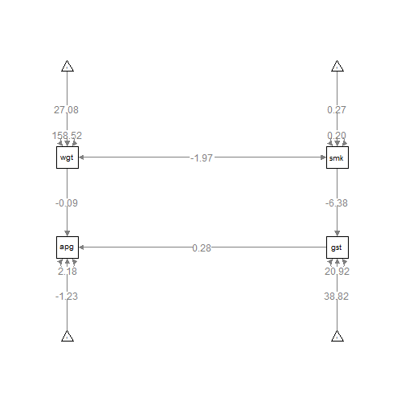

11/21/2013 - Mean Structures
===============================================================================


```r
library(lavaan)
library(semPlot)
library(lmSupport)
d <- lm.readDat("../data/data_apgar.dat")
```


### How do you find the mean of X without using `mean`?


```r
d$one <- 1
m1 <- lm(data = d, smokes ~ 0 + one)
summary(m1)
```

```
## 
## Call:
## lm(formula = smokes ~ 0 + one, data = d)
## 
## Residuals:
##    Min     1Q Median     3Q    Max 
## -0.267 -0.267 -0.267  0.733  0.733 
## 
## Coefficients:
##     Estimate Std. Error t value Pr(>|t|)    
## one   0.2667     0.0576    4.63    2e-05 ***
## ---
## Signif. codes:  0 '***' 0.001 '**' 0.01 '*' 0.05 '.' 0.1 ' ' 1
## 
## Residual standard error: 0.446 on 59 degrees of freedom
## Multiple R-squared:  0.267,	Adjusted R-squared:  0.254 
## F-statistic: 21.5 on 1 and 59 DF,  p-value: 2.04e-05
```


The coefficient for `one` is the mean. This is a one-sample t-test too.


```r
m2 <- lm(data = d, smokes ~ 1)
summary(m2)
```

```
## 
## Call:
## lm(formula = smokes ~ 1, data = d)
## 
## Residuals:
##    Min     1Q Median     3Q    Max 
## -0.267 -0.267 -0.267  0.733  0.733 
## 
## Coefficients:
##             Estimate Std. Error t value Pr(>|t|)    
## (Intercept)   0.2667     0.0576    4.63    2e-05 ***
## ---
## Signif. codes:  0 '***' 0.001 '**' 0.01 '*' 0.05 '.' 0.1 ' ' 1
## 
## Residual standard error: 0.446 on 59 degrees of freedom
```


The path from the exogenous variable `one` to `smokes` is the mean.

Now, how to find the mean of an endogenous variable?


```r
m3 <- lm(data = d, gestat ~ 0 + smokes + one)
summary(m3)
```

```
## 
## Call:
## lm(formula = gestat ~ 0 + smokes + one, data = d)
## 
## Residuals:
##     Min      1Q  Median      3Q     Max 
## -12.438  -1.818   0.182   2.277   9.562 
## 
## Coefficients:
##        Estimate Std. Error t value Pr(>|t|)    
## smokes   -6.381      1.347   -4.74  1.4e-05 ***
## one      38.818      0.696   55.81  < 2e-16 ***
## ---
## Signif. codes:  0 '***' 0.001 '**' 0.01 '*' 0.05 '.' 0.1 ' ' 1
## 
## Residual standard error: 4.61 on 58 degrees of freedom
## Multiple R-squared:  0.985,	Adjusted R-squared:  0.985 
## F-statistic: 1.95e+03 on 2 and 58 DF,  p-value: <2e-16
```


The mean of `gestat` is the total effect of `one` on `gestat`.


```r
# Indirect effect + direct effect
unname(coef(m3)["smokes"] * coef(m1)["one"] + coef(m3)["one"])
```

```
## [1] 37.12
```

```r
mean(d$gestat)
```

```
## [1] 37.12
```


## Mean structures

Recall `apgar2`.


```r
apgar2 <- "
  apgar ~ gestat + wgtgain
  gestat ~ smokes
"
fit1 <- sem(apgar2, d, likelihood = "wishart")
summary(fit1)
```

```
## lavaan (0.5-15) converged normally after  24 iterations
## 
##   Number of observations                            60
## 
##   Estimator                                         ML
##   Minimum Function Test Statistic               10.341
##   Degrees of freedom                                 2
##   P-value (Chi-square)                           0.006
## 
## Parameter estimates:
## 
##   Information                                 Expected
##   Standard Errors                             Standard
## 
##                    Estimate  Std.err  Z-value  P(>|z|)
## Regressions:
##   apgar ~
##     gestat            0.276    0.036    7.599    0.000
##     wgtgain          -0.086    0.016   -5.529    0.000
##   gestat ~
##     smokes           -6.381    1.335   -4.778    0.000
## 
## Variances:
##     apgar             2.178    0.401
##     gestat           20.923    3.852
```


Including the means structure adds 4 new pieces of information.


```r
(p <- 4 * (4 + 3)/2)
```

```
## [1] 14
```

```r
(q <- 3 + 1 + 4 + 4)
```

```
## [1] 12
```

```r
p - q
```

```
## [1] 2
```


`smokes` and `wgtgain` are no longer exogenous variables so we have to tell lavaan to let the two variables covary with `~~`. 


```r
apgar2ms <- "
  apgar ~ gestat + wgtgain
  gestat ~ smokes
  apgar ~ 1
  gestat ~ 1
  wgtgain ~ 1
  smokes ~ 1
  wgtgain ~~ smokes
"
fit1ms <- sem(apgar2ms, d, likelihood = "wishart")
```

```
## Warning: lavaan WARNING: model syntax contains variance/covariance/intercept formulas
##   involving (an) exogenous variable(s): [wgtgain smokes];
##   Please use fixed.x=FALSE or leave them alone
```

```r
summary(fit1ms)
```

```
## lavaan (0.5-15) converged normally after  42 iterations
## 
##   Number of observations                            60
## 
##   Estimator                                         ML
##   Minimum Function Test Statistic               10.341
##   Degrees of freedom                                 2
##   P-value (Chi-square)                           0.006
## 
## Parameter estimates:
## 
##   Information                                 Expected
##   Standard Errors                             Standard
## 
##                    Estimate  Std.err  Z-value  P(>|z|)
## Regressions:
##   apgar ~
##     gestat            0.276    0.036    7.599    0.000
##     wgtgain          -0.086    0.016   -5.529    0.000
##   gestat ~
##     smokes           -6.381    1.335   -4.778    0.000
## 
## Covariances:
##   wgtgain ~~
##     smokes           -1.972    0.775   -2.545    0.011
## 
## Intercepts:
##     apgar            -1.228    1.349   -0.911    0.362
##     gestat           38.818    0.694   55.945    0.000
##     wgtgain          27.083    1.639   16.523    0.000
##     smokes            0.267    0.058    4.593    0.000
## 
## Variances:
##     apgar             2.178    0.401
##     gestat           20.923    3.852
##     wgtgain         158.518   29.186
##     smokes            0.199    0.037
```

```r
semPaths(fit1ms, whatLabels = "est")
```

 


Set `meanstructure = TRUE` instead of adding intercept terms.


```r
fit1ms2 <- sem(apgar2, d, likelihood = "wishart", meanstructure = TRUE)
summary(fit1ms2)
```

```
## lavaan (0.5-15) converged normally after  28 iterations
## 
##   Number of observations                            60
## 
##   Estimator                                         ML
##   Minimum Function Test Statistic               10.341
##   Degrees of freedom                                 2
##   P-value (Chi-square)                           0.006
## 
## Parameter estimates:
## 
##   Information                                 Expected
##   Standard Errors                             Standard
## 
##                    Estimate  Std.err  Z-value  P(>|z|)
## Regressions:
##   apgar ~
##     gestat            0.276    0.036    7.599    0.000
##     wgtgain          -0.086    0.016   -5.529    0.000
##   gestat ~
##     smokes           -6.381    1.335   -4.778    0.000
## 
## Intercepts:
##     apgar            -1.228    1.349   -0.911    0.362
##     gestat           38.818    0.694   55.945    0.000
## 
## Variances:
##     apgar             2.178    0.401
##     gestat           20.923    3.852
```


The four means are replicated perfectly by the total effects for each variable. We use all four means in the model, so we have a "just-identified mean structure", so the means are perfectly replicated. The chi-square does not change with the addition of the (just-identified) mean structure. 

### Under-identified mean structure

The following model has 5 intercept paths but only 4 means. The mean structure is under-identified.


```r
m_ex <- "
  F1 =~ v1 + v2 + v3 + v4
  F1 ~ 1
  v1 ~ 1
  v2 ~ 1
  v3 ~ 1
  v4 ~ 1
"
```


### Latent growth models

The test whether Change ~ 1 is different from 0 is all we care about in this kind of model.


```r
m_latent_growth <- "
  Initial =~ 1*t1 + 1*t2 + 1*t3 + 1*t4
  Change  =~ 0*t1 + 1*t2 + 2*t3 + 3*t4
  Change ~~ Initial
  Initial ~ 1
  Change ~ 1
"
# cov: p = 14, q = 5, df_cov = 5
# mean: p = 4, q = 2, df_mean = 2
```


***


```r
sessionInfo()
```

```
## R version 3.0.1 (2013-05-16)
## Platform: x86_64-w64-mingw32/x64 (64-bit)
## 
## locale:
## [1] LC_COLLATE=English_United States.1252 
## [2] LC_CTYPE=English_United States.1252   
## [3] LC_MONETARY=English_United States.1252
## [4] LC_NUMERIC=C                          
## [5] LC_TIME=English_United States.1252    
## 
## attached base packages:
## [1] stats     graphics  grDevices utils     datasets  methods   base     
## 
## other attached packages:
## [1] lmSupport_1.07.1 car_2.0-19       semPlot_0.3.3    lavaan_0.5-15   
## [5] knitr_1.5       
## 
## loaded via a namespace (and not attached):
##  [1] bitops_1.0-6       caTools_1.16       cluster_1.14.4    
##  [4] colorspace_1.2-4   corpcor_1.6.6      ellipse_0.3-8     
##  [7] evaluate_0.5.1     formatR_0.10       gdata_2.13.2      
## [10] gplots_2.12.1      grid_3.0.1         gtools_3.1.1      
## [13] gvlma_1.0.0.1      Hmisc_3.12-2       igraph_0.6.6      
## [16] jpeg_0.1-6         KernSmooth_2.23-10 lattice_0.20-15   
## [19] lisrelToR_0.1.4    MASS_7.3-26        mnormt_1.4-5      
## [22] nnet_7.3-6         pbivnorm_0.5-1     plyr_1.8          
## [25] png_0.1-6          psych_1.3.10.12    qgraph_1.2.3      
## [28] quadprog_1.5-5     rockchalk_1.8.0    rpart_4.1-1       
## [31] sem_3.1-3          stats4_3.0.1       stringr_0.6.2     
## [34] tools_3.0.1        XML_3.98-1.1
```


