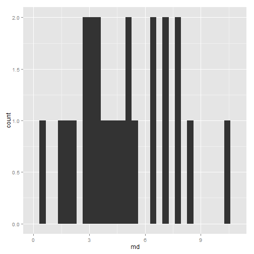
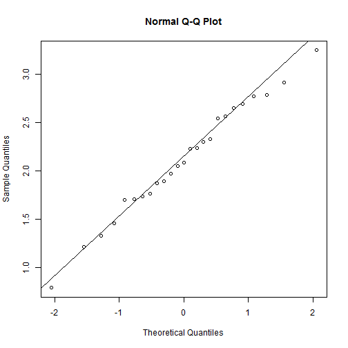
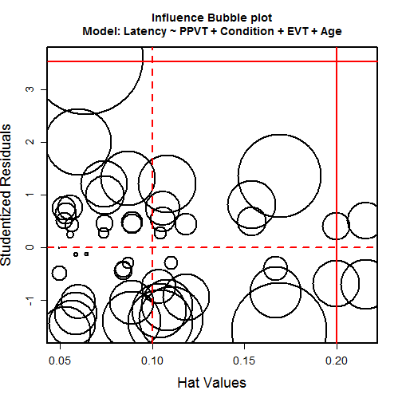
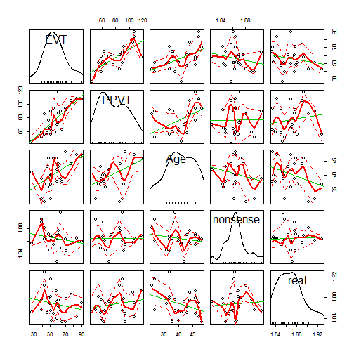

Exercises about Rex Kline's book (for Tues., Sept. 24)
===============================================================================


```r
library(plyr)
library(psych)
library(ggplot2)
library(reshape2)
library(lmSupport)
long_scores <- read.csv("../data/hw3.csv", row.names = 1)
just_scores <- read.csv("../data/hw3b.csv", row.names = 1)
lengths <- read.csv("../data/hw3c.csv", row.names = 1)
```


Reading Notes
-------------------------------------------------------------------------------

### Be prepared to explain to a novice what the topics below mean and why they are particularly important in SEM. 

> For each of the topics you should be able to say two or three sentences without looking at your notes. 

#### Positive definiteness of matrices (causes, indicators of nonpositive definiteness)

In order for us to do the SEM analysis on the covariance matrix (a description of the variables in our data and how they vary together), the matrix needs to be well-formed--that is, positive definite--so that we can do some linear algebra on them. The indicators of nonpositive definiteness:

1. The matrix is nonsingular, or invertible.
2. All eigenvalues of the matrix are greater than zero.
3. The determinant of the matrix is greater than zero.
4. All of the correlations and covariances are not out of bounds.

Causes: Include errors, outliers, collinearity.

This problem will kill your model, so its pretty obvious to detect.

#### Collinearity (between a pair of variables and between a variable and two or more others)

Collinearity indicates that 2+ different variables are measuring the same thing. Redundant variables need to be eliminated or combined together. Check with VIF, squared multiple correlation, or tolleratnce.

#### Outliers (univariate outliers, multivariate outliers)

Outliers are extreme values that distort or exaggerate trends in the data. Set with a cutoff like 3SD or a distance measure. An outlier may not belong to the sample's true population. Multivariate outliers are calculated with Mahalanonis distance. 


```r
md <- mahalanobis(just_scores, colMeans(just_scores), cov = cov(just_scores))
qplot(x = md)
```

```
## stat_bin: binwidth defaulted to range/30. Use 'binwidth = x' to adjust this.
```

 

```r
mardia(just_scores)
```

 

```
## Call: mardia(x = just_scores)
## 
## Mardia tests of multivariate skew and kurtosis
## Use describe(x) the to get univariate tests
## n.obs = 25   num.vars =  5 
## b1p =  5.95   skew =  24.81  with probability =  0.9
##  small sample skew =  28.89  with probability =  0.76
## b2p =  28.79   kurtosis =  -1.86  with probability =  0.064
```

```r
mod <- lm(Latency ~ PPVT + Condition + EVT + Age, long_scores)
cases <- lm.caseAnalysis(mod, "influenceplot")
```

 


(_I should review Cook's D, hat values, Studentized values_.)

#### Missing data (ignorable, systematic, MAR, MCAR, available case methods, mean substitution, regression-based imputation, model-based imputation)

Ignorable missing data is not systematic. If missingness is systematic, the results from the available cases may not generalize to the targeted population. Missing at random means that the missing scores only vary by chance. Missing completely at random means that missingness is not predicted by any other variable in the dataset. Available case methods are ways of dealing with missing data, including excluding incomplete subjects or trying to use as many of the observations as possible. Imputations describe different ways to fill in the missing data points. During a sensitivity analysis, we would compare results from analyses with different assumptions to see how they compare. For example, do the results under listwise deletion differ from the imputed results?

#### Normality (univariate, multivariate) and transformations

ML assumes normality. Normality tells us whether the data follow a classical bell curve or whether the data are skewed or have abnormal tails (kurtosis). Transformations try to compress parts of the data distribution with the goal of achieving a more normal distribution. 

Multivariate normality implies that 

1. Each variable is univariate normal
2. Each pair of variables is bivariate normal.
3. All bivariate scatterplots exhibit linearity and homoscedacity. 

#### Linearity and homoscedasticity

Linearity meets that bivariate scatter plots are linear. Homescedacity means that residuals have constant variance, i.e., a uniform distributation

#### Relative variances

In order for the ML algorithm to converge, the variances should have relatively comparable units of measures. The ratio of the largest variance to the smallest variance should be 10 or less, ideally, i.e., within a unit an order of magnitude.

#### Reliability and validity

Reliability is the extent to which you are measure something meaningful, as opposed to random error. Validity is the extent to which you are measuring the desired construct.

### B. Make a table that looks like the trouble shooting guide of the last dishwasher you bought. 

> In the left column are the potential problems, in the middle column are the ways to diagnose the problems, and in the right column are ways to solve the problems (0.5 to 1 page max.). 

Exercises
-------------------------------------------------------------------------------

### C. Take a recent data set of yours, select 5 to 10 variables that are important to your hypotheses, and do some data screening. 

> Among the selected variables there should be at most one experimental manipulation with two levels. Selecting only measured variables is fine, too. Go through the table you made in B. Check whether each problem is present in your variables, i.e., check whether your covariance matrix is positive definite, check whether there is a collinearity problem in your data (e.g., by computing the variance inflation factor for each of the variables), check whether there are outliers (e.g., by computing Mahalanobis distance for each observation), and so forth. Summarize your data screening (what you did and what you found) in ½ to 1 page. If you want you can put additional information (R script, box plots, etc.) in an appendix, but your summary should be informative by itself (I must be able to understand it without looking in the appendix). 

I have chosen to screen some reaction time data from a language processing task with 30--45 month-old children. I am interested in whether vocabulary size predicts reaction time. There are two trial conditions, one in which the child is prompted to look a familiar object named using a real word (e.g., _dog_) and another condition in which the child is prompted to look at unfamiliar object named with a nonsense word. Therefore the five variables in this dataset are are two different measures of vocabulary, age in months, reaction time and trial condition.

These reaction times already underwent one iteration of screening and correction: Blinks and other random missingness in the eye-tracking data were imputed using neighboring data, RTs that were impossible fast (by virtue of how eye-movements work) were excluded and then RTs that were more than 2 SDs above the mean were dropped within each condition. Since reaction times are practically unbounded durations, trimming the slowest 5% of RTs seems appropriate.

Missingness was present in the dataset because not every trial yielded a usable reaction time, and a number of reaction times were trimmed as described above. It is possible that attention to the task predicts the number of usable reaction times, and therefore that the number of usable observations within each subject is not ignorable missing data. I checked against this possibility by regressing the number of reaction times onto condition, two measures of vocabulary, and age. There was a signifcant effect of age such that increasing one-month in age predicted an increase in usable data by 0.76 trials, controlling all other predictors. In other words, older kids may dispropriately represented in the unaggregated data-set.


```r
lengths <- melt(lengths, measure.vars = c("nonsense", "real"))
lengths <- mutate(lengths, Condition = ifelse(variable == "nonsense", -0.5, 
    0.5))
summary(lm(value ~ EVT + PPVT + Age + Condition, lengths))
```

```
## 
## Call:
## lm(formula = value ~ EVT + PPVT + Age + Condition, data = lengths)
## 
## Residuals:
##    Min     1Q Median     3Q    Max 
## -12.92  -6.24  -3.19   2.92  32.24 
## 
## Coefficients:
##             Estimate Std. Error t value Pr(>|t|)  
## (Intercept)  -3.8466    12.4584   -0.31    0.759  
## EVT           0.0722     0.1566    0.46    0.647  
## PPVT         -0.1825     0.1083   -1.68    0.099 .
## Age           0.7670     0.3613    2.12    0.039 *
## Condition     0.9200     2.9389    0.31    0.756  
## ---
## Signif. codes:  0 '***' 0.001 '**' 0.01 '*' 0.05 '.' 0.1 ' ' 1
## 
## Residual standard error: 10.4 on 45 degrees of freedom
## Multiple R-squared:  0.124,	Adjusted R-squared:  0.0461 
## F-statistic: 1.59 on 4 and 45 DF,  p-value: 0.193
```


For the purposes of this exercise, I aggregated observations by condition within each subject by computing mean reaction times. (A more robust analysis would use these repeated measures to its advantage, of course.) The aggregated data contains no missing observations.

The covariance matrix showed positive eigenvalues, so it is positive definite.


```r
eigen(cov(just_scores))
```

```
## $values
## [1] 5.633e+02 7.533e+01 1.691e+01 4.084e-04 2.271e-04
## 
## $vectors
##            [,1]       [,2]      [,3]       [,4]       [,5]
## [1,] -5.274e-01  0.8388612  0.134771 -0.0007000 -0.0007102
## [2,] -8.423e-01 -0.5370409  0.046732  0.0007632  0.0006004
## [3,] -1.116e-01  0.0888626 -0.989772 -0.0018844 -0.0013769
## [4,]  4.300e-05 -0.0005739  0.000591  0.3456488 -0.9383636
## [5,] -5.169e-05 -0.0014525  0.002143 -0.9383615 -0.3456458
```


Collinearity was assessed by computing the squared multiple correlations of each variable as well as examining the bivariate correlations. All of these correlations were less than 0.90. The highest correlation was between expressive and receptive vocabulary measures, _r_ = 0.73, which suggests that these scores measure different aspects of the same underlying vocabulary construct. 


```r
smc(just_scores)
```

```
##      EVT     PPVT      Age nonsense     real 
##   0.6677   0.7117   0.4492   0.1451   0.4033
```

```r
cor(just_scores)
```

```
##              EVT     PPVT     Age  nonsense    real
## EVT       1.0000 0.727440  0.5124 -0.196520 -0.1975
## PPVT      0.7274 1.000000  0.4811  0.009557  0.1656
## Age       0.5124 0.481129  1.0000 -0.199605 -0.3445
## nonsense -0.1965 0.009557 -0.1996  1.000000  0.0577
## real     -0.1975 0.165621 -0.3445  0.057698  1.0000
```


Univariate normality was using measures for skew and kurtosis. Adequate values were found for these measures.


```r
describe(just_scores)
```

```
##          var  n  mean    sd median trimmed   mad   min    max range  skew
## EVT        1 25 56.60 14.49  55.00   55.95 11.86 27.00  90.00 63.00  0.38
## PPVT       2 25 77.04 20.53  73.00   76.38 25.20 45.00 118.00 73.00  0.30
## Age        3 25 40.52  4.92  40.00   40.71  4.45 31.00  48.00 17.00 -0.27
## nonsense   4 25  1.86  0.02   1.86    1.86  0.01  1.83   1.91  0.08  0.35
## real       5 25  1.87  0.02   1.87    1.87  0.02  1.83   1.93  0.09  0.59
##          kurtosis   se
## EVT         -0.18 2.90
## PPVT        -1.22 4.11
## Age         -0.98 0.98
## nonsense     0.37 0.00
## real        -0.35 0.00
```

```r
car::scatterplotMatrix(just_scores)
```

 


Linearity and heteroscedacity were assessed for the additive model that regresses reaction time onto the four predictor variables, using a function that checks whether the GLM's assumptions hold for a model. All assumptions, including linearity and heteroscedacity, held for the additive model with log-transformed reaction times.


```r
m <- lm(Latency ~ Condition + EVT + PPVT + Age, long_scores)
summary(m)
```

```
## 
## Call:
## lm(formula = Latency ~ Condition + EVT + PPVT + Age, data = long_scores)
## 
## Residuals:
##      Min       1Q   Median       3Q      Max 
## -0.02936 -0.01450  0.00220  0.00978  0.05920 
## 
## Coefficients:
##                Estimate Std. Error t value Pr(>|t|)    
## (Intercept)    1.913272   0.023117   82.76   <2e-16 ***
## Conditionreal  0.003359   0.005416    0.62   0.5382    
## EVT           -0.000663   0.000289   -2.30   0.0262 *  
## PPVT           0.000612   0.000200    3.06   0.0037 ** 
## Age           -0.001442   0.000666   -2.17   0.0356 *  
## ---
## Signif. codes:  0 '***' 0.001 '**' 0.01 '*' 0.05 '.' 0.1 ' ' 1
## 
## Residual standard error: 0.0191 on 45 degrees of freedom
## Multiple R-squared:  0.246,	Adjusted R-squared:  0.179 
## F-statistic: 3.66 on 4 and 45 DF,  p-value: 0.0115
```

```r
lm.modelAssumptions(m)
```

```
## Descriptive Statistics for Studentized Residuals
## 
## Call:
## lm(formula = Latency ~ Condition + EVT + PPVT + Age, data = long_scores)
## 
## Coefficients:
##   (Intercept)  Conditionreal            EVT           PPVT            Age  
##      1.913272       0.003359      -0.000663       0.000612      -0.001442
```


### D. Do exercise 5 on page 74


```r
dataset <- list(Score = c(10:17, 27), Counts = c(6, 15, 19, 18, 5, 5, 4, 1, 
    1))
full_data <- unlist(Map(rep, dataset$Score, dataset$Counts))
m <- lm(full_data ~ 1)
plot.lm(m, which = 2)
```

 


> Create a single word document with your troubleshooting table (B.), the summary of your data screening (C.), the normal probability plot plus conclusion (D.).


***


```r
sessionInfo()
```

```
## R version 3.0.1 (2013-05-16)
## Platform: x86_64-w64-mingw32/x64 (64-bit)
## 
## locale:
## [1] LC_COLLATE=English_United States.1252 
## [2] LC_CTYPE=English_United States.1252   
## [3] LC_MONETARY=English_United States.1252
## [4] LC_NUMERIC=C                          
## [5] LC_TIME=English_United States.1252    
## 
## attached base packages:
## [1] stats     graphics  grDevices utils     datasets  methods   base     
## 
## other attached packages:
## [1] lmSupport_1.07.1 car_2.0-19       reshape2_1.2.2   ggplot2_0.9.3.1 
## [5] psych_1.3.10.12  plyr_1.8         knitr_1.5       
## 
## loaded via a namespace (and not attached):
##  [1] bitops_1.0-6       caTools_1.16       colorspace_1.2-4  
##  [4] dichromat_2.0-0    digest_0.6.3       evaluate_0.5.1    
##  [7] formatR_0.10       gdata_2.13.2       gplots_2.12.1     
## [10] grid_3.0.1         gtable_0.1.2       gtools_3.1.1      
## [13] gvlma_1.0.0.1      KernSmooth_2.23-10 labeling_0.2      
## [16] MASS_7.3-26        munsell_0.4.2      nnet_7.3-6        
## [19] proto_0.3-10       RColorBrewer_1.0-5 scales_0.2.3      
## [22] stringr_0.6.2      tools_3.0.1
```

