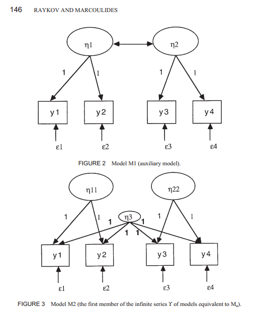

```{r, echo = FALSE}
options(width = 100)
```

Questions about Rex Kline's book (for Tues., Nov. 12)
===============================================================================

> Read Kline (pp. 245-261), Tabachnick and Fidell (pp. 734-749), and Kline (pp. 118-122). Be prepared to answer the questions below. Please also do the data analysis exercise described below. 
 
#### 1. It has been shown that there is a set of infinitely many equivalent models for standard multifactor CFA models. Explain why.

The covariance between the factors can be replaced by one or more factors. These factors have unit-weighted loadings on all the indicators. Here's an example of such a replacement:




#### 2. When analyzing a hierarchical CFA model, how many first-order factors do we need for the model to be identified?

we need at least three first-order factors in order to avoid underidentifications. Also, each first-order factor should itself have two indicators.


#### 3. Which types of models are nowadays used to examine the convergent and discriminant validity of factor: "correlated trait-correlated method models" or "correlated uniqueness models"? Why is one type no longer used?

Correlated trait-correlated method models are no longer preferred because they may give illogical estimates. Correlated uniqueness models allow measurement errors to covary within each method, instead of creating a factor for each method.


#### 4. Explain to a novice the different forms of measurement invariance: (1) Configural invariance, (2) Construct-level metric invariance, (3) Invariance of construct variances and covariances, (4) Invariance of residual variances and covariances

Measurement invariance comes up when looking at how a measurement model performs between different groups (e.g., comparing men vs women). 

1. **Configural invariance** means that the same model structure (i.e., same model diagram) works for each group. This form of invariance lets you "conclude that the same constructs are manifested in some different ways [i.e., with different estimates] in each group."
2. **Construct-level metric invariance** means that the model structure and the factor loadings are the same for the groups. When this form of invariance holds, you can "conclude that the constructs are manifested the same way in each group".
3. Even stricter forms of invariance arise by assuming other estimates are the same for in each group. Two such invariances are **equivalance of construct variances and covariances** (factor-related estimates) and **equivalence of residual variances and covariances** (measurement error-related estimates). These two should be self-explanatory.


#### 5. What fit index should we look at when we test for measurement invariance?

Since the models being compared are hierarchically related, the chi-square difference test is appropriate. This test may give spurious results for very large sample sizes. The text mentions the Bentler CFI and noncentrality index (NCI) as indices that are not quite as sensitive to large sample sizes.


#### 6. The unstandardized factor loadings in the bottom half of Table 9.10 are the same for the two samples, but the standardized loadings are not. And yet, the parameters were forced to be equal across samples. Do you think the standardized loadings are reported incorrectly?

The results are reported incorrectly; the table should have a footnote saying why these solutions differ. The text blames EQS' procedure for generating standardized estimates for this discrepancy. Kline then cautions us to check how our software generates standardized solutions since there are a few different ways to come up with these solutions.


#### 7. "We can test all sorts of models (path analysis models, CFA models, structural regression models) for invariance across samples." True or false?

True.


#### 8. According to Tabachnick and Fidell, we are estimating 23 free parameters in the CFA model shown in Figure 14.8 (p. 733). Of these 23 parameters, 11 are regression coefficients (factor loadings) and 11 are variances. But aren't we estimating 9 regression coefficients and 13 variances (11 variances of measurement errors and 2 variances of exogenous factors)?

It looks like they are setting the variance of the factors (phi-11, phi-22) equal to 1 instead of scaling each factor with a reference variable. This technique is called _unit variance identification_ (p. 128).


#### 9. What are the "standardized residuals" reported on top of page 738 in Tabachnick and Fidell's book? How do we interpret them? If you don't remember reread chapter 6 of Kline's book.

The standardized residual is a covariance residuals divided by its standard error. It is interpreted as a z-test, so an absolute value of 1.96 is significant.


#### 10. Why do Tabachnick and Fidell conclude that the CODING variable is not related to the PERFORMANCE factor, as hypothesized in Figure 14.8?

Because it has a very large residual, an insignificant estimate, a miniscule standardized estimate, and an R^2 of 0.005, meaning the model accounts for less than one percent of the variance in CODING.


#### 11. Does the addition of a path predicting comprehension from the Performance factor improve the fit of the CFA model discussed by Tabachnick and Fidell?

Yes. This hypothesis is tested and confirmed by a chi-square difference test on the added path.


#### 12. The model modifications made by Tabachnik and Fidell were made post hoc, were purely data driven and therefore capitalized on chance. What would ideally be the next step?

To test the data-driven model against a new sample.


#### 13. There are more and more claims to avoid passive voice in the writing of scientific articles (see http://allendowney.com/essays/passive.html for an example). In fact, most journals now explicitly encourage authors to use active voice. Do Tabachnick and Fidell follow this advice in their sample results section on pages 748-749?

Absolutely not. "The hypothesized model was tested next and support was found for the hypothesized model."


#### 14. "In both path analysis models and (fully latent) structural regression models, the disturbances reflect omitted causes and measurement error." True or false?

False. "Unlike path models, the disturbances of SR models reflect only omitted causes and not also measurement errors."


#### 15. Do a confirmatory factor analysis using the "carnet" data file I sent you last week (`data_carnet3.sav`). Analyze the variables mpn1 to mpn10 (N = 98). Start out with a one-factor model. You may have to adjust the starting values. I had good luck when I used 20 as a starting value for the variances of the factor and of the measurement errors. Is this model satisfactory?

```{r}
library(lavaan)
library(foreign)
d <- read.spss("../data/data_carnet3.sav", to.data.frame = TRUE)
# Keep just the `mpn` columns
d <- d[, paste("mpn", 1:10, sep = "")]
psych::describe(d)

# Model the data.
m1 <- "F =~ mpn1 + mpn2 + mpn3 + mpn4 + mpn5 + mpn6 + mpn7 + mpn8 + mpn9 + mpn10"
fit1 <- cfa(m1, d, likelihood = "wishart")
summary(fit1, standardized = TRUE, fit.measures = TRUE, rsquare = TRUE)
residuals(fit1, "cor")
residuals(fit1, "standardized")
abs(residuals(fit1, "standardized")$cov) > 1.96
```

The model is not satisfactory. The chi-squared test is significant, and the entire confidence interval for the RMSEA exceeds 0.10, so the model has a poor fit overall. Nine standardized residuals exceed 1.96 in magnitude, so not surprisingly the one factor-model has underpredicts some relationships among the variables.


#### 16. Now test a three-factor model. The researchers hypothesize that the indicators mpn2, mpn4, mpn6, and mpn9 are caused by factor 1, that the indicators mpn1, mpn7, and mpn10 are caused by factor 2, and that the indicators mpn3, mpn5, and mpn8 are caused by factor 3. Be prepared to draw a graphic representation of the model with the (standardized) factor loadings and the correlations between the three factors. Is this model satisfactory?


```{r}
m2 <- "
  F1 =~ mpn2 + mpn4 + mpn6 + mpn9
  F2 =~ mpn1 + mpn7 + mpn10
  F3 =~ mpn3 + mpn5 + mpn8"
fit2 <- cfa(m2, d, likelihood = "wishart")
summary(fit2, standardized = TRUE, fit.measures = TRUE, rsquare = TRUE)

residuals(fit2, "cor")
residuals(fit2, "standardized")
abs(residuals(fit2, "standardized")$cov) > 1.96
```

The model is not satisfactory. The overall model fit is not great, but the close-fit hypothesis is not rejected outright (lower bound RMSEA = 0.048). Twelve of the standardized residuals are significant, so this model underpredicts relatively more relationships than the single-factor model.


#### 17. If you concluded that the three-factor model is unsatisfactory, run a model in which you "fix" the problem you identified in the previous step. Be prepared to draw a graphic representation of the model with the (standardized) factor loadings and the correlations between the factors. Is your new model satisfactory?
 
I committed the great sin of doing data-driven model-building. Of course, I had no choice because these variables are meaningless labels that start with with letters "mpn". I noticed significant standardized residuals between mpn1-mpn5, mpn1-mpn6 and mpn1-mpn9, and between mpn7-mpn9. Therefore I let factor 1 additionally load onto mpn1 and factor 2 additionally load onto mp9.

```{r}
m3 <- "
  F1 =~ mpn2 + mpn4 + mpn6 + mpn9 + mpn1
  F2 =~ mpn1 + mpn7 + mpn10 + mpn9
  F3 =~ mpn3 + mpn5 + mpn8"
fit3 <- cfa(m3, d, likelihood = "wishart")
summary(fit3, standardized = TRUE, fit.measures = TRUE, rsquare = TRUE)
residuals(fit3, "standardized")
abs(residuals(fit3, "standardized")$cov) > 1.96
anova(fit2, fit3)
```

The revised model no longer has a significant chi-square test, and the RMSEA is improved. The model has fewer significant standardized residuals (7). AIC and chi-square difference tests support the conclusion that this model is _more_ satistisfactory than the previous model. Philosophically, the model is unsatisfactory because I had no theoretical motive for manipulating the paths.


Lecture 11/14/13
-------------------------------------------------------------------------------

Make a structural regression model.

```{r}
m <- "
  F1 =~ mpn2 + mpn4 + mpn6 + mpn9
  F2 =~ mpn1 + mpn7 + mpn10
  F3 =~ mpn3 + mpn5 + mpn8
  F2 ~ F3 + F1
  F3 ~ F1"
fit <- sem(m, d, likelihood = "wishart")
summary(fit, standardized = TRUE, fit.measures = TRUE, rsquare = TRUE)
```

This model has the same chi-square as the `m2` model from above; it is an equivalent model. We basically turn covariance paths to causal paths. We need to check whether the structural part of the model (the paths among the factors) is just-identified or over-identified. The other part of the model is the measurement component of the model.

If we fix one path to zero in the structural part of the model, the chi-square of the model will increase. 

If you start out with a poor measurement model, your structural model can only be worse.


```{r}
m4 <- "
  F1 =~ mpn2 + mpn4 + mpn6 + mpn9
  F2 =~ mpn1 + mpn7 + mpn10
  F3 =~ mpn3 + mpn5 + mpn8
  F3 ~ F1
  F2 ~ F3"
fit <- sem(m4, d, likelihood = "wishart")
summary(fit, standardized = TRUE, fit.measures = TRUE, rsquare = TRUE)
```

```{r}
m5 <- "
  F1 =~ mpn2 + mpn4 + mpn6 + mpn9
  F3 =~ mpn3 + mpn5 + mpn8
  F3 ~ F1
  mpn7 ~ F3"
fit <- sem(m5, d, likelihood = "wishart")
summary(fit, standardized = TRUE, fit.measures = TRUE, rsquare = TRUE)
```

```
p = 36
q = 5 loadings + 7 measurement errors + 2 causal paths + 1 exo variance + 2 disturbances of endogenous
df = 19
```

Suppose that path from F2 to mpn7 is fixed to 1. Then disturbance of F2 and measurement error of mpn7 are the same thing.

```{r}
m6 <- "
  F1 =~ mpn2 + mpn4 + mpn6 + mpn9
  F3 =~ mpn3 + mpn5 + mpn8
  F2 =~ mpn7
  F3 ~ F1
  F2 ~ F3
  mpn7 ~~ 11.42*mpn7
"
fit6 <- sem(m6, d, likelihood = "wishart")
summary(fit6, standardized = TRUE, fit.measures = TRUE, rsquare = TRUE)
semPaths(fit6, layout = "tree", whatLabels = "est")
```

