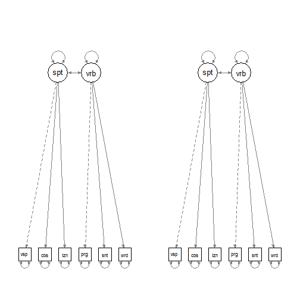
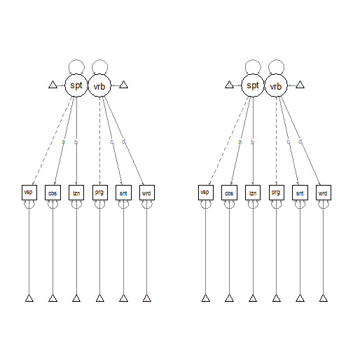
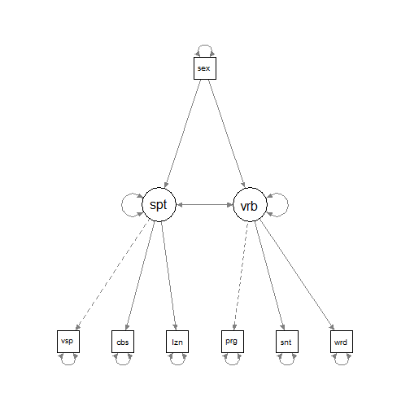
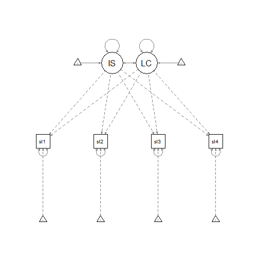
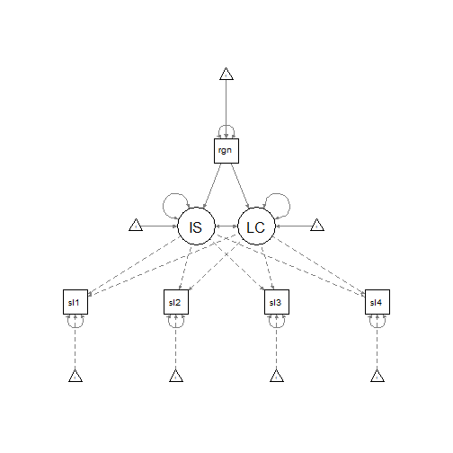

Questions about Rex Kline's book (for Tues., Nov. 26)
===============================================================================

> Read chapter 11 of Kline's book be prepared to answer the questions below. Please also do the data analysis exercise described at the end.


```r
# Preliminary steps
library(foreign)
library(lavaan)
library(semPlot)

# Make a function to print out the constrained/free parameters from a model.
inspect_parameters <- function(model) {
    param_table <- inspect(model, what = "list")
    # Simplify the table
    param_table <- transform(param_table, call = paste(lhs, op, rhs, sep = " "))
    param_table <- param_table[c("call", "free", "group", "user", "ustart")]
    # Sort by the `free` column
    param_table[order(param_table$free, param_table$call), ]
}

# Load the data-sets
d_intell_fem <- read.spss("../data/Grnt_fem.sav", to.data.frame = TRUE)
d_intell_mal <- read.spss("../data/Grnt_mal.sav", to.data.frame = TRUE)
d_intell_fem$gender <- "female"
d_intell_mal$gender <- "male"
d <- rbind(d_intell_fem, d_intell_mal)
# Make a numeric version of `gender`
d <- transform(d, sex = ifelse(gender == "female", 0, 1))

# Data for exercises 15-16
covmatrix <- matrix(c(6.5025, 4.79349, 4.652985, 4.37376, 0.19941, 4.79349, 
    5.8081, 4.521401, 4.391984, 0.22172, 4.652985, 4.521401, 6.6049, 5.1657, 
    0.242351, 4.37376, 4.391984, 5.1657, 7.1824, 0.295872, 0.19941, 0.22172, 
    0.242351, 0.295872, 0.0529), nrow = 5, dimnames = list(c("sales1", "sales2", 
    "sales3", "sales4", "region"), c("sales1", "sales2", "sales3", "sales4", 
    "region")))
myDataMeans <- c(6.08, 7.22, 8.14, 9.38, 0.48)
names(myDataMeans) <- c("sales1", "sales2", "sales3", "sales4", "region")
```


#### 1. Assuming you include a mean structure, how do you determine the model-implied (predicted) mean for a given variable?

The model-implied mean of X is the total effect of the constant variable ("1") on X. For an endogenous variable, this is the direct effect ("the intercept") plus the indirect effects (e.g., the mean of the exogenous variable Y ~ 1 times the path coefficient X ~ Y.)


#### 2. What is the mean of a variable assumed to be if it is excluded from the mean structure?

Zero.


#### 3. "A heavily over-identified covariance structure can compensate for a mildly under-identified mean structure, and vice versa." True or false?

False. "The identification status of a mean structure must be considered separately from that of the covariance structure" (p. 303).


#### 4. What are the implications of adding a just-identified mean structure for model fit? 

> In other words: If you add a just-identified mean structure, does this usually lead to A) better, B) worse, or C) equal model fit compared to the same model without mean structure?

The just-identified mean structure will precisely estimate the means of the observed variables. The covariance structure will not be affected by the added mean structure, so the model will have C) equal model fit compared to the same model without the mean structure. 


#### 5. Compare the advantages and disadvantages of HLM and SEM for the estimation of latent growth models.

+ SEM growth models require **time-structured data**. This means that the subjects are measured with uniform inter-measurement intervals. HLM does not require time-structured data.
+ HLM handles missing data and unbalanced data more flexibly than SEM.
+ SEM provides indices for evaluating whole-model fit.
+ SEM can handle multiple growth curves (multiple outcomes) simultaneously in a single model.
+ SEM can model factors as outcome variables. It can use factors as predictor variables as well, whereas HLM cannot, and it is generally easier to compute indirect effects among these latent factors.


#### 6. When we specify a latent growth model in SEM, do we usually allow the "Initial Status" factor and the "Linear Change" factor to covary? If not, why not? If yes, what is the meaning of this covariance?  

Yes. The covariance describes how much the Initial Status predicts later rates of Linear Change. It makes sense that the baseline level would be correlated with later changes away from that baseline level.


#### 7. Compare latent growth analysis in SEM with more traditional data analysis techniques, such as "repeated measures analysis of variance" (within-subject ANOVA), "multivariate analysis of variance" (MANOVA). What assumptions do these different techniques make for the measurement errors? How do they treat individual differences in growth trajectories?

SEM provides a mechanism for modeling measurement error, and we can allow measurement errors to covary with each other. ANOVA assumes that error variance is constant and independent (tough assumptions for repeated measures within subjects). MANOVA requires less strict assumptions (allowing non-independent errors). "Both ANOVA and MANOVA treat individual differences in growth trajectories as error variance" (p. 307) whereas latent growth models can model such differences.


#### 8. What would we do, if we wanted to estimate a curvilinear trend in addition to the linear trend specified in Figure 11.2? What would be the df of the model that includes also a curvilinear trend?

Figure 11.2 has:

```
P = (4 * 7) / 2 = 14.
Q = 2 factor variances + 4 measurement errors variances + 1 factor covariance + 
    3 error covariances + 2 factor means
Q = 12 
df = 14 - 12 = 2
```

Adding the quadratic change factor would also add:

```
Q_new = Q + 1 factor mean + 1 factor variance + 2 factor covariances
Q_new = 16
df = 14 - 16 = -2
```

#### 9. Consider the "intell" data we analyzed several weeks ago. Be prepared to draw on the blackboard a multi-group measurement model that allows us to test for configural invariance.

> As a reminder, we tested a CFA model with two factors and three indicators per factor. The factor "spatial" was assumed to influence the indicators "visperc", cubes", and "lozenges", and the factor "verbal" was assumed to influence the indicators "paragraph", "sentence", and "wordmean". There were two samples, women ("Grnt_fem.sav") and men ("Grnt_mal.sav"). We already did that. Just redraw the model we drew several weeks ago. What are the # of observations, # of estimated parameters, and df of this model? Is this model at least just-identified?


```r
# Configural invariance model
m_form <- '
  spatial =~ visperc + cubes + lozenges 
  verbal =~ paragrap + sentence + wordmean'
h_form <- cfa(m_form, data = d, likelihood = "wishart", group = "gender", 
              meanstructure = FALSE)
summary(h_form, standardized = TRUE, fit.measures = TRUE, rsquare = TRUE)
```

```
## lavaan (0.5-15) converged normally after 122 iterations
## 
##   Number of observations per group         
##   female                                            73
##   male                                              72
## 
##   Estimator                                         ML
##   Minimum Function Test Statistic               16.480
##   Degrees of freedom                                16
##   P-value (Chi-square)                           0.420
## 
## Chi-square for each group:
## 
##   female                                         7.853
##   male                                           8.627
## 
## Model test baseline model:
## 
##   Minimum Function Test Statistic              337.557
##   Degrees of freedom                                30
##   P-value                                        0.000
## 
## User model versus baseline model:
## 
##   Comparative Fit Index (CFI)                    0.998
##   Tucker-Lewis Index (TLI)                       0.997
## 
## Loglikelihood and Information Criteria:
## 
##   Loglikelihood user model (H0)              -2570.027
##   Loglikelihood unrestricted model (H1)      -2561.672
## 
##   Number of free parameters                         26
##   Akaike (AIC)                                5192.053
##   Bayesian (BIC)                              5269.087
##   Sample-size adjusted Bayesian (BIC)         5186.819
## 
## Root Mean Square Error of Approximation:
## 
##   RMSEA                                          0.020
##   90 Percent Confidence Interval          0.000  0.112
##   P-value RMSEA <= 0.05                          0.603
## 
## Standardized Root Mean Square Residual:
## 
##   SRMR                                           0.045
## 
## Parameter estimates:
## 
##   Information                                 Expected
##   Standard Errors                             Standard
## 
## Group 1 [female]:
## 
##                    Estimate  Std.err  Z-value  P(>|z|)   Std.lv  Std.all
## Latent variables:
##   spatial =~
##     visperc           1.000                               4.861    0.703
##     cubes             0.610    0.143    4.249    0.000    2.964    0.654
##     lozenges          1.198    0.272    4.405    0.000    5.824    0.736
##   verbal =~
##     paragrap          1.000                               3.133    0.880
##     sentence          1.334    0.160    8.321    0.000    4.180    0.827
##     wordmean          2.234    0.263    8.482    0.000    7.000    0.841
## 
## Covariances:
##   spatial ~~
##     verbal            7.417    2.607    2.845    0.004    0.487    0.487
## 
## Variances:
##     visperc          24.204    6.070                     24.204    0.506
##     cubes            11.763    2.620                     11.763    0.572
##     lozenges         28.668    8.002                     28.668    0.458
##     paragrap          2.873    0.881                      2.873    0.226
##     sentence          8.077    1.895                      8.077    0.316
##     wordmean         20.202    5.020                     20.202    0.292
##     spatial          23.626    8.237                      1.000    1.000
##     verbal            9.817    2.189                      1.000    1.000
## 
## 
## 
## Group 2 [male]:
## 
##                    Estimate  Std.err  Z-value  P(>|z|)   Std.lv  Std.all
## Latent variables:
##   spatial =~
##     visperc           1.000                               4.035    0.581
##     cubes             0.450    0.176    2.556    0.011    1.817    0.415
##     lozenges          1.510    0.461    3.273    0.001    6.095    0.708
##   verbal =~
##     paragrap          1.000                               2.646    0.863
##     sentence          1.275    0.171    7.463    0.000    3.375    0.806
##     wordmean          2.294    0.308    7.451    0.000    6.070    0.805
## 
## Covariances:
##   spatial ~~
##     verbal            6.937    2.404    2.886    0.004    0.650    0.650
## 
## Variances:
##     visperc          32.016    7.080                     32.016    0.663
##     cubes            15.914    2.945                     15.914    0.828
##     lozenges         37.041   11.694                     37.041    0.499
##     paragrap          2.397    0.737                      2.397    0.255
##     sentence          6.120    1.453                      6.120    0.350
##     wordmean         19.974    4.724                     19.974    0.352
##     spatial          16.284    7.622                      1.000    1.000
##     verbal            7.001    1.645                      1.000    1.000
## 
## R-Square Group female:
## 
##     visperc           0.494
##     cubes             0.428
##     lozenges          0.542
##     paragrap          0.774
##     sentence          0.684
##     wordmean          0.708
## 
## R-Square Group male:
## 
##     visperc           0.337
##     cubes             0.172
##     lozenges          0.501
##     paragrap          0.745
##     sentence          0.650
##     wordmean          0.648
```

```r
semPaths(h_form, panelGroups = TRUE, ask = FALSE, title = FALSE)
```

 


The model is over-identified.

```
P = (6 * 7) / 2 * 2 samples = 42
Q_base = 2 factor variances + 1 factor covariance + 
         4 factor loadings + 6 measurement errors
Q = 13 * 2 samples = 26
df = 42 - 26 = 16
```


#### 10. Modify this model to test for "construct-level metric invariance". 

> If you don't remember what this is, reread chapter 9 of Kline's book. You will have to constrain certain parameters to be the same across groups. Do so by assigning to them the same lower-case letter in both samples. What are the # of observations, # of estimated parameters, and df of this model? Is this model at least just-identified?

Construct-level metric invariance specifies equal factor loadings across both groups. We have to estimate four fewer parameters because the same factor loadings will be used for each sample. Therefore, P = 42, Q = 26 - 4 = 22, df = 16 + 4 = 20. The model is overidentified.


```r
m_lambda <- '
  spatial =~ visperc + c(a, a)*cubes + c(b, b)*lozenges 
  verbal =~ paragrap + c(c, c)*sentence + c(d, d)*wordmean'
h_lambda <- cfa(m_lambda, data = d, likelihood = "wishart", group = "gender", 
              meanstructure = FALSE)
inspect_parameters(h_lambda)
```

```
##                    call free group user ustart
## 1    spatial =~ visperc    0     1    1      1
## 16   spatial =~ visperc    0     2    1      1
## 4    verbal =~ paragrap    0     1    1      1
## 19   verbal =~ paragrap    0     2    1      1
## 2      spatial =~ cubes    1     1    1     NA
## 17     spatial =~ cubes    1     2    1     NA
## 3   spatial =~ lozenges    2     1    1     NA
## 18  spatial =~ lozenges    2     2    1     NA
## 5    verbal =~ sentence    3     1    1     NA
## 20   verbal =~ sentence    3     2    1     NA
## 6    verbal =~ wordmean    4     1    1     NA
## 21   verbal =~ wordmean    4     2    1     NA
## 7    visperc ~~ visperc    5     1    0     NA
## 8        cubes ~~ cubes    6     1    0     NA
## 9  lozenges ~~ lozenges    7     1    0     NA
## 10 paragrap ~~ paragrap    8     1    0     NA
## 11 sentence ~~ sentence    9     1    0     NA
## 12 wordmean ~~ wordmean   10     1    0     NA
## 13   spatial ~~ spatial   11     1    0     NA
## 14     verbal ~~ verbal   12     1    0     NA
## 15    spatial ~~ verbal   13     1    0     NA
## 22   visperc ~~ visperc   14     2    0     NA
## 23       cubes ~~ cubes   15     2    0     NA
## 24 lozenges ~~ lozenges   16     2    0     NA
## 25 paragrap ~~ paragrap   17     2    0     NA
## 26 sentence ~~ sentence   18     2    0     NA
## 27 wordmean ~~ wordmean   19     2    0     NA
## 28   spatial ~~ spatial   20     2    0     NA
## 29     verbal ~~ verbal   21     2    0     NA
## 30    spatial ~~ verbal   22     2    0     NA
```

```r
summary(h_lambda, standardized = TRUE, fit.measures = TRUE, rsquare = TRUE)
```

```
## lavaan (0.5-15) converged normally after 113 iterations
## 
##   Number of observations per group         
##   female                                            73
##   male                                              72
## 
##   Estimator                                         ML
##   Minimum Function Test Statistic               18.291
##   Degrees of freedom                                20
##   P-value (Chi-square)                           0.568
## 
## Chi-square for each group:
## 
##   female                                         8.554
##   male                                           9.737
## 
## Model test baseline model:
## 
##   Minimum Function Test Statistic              337.557
##   Degrees of freedom                                30
##   P-value                                        0.000
## 
## User model versus baseline model:
## 
##   Comparative Fit Index (CFI)                    1.000
##   Tucker-Lewis Index (TLI)                       1.008
## 
## Loglikelihood and Information Criteria:
## 
##   Loglikelihood user model (H0)              -2570.945
##   Loglikelihood unrestricted model (H1)      -2561.672
## 
##   Number of free parameters                         22
##   Akaike (AIC)                                5185.891
##   Bayesian (BIC)                              5251.073
##   Sample-size adjusted Bayesian (BIC)         5181.462
## 
## Root Mean Square Error of Approximation:
## 
##   RMSEA                                          0.000
##   90 Percent Confidence Interval          0.000  0.092
##   P-value RMSEA <= 0.05                          0.749
## 
## Standardized Root Mean Square Residual:
## 
##   SRMR                                           0.053
## 
## Parameter estimates:
## 
##   Information                                 Expected
##   Standard Errors                             Standard
## 
## Group 1 [female]:
## 
##                    Estimate  Std.err  Z-value  P(>|z|)   Std.lv  Std.all
## Latent variables:
##   spatial =~
##     visperc           1.000                               4.723    0.684
##     cubes     (a)     0.557    0.114    4.890    0.000    2.631    0.596
##     lozenges  (b)     1.327    0.248    5.349    0.000    6.266    0.778
##   verbal =~
##     paragrap          1.000                               3.140    0.880
##     sentence  (c)     1.305    0.117   11.157    0.000    4.098    0.819
##     wordmean  (d)     2.260    0.200   11.296    0.000    7.097    0.847
## 
## Covariances:
##   spatial ~~
##     verbal            7.325    2.492    2.939    0.003    0.494    0.494
## 
## Variances:
##     visperc          25.430    5.913                     25.430    0.533
##     cubes            12.554    2.516                     12.554    0.645
##     lozenges         25.595    8.152                     25.595    0.395
##     paragrap          2.874    0.845                      2.874    0.226
##     sentence          8.228    1.841                      8.228    0.329
##     wordmean         19.821    4.905                     19.821    0.282
##     spatial          22.307    7.176                      1.000    1.000
##     verbal            9.859    2.053                      1.000    1.000
## 
## 
## 
## Group 2 [male]:
## 
##                    Estimate  Std.err  Z-value  P(>|z|)   Std.lv  Std.all
## Latent variables:
##   spatial =~
##     visperc           1.000                               4.051    0.582
##     cubes     (a)     0.557    0.114    4.890    0.000    2.257    0.498
##     lozenges  (b)     1.327    0.248    5.349    0.000    5.375    0.640
##   verbal =~
##     paragrap          1.000                               2.639    0.863
##     sentence  (c)     1.305    0.117   11.157    0.000    3.444    0.814
##     wordmean  (d)     2.260    0.200   11.296    0.000    5.965    0.799
## 
## Covariances:
##   spatial ~~
##     verbal            7.095    2.119    3.348    0.001    0.664    0.664
## 
## Variances:
##     visperc          32.007    6.775                     32.007    0.661
##     cubes            15.460    2.975                     15.460    0.752
##     lozenges         41.551    9.825                     41.551    0.590
##     paragrap          2.396    0.690                      2.396    0.256
##     sentence          6.038    1.418                      6.038    0.337
##     wordmean         20.218    4.533                     20.218    0.362
##     spatial          16.411    5.968                      1.000    1.000
##     verbal            6.966    1.486                      1.000    1.000
## 
## R-Square Group female:
## 
##     visperc           0.467
##     cubes             0.355
##     lozenges          0.605
##     paragrap          0.774
##     sentence          0.671
##     wordmean          0.718
## 
## R-Square Group male:
## 
##     visperc           0.339
##     cubes             0.248
##     lozenges          0.410
##     paragrap          0.744
##     sentence          0.663
##     wordmean          0.638
```

```r
# semPaths(h_lambda, panelGroups = TRUE, ask = FALSE, title = FALSE)
```


The chi-square difference test indicates that the fit is not significantly worse, so H-lambda is retained.


```r
anova(h_form, h_lambda)
```

```
## Chi Square Difference Test
## 
##          Df  AIC  BIC Chisq Chisq diff Df diff Pr(>Chisq)
## h_form   16 5192 5269  16.5                              
## h_lambda 20 5186 5251  18.3       1.81       4       0.77
```


#### 11. Add a mean structure to the previous model. In each sample, specify a path from the constant to each of the six indicators and to each of the two factors. 


```r
# Write out the model syntax long-hand
m_lambda_1s <- '
  spatial =~ visperc + c(a, a)*cubes + c(b, b)*lozenges 
  verbal =~ paragrap + c(c, c)*sentence + c(d, d)*wordmean
  paragrap + sentence + wordmean + visperc + cubes + lozenges ~ 1
  spatial + verbal ~ 1'
# I think the under-indentified mean structure upsets lavaan
h_lambda_1s <- cfa(m_lambda_1s, data = d, likelihood = "wishart", group = "gender")
```

```
## Warning: lavaan WARNING: could not compute standard errors!
```

```r
inspect_parameters(h_lambda_1s)
```

```
##                    call free group user ustart
## 1    spatial =~ visperc    0     1    1      1
## 24   spatial =~ visperc    0     2    1      1
## 4    verbal =~ paragrap    0     1    1      1
## 27   verbal =~ paragrap    0     2    1      1
## 2      spatial =~ cubes    1     1    1     NA
## 25     spatial =~ cubes    1     2    1     NA
## 3   spatial =~ lozenges    2     1    1     NA
## 26  spatial =~ lozenges    2     2    1     NA
## 5    verbal =~ sentence    3     1    1     NA
## 28   verbal =~ sentence    3     2    1     NA
## 6    verbal =~ wordmean    4     1    1     NA
## 29   verbal =~ wordmean    4     2    1     NA
## 7          paragrap ~1     5     1    1     NA
## 8          sentence ~1     6     1    1     NA
## 9          wordmean ~1     7     1    1     NA
## 10          visperc ~1     8     1    1     NA
## 11            cubes ~1     9     1    1     NA
## 12         lozenges ~1    10     1    1     NA
## 13          spatial ~1    11     1    1     NA
## 14           verbal ~1    12     1    1     NA
## 15   visperc ~~ visperc   13     1    0     NA
## 16       cubes ~~ cubes   14     1    0     NA
## 17 lozenges ~~ lozenges   15     1    0     NA
## 18 paragrap ~~ paragrap   16     1    0     NA
## 19 sentence ~~ sentence   17     1    0     NA
## 20 wordmean ~~ wordmean   18     1    0     NA
## 21   spatial ~~ spatial   19     1    0     NA
## 22     verbal ~~ verbal   20     1    0     NA
## 23    spatial ~~ verbal   21     1    0     NA
## 30         paragrap ~1    22     2    1     NA
## 31         sentence ~1    23     2    1     NA
## 32         wordmean ~1    24     2    1     NA
## 33          visperc ~1    25     2    1     NA
## 34            cubes ~1    26     2    1     NA
## 35         lozenges ~1    27     2    1     NA
## 36          spatial ~1    28     2    1     NA
## 37           verbal ~1    29     2    1     NA
## 38   visperc ~~ visperc   30     2    0     NA
## 39       cubes ~~ cubes   31     2    0     NA
## 40 lozenges ~~ lozenges   32     2    0     NA
## 41 paragrap ~~ paragrap   33     2    0     NA
## 42 sentence ~~ sentence   34     2    0     NA
## 43 wordmean ~~ wordmean   35     2    0     NA
## 44   spatial ~~ spatial   36     2    0     NA
## 45     verbal ~~ verbal   37     2    0     NA
## 46    spatial ~~ verbal   38     2    0     NA
```

```r
summary(h_lambda_1s, standardized = TRUE, fit.measures = TRUE, rsquare = TRUE)
```

```
## lavaan (0.5-15) converged normally after 113 iterations
## 
##   Number of observations per group         
##   female                                            73
##   male                                              72
## 
##   Estimator                                         ML
##   Minimum Function Test Statistic               18.291
##   Degrees of freedom                                16
##   P-value (Chi-square)                           0.307
## 
## Chi-square for each group:
## 
##   female                                         8.554
##   male                                           9.737
## 
## Model test baseline model:
## 
##   Minimum Function Test Statistic              337.557
##   Degrees of freedom                                30
##   P-value                                        0.000
## 
## User model versus baseline model:
## 
##   Comparative Fit Index (CFI)                    0.993
##   Tucker-Lewis Index (TLI)                       0.986
## 
## Loglikelihood and Information Criteria:
## 
##   Loglikelihood user model (H0)              -2570.945
##   Loglikelihood unrestricted model (H1)      -2561.672
## 
##   Number of free parameters                         38
##   Akaike (AIC)                                5217.891
##   Bayesian (BIC)                              5330.479
##   Sample-size adjusted Bayesian (BIC)         5210.240
## 
## Root Mean Square Error of Approximation:
## 
##   RMSEA                                          0.045
##   90 Percent Confidence Interval          0.000  0.122
##   P-value RMSEA <= 0.05                          0.489
## 
## Standardized Root Mean Square Residual:
## 
##   SRMR                                           0.047
## 
## Parameter estimates:
## 
##   Information                                 Expected
##   Standard Errors                             Standard
## 
## Group 1 [female]:
## 
##                    Estimate  Std.err  Z-value  P(>|z|)   Std.lv  Std.all
## Latent variables:
##   spatial =~
##     visperc           1.000                               4.723    0.684
##     cubes     (a)     0.557                               2.631    0.596
##     lozenges  (b)     1.327                               6.266    0.778
##   verbal =~
##     paragrap          1.000                               3.140    0.880
##     sentence  (c)     1.305                               4.098    0.819
##     wordmean  (d)     2.260                               7.097    0.847
## 
## Covariances:
##   spatial ~~
##     verbal            7.325                               0.494    0.494
## 
## Intercepts:
##     paragrap         10.589                              10.589    2.968
##     sentence         19.301                              19.301    3.859
##     wordmean         18.014                              18.014    2.150
##     visperc          29.315                              29.315    4.243
##     cubes            24.699                              24.699    5.597
##     lozenges         14.836                              14.836    1.842
##     spatial           0.000                               0.000    0.000
##     verbal            0.000                               0.000    0.000
## 
## Variances:
##     visperc          25.430                              25.430    0.533
##     cubes            12.554                              12.554    0.645
##     lozenges         25.595                              25.595    0.395
##     paragrap          2.874                               2.874    0.226
##     sentence          8.228                               8.228    0.329
##     wordmean         19.821                              19.821    0.282
##     spatial          22.307                               1.000    1.000
##     verbal            9.859                               1.000    1.000
## 
## 
## 
## Group 2 [male]:
## 
##                    Estimate  Std.err  Z-value  P(>|z|)   Std.lv  Std.all
## Latent variables:
##   spatial =~
##     visperc           1.000                               4.051    0.582
##     cubes     (a)     0.557                               2.257    0.498
##     lozenges  (b)     1.327                               5.375    0.640
##   verbal =~
##     paragrap          1.000                               2.639    0.863
##     sentence  (c)     1.305                               3.444    0.814
##     wordmean  (d)     2.260                               5.965    0.799
## 
## Covariances:
##   spatial ~~
##     verbal            7.095                               0.664    0.664
## 
## Intercepts:
##     paragrap          9.306                               9.306    3.041
##     sentence         18.389                              18.389    4.346
##     wordmean         16.542                              16.542    2.214
##     visperc          29.847                              29.847    4.289
##     cubes            24.903                              24.903    5.493
##     lozenges         17.111                              17.111    2.039
##     spatial           0.000                               0.000    0.000
##     verbal            0.000                               0.000    0.000
## 
## Variances:
##     visperc          32.007                              32.007    0.661
##     cubes            15.460                              15.460    0.752
##     lozenges         41.551                              41.551    0.590
##     paragrap          2.396                               2.396    0.256
##     sentence          6.038                               6.038    0.337
##     wordmean         20.218                              20.218    0.362
##     spatial          16.411                               1.000    1.000
##     verbal            6.966                               1.000    1.000
## 
## R-Square Group female:
## 
##     visperc           0.467
##     cubes             0.355
##     lozenges          0.605
##     paragrap          0.774
##     sentence          0.671
##     wordmean          0.718
## 
## R-Square Group male:
## 
##     visperc           0.339
##     cubes             0.248
##     lozenges          0.410
##     paragrap          0.744
##     sentence          0.663
##     wordmean          0.638
```

```r
semPaths(h_lambda_1s, panelGroups = TRUE, ask = FALSE, title = FALSE)
```

 


> What are the # of observations, # of estimated parameters, and df of the covariance structure? Is the covariance structure at least just-identified? 

The covariance structure is unaffected. P = 42, Q = 22, df = 20. It is over-identified.

> What are the # of observations, # of estimated parameters, and df of the mean structure? Is the mean structure at least just-identified? 

The mean structure is under-identified.

```
P = 6 means * 2 samples = 12
Q = (6 indicators means + 2 factor means) * 2 samples = 16
df = -4
```

> What are the # of observations, # of estimated parameters, and df of the total model? Is the total model at least just-identified?

The total model is over-indentified.

```
P = 54
Q = 22 covariance parameters + 16 mean parameters = 38
df = 16
```


#### 12. Modify the model so that we can test whether there are gender differences on the two factors. 

> You'll find detailed instructions on the bottom half of page 317 and on the bottom half of page 318 in Kline's book. Make sure both the covariance structure and the mean structure are at least just-identified. Once you are done, determine the df for the entire model.  

First, we should test if we can use the same intercepts for the two groups. We do this taking our `h_lambda` model (with the equal loadings for the two groups) and adding on a mean structure. We compare a mean structure with freely estimated intercepts to one with equal intercepts for the two groups. 


```r
m_lambda_tau <- '
  spatial =~ visperc + cubes + lozenges 
  verbal =~ paragrap + sentence + wordmean
  verbal ~ c(a, b)*1
  spatial ~ c(c, d)*1'
# Freely estimated intercepts
h_form_mean <- cfa(m_lambda_tau, data = d, likelihood = "wishart", 
                    group = "gender", group.equal = c("loadings"))
```

```
## Warning: lavaan WARNING: could not compute standard errors!
```

```r
inspect_parameters(h_form_mean)
```

```
##                    call free group user ustart
## 1    spatial =~ visperc    0     1    1      1
## 24   spatial =~ visperc    0     2    1      1
## 4    verbal =~ paragrap    0     1    1      1
## 27   verbal =~ paragrap    0     2    1      1
## 2      spatial =~ cubes    1     1    1     NA
## 25     spatial =~ cubes    1     2    1     NA
## 3   spatial =~ lozenges    2     1    1     NA
## 26  spatial =~ lozenges    2     2    1     NA
## 5    verbal =~ sentence    3     1    1     NA
## 28   verbal =~ sentence    3     2    1     NA
## 6    verbal =~ wordmean    4     1    1     NA
## 29   verbal =~ wordmean    4     2    1     NA
## 7            verbal ~1     5     1    1     NA
## 8           spatial ~1     6     1    1     NA
## 9    visperc ~~ visperc    7     1    0     NA
## 10       cubes ~~ cubes    8     1    0     NA
## 11 lozenges ~~ lozenges    9     1    0     NA
## 12 paragrap ~~ paragrap   10     1    0     NA
## 13 sentence ~~ sentence   11     1    0     NA
## 14 wordmean ~~ wordmean   12     1    0     NA
## 15   spatial ~~ spatial   13     1    0     NA
## 16     verbal ~~ verbal   14     1    0     NA
## 17    spatial ~~ verbal   15     1    0     NA
## 18          visperc ~1    16     1    0     NA
## 19            cubes ~1    17     1    0     NA
## 20         lozenges ~1    18     1    0     NA
## 21         paragrap ~1    19     1    0     NA
## 22         sentence ~1    20     1    0     NA
## 23         wordmean ~1    21     1    0     NA
## 30           verbal ~1    22     2    1     NA
## 31          spatial ~1    23     2    1     NA
## 32   visperc ~~ visperc   24     2    0     NA
## 33       cubes ~~ cubes   25     2    0     NA
## 34 lozenges ~~ lozenges   26     2    0     NA
## 35 paragrap ~~ paragrap   27     2    0     NA
## 36 sentence ~~ sentence   28     2    0     NA
## 37 wordmean ~~ wordmean   29     2    0     NA
## 38   spatial ~~ spatial   30     2    0     NA
## 39     verbal ~~ verbal   31     2    0     NA
## 40    spatial ~~ verbal   32     2    0     NA
## 41          visperc ~1    33     2    0     NA
## 42            cubes ~1    34     2    0     NA
## 43         lozenges ~1    35     2    0     NA
## 44         paragrap ~1    36     2    0     NA
## 45         sentence ~1    37     2    0     NA
## 46         wordmean ~1    38     2    0     NA
```

```r
# semPaths(h_form_mean, panelGroups = TRUE, ask = FALSE, title = FALSE)
# Now we constrain the intercepts to be the same for each group
h_lambda_tau <- cfa(m_lambda_tau, data = d, likelihood = "wishart", 
                    group = "gender", group.equal = c("loadings", "intercepts"))
```

```
## Warning: lavaan WARNING: could not compute standard errors!
```

```r
inspect_parameters(h_lambda_tau)
```

```
##                    call free group user ustart
## 1    spatial =~ visperc    0     1    1      1
## 24   spatial =~ visperc    0     2    1      1
## 4    verbal =~ paragrap    0     1    1      1
## 27   verbal =~ paragrap    0     2    1      1
## 2      spatial =~ cubes    1     1    1     NA
## 25     spatial =~ cubes    1     2    1     NA
## 3   spatial =~ lozenges    2     1    1     NA
## 26  spatial =~ lozenges    2     2    1     NA
## 5    verbal =~ sentence    3     1    1     NA
## 28   verbal =~ sentence    3     2    1     NA
## 6    verbal =~ wordmean    4     1    1     NA
## 29   verbal =~ wordmean    4     2    1     NA
## 7            verbal ~1     5     1    1     NA
## 8           spatial ~1     6     1    1     NA
## 9    visperc ~~ visperc    7     1    0     NA
## 10       cubes ~~ cubes    8     1    0     NA
## 11 lozenges ~~ lozenges    9     1    0     NA
## 12 paragrap ~~ paragrap   10     1    0     NA
## 13 sentence ~~ sentence   11     1    0     NA
## 14 wordmean ~~ wordmean   12     1    0     NA
## 15   spatial ~~ spatial   13     1    0     NA
## 16     verbal ~~ verbal   14     1    0     NA
## 17    spatial ~~ verbal   15     1    0     NA
## 18          visperc ~1    16     1    0     NA
## 41          visperc ~1    16     2    0     NA
## 19            cubes ~1    17     1    0     NA
## 42            cubes ~1    17     2    0     NA
## 20         lozenges ~1    18     1    0     NA
## 43         lozenges ~1    18     2    0     NA
## 21         paragrap ~1    19     1    0     NA
## 44         paragrap ~1    19     2    0     NA
## 22         sentence ~1    20     1    0     NA
## 45         sentence ~1    20     2    0     NA
## 23         wordmean ~1    21     1    0     NA
## 46         wordmean ~1    21     2    0     NA
## 30           verbal ~1    22     2    1     NA
## 31          spatial ~1    23     2    1     NA
## 32   visperc ~~ visperc   24     2    0     NA
## 33       cubes ~~ cubes   25     2    0     NA
## 34 lozenges ~~ lozenges   26     2    0     NA
## 35 paragrap ~~ paragrap   27     2    0     NA
## 36 sentence ~~ sentence   28     2    0     NA
## 37 wordmean ~~ wordmean   29     2    0     NA
## 38   spatial ~~ spatial   30     2    0     NA
## 39     verbal ~~ verbal   31     2    0     NA
## 40    spatial ~~ verbal   32     2    0     NA
```

```r
summary(h_lambda_tau, standardized = TRUE, fit.measures = TRUE, rsquare = TRUE)
```

```
## lavaan (0.5-15) converged normally after 133 iterations
## 
##   Number of observations per group         
##   female                                            73
##   male                                              72
## 
##   Estimator                                         ML
##   Minimum Function Test Statistic               22.536
##   Degrees of freedom                                22
##   P-value (Chi-square)                           0.428
## 
## Chi-square for each group:
## 
##   female                                        10.878
##   male                                          11.658
## 
## Model test baseline model:
## 
##   Minimum Function Test Statistic              337.557
##   Degrees of freedom                                30
##   P-value                                        0.000
## 
## User model versus baseline model:
## 
##   Comparative Fit Index (CFI)                    0.998
##   Tucker-Lewis Index (TLI)                       0.998
## 
## Loglikelihood and Information Criteria:
## 
##   Loglikelihood user model (H0)              -2573.097
##   Loglikelihood unrestricted model (H1)      -2561.672
## 
##   Number of free parameters                         32
##   Akaike (AIC)                                5210.194
##   Bayesian (BIC)                              5305.005
##   Sample-size adjusted Bayesian (BIC)         5203.752
## 
## Root Mean Square Error of Approximation:
## 
##   RMSEA                                          0.018
##   90 Percent Confidence Interval          0.000  0.101
##   P-value RMSEA <= 0.05                          0.641
## 
## Standardized Root Mean Square Residual:
## 
##   SRMR                                           0.051
## 
## Parameter estimates:
## 
##   Information                                 Expected
##   Standard Errors                             Standard
## 
## Group 1 [female]:
## 
##                    Estimate  Std.err  Z-value  P(>|z|)   Std.lv  Std.all
## Latent variables:
##   spatial =~
##     visperc           1.000                               4.636    0.673
##     cubes             0.557                               2.582    0.586
##     lozenges          1.371                               6.358    0.786
##   verbal =~
##     paragrap          1.000                               3.176    0.882
##     sentence          1.279                               4.062    0.815
##     wordmean          2.211                               7.020    0.842
## 
## Covariances:
##   spatial ~~
##     verbal            7.286                               0.495    0.495
## 
## Intercepts:
##     verbal    (a)     0.479                               0.151    0.151
##     spatial   (c)    -0.541                              -0.117   -0.117
##     visperc          29.621                              29.621    4.300
##     cubes            24.826                              24.826    5.638
##     lozenges         15.883                              15.883    1.964
##     paragrap          9.932                               9.932    2.758
##     sentence         18.866                              18.866    3.786
##     wordmean         17.269                              17.269    2.072
## 
## Variances:
##     visperc          25.967                              25.967    0.547
##     cubes            12.722                              12.722    0.656
##     lozenges         25.000                              25.000    0.382
##     paragrap          2.878                               2.878    0.222
##     sentence          8.325                               8.325    0.335
##     wordmean         20.153                              20.153    0.290
##     spatial          21.493                               1.000    1.000
##     verbal           10.085                               1.000    1.000
## 
## 
## 
## Group 2 [male]:
## 
##                    Estimate  Std.err  Z-value  P(>|z|)   Std.lv  Std.all
## Latent variables:
##   spatial =~
##     visperc           1.000                               3.997    0.575
##     cubes             0.557                               2.226    0.492
##     lozenges          1.371                               5.482    0.649
##   verbal =~
##     paragrap          1.000                               2.669    0.866
##     sentence          1.279                               3.414    0.810
##     wordmean          2.211                               5.899    0.793
## 
## Covariances:
##   spatial ~~
##     verbal            7.080                               0.664    0.664
## 
## Intercepts:
##     verbal    (b)    -0.477                              -0.179   -0.179
##     spatial   (d)     0.524                               0.131    0.131
##     visperc          29.621                              29.621    4.262
##     cubes            24.826                              24.826    5.486
##     lozenges         15.883                              15.883    1.880
##     paragrap          9.932                               9.932    3.222
##     sentence         18.866                              18.866    4.477
##     wordmean         17.269                              17.269    2.320
## 
## Variances:
##     visperc          32.311                              32.311    0.669
##     cubes            15.521                              15.521    0.758
##     lozenges         41.287                              41.287    0.579
##     paragrap          2.382                               2.382    0.251
##     sentence          6.107                               6.107    0.344
##     wordmean         20.607                              20.607    0.372
##     spatial          15.980                               1.000    1.000
##     verbal            7.122                               1.000    1.000
## 
## R-Square Group female:
## 
##     visperc           0.453
##     cubes             0.344
##     lozenges          0.618
##     paragrap          0.778
##     sentence          0.665
##     wordmean          0.710
## 
## R-Square Group male:
## 
##     visperc           0.331
##     cubes             0.242
##     lozenges          0.421
##     paragrap          0.749
##     sentence          0.656
##     wordmean          0.628
```

```r
# semPaths(h_lambda_tau, panelGroups = TRUE, ask = FALSE, title = FALSE)
anova(h_form_mean, h_lambda_tau)
```

```
## Chi Square Difference Test
## 
##              Df  AIC  BIC Chisq Chisq diff Df diff Pr(>Chisq)
## h_form_mean  16 5218 5331  18.3                              
## h_lambda_tau 22 5210 5305  22.5       4.24       6       0.64
```


`h_lambda_tau` is retained, meaning that we can use the same intercepts and factor loadings for the two groups. 

Now we investigate whether there is a difference between the groups.


```r
m_factor_means <- '
  spatial =~ visperc + cubes + lozenges 
  verbal =~ paragrap + sentence + wordmean
  verbal ~ c(a, b)*1
  spatial ~ c(c, d)*1
  a == 0
  c == 0'
h_factor_means <- cfa(m_factor_means, data = d, likelihood = "wishart", 
                      group = "gender", group.equal = c("loadings", "intercepts"))
inspect_parameters(h_factor_means)
```

```
##                    call free group user ustart
## 47               a == 0    0     0    1     NA
## 48               c == 0    0     0    1     NA
## 1    spatial =~ visperc    0     1    1      1
## 24   spatial =~ visperc    0     2    1      1
## 4    verbal =~ paragrap    0     1    1      1
## 27   verbal =~ paragrap    0     2    1      1
## 2      spatial =~ cubes    1     1    1     NA
## 25     spatial =~ cubes    1     2    1     NA
## 3   spatial =~ lozenges    2     1    1     NA
## 26  spatial =~ lozenges    2     2    1     NA
## 5    verbal =~ sentence    3     1    1     NA
## 28   verbal =~ sentence    3     2    1     NA
## 6    verbal =~ wordmean    4     1    1     NA
## 29   verbal =~ wordmean    4     2    1     NA
## 7            verbal ~1     5     1    1     NA
## 8           spatial ~1     6     1    1     NA
## 9    visperc ~~ visperc    7     1    0     NA
## 10       cubes ~~ cubes    8     1    0     NA
## 11 lozenges ~~ lozenges    9     1    0     NA
## 12 paragrap ~~ paragrap   10     1    0     NA
## 13 sentence ~~ sentence   11     1    0     NA
## 14 wordmean ~~ wordmean   12     1    0     NA
## 15   spatial ~~ spatial   13     1    0     NA
## 16     verbal ~~ verbal   14     1    0     NA
## 17    spatial ~~ verbal   15     1    0     NA
## 18          visperc ~1    16     1    0     NA
## 41          visperc ~1    16     2    0     NA
## 19            cubes ~1    17     1    0     NA
## 42            cubes ~1    17     2    0     NA
## 20         lozenges ~1    18     1    0     NA
## 43         lozenges ~1    18     2    0     NA
## 21         paragrap ~1    19     1    0     NA
## 44         paragrap ~1    19     2    0     NA
## 22         sentence ~1    20     1    0     NA
## 45         sentence ~1    20     2    0     NA
## 23         wordmean ~1    21     1    0     NA
## 46         wordmean ~1    21     2    0     NA
## 30           verbal ~1    22     2    1     NA
## 31          spatial ~1    23     2    1     NA
## 32   visperc ~~ visperc   24     2    0     NA
## 33       cubes ~~ cubes   25     2    0     NA
## 34 lozenges ~~ lozenges   26     2    0     NA
## 35 paragrap ~~ paragrap   27     2    0     NA
## 36 sentence ~~ sentence   28     2    0     NA
## 37 wordmean ~~ wordmean   29     2    0     NA
## 38   spatial ~~ spatial   30     2    0     NA
## 39     verbal ~~ verbal   31     2    0     NA
## 40    spatial ~~ verbal   32     2    0     NA
```

```r
summary(h_factor_means, standardized = TRUE, fit.measures = TRUE, rsquare = TRUE)
```

```
## lavaan (0.5-15) converged normally after 567 iterations
## 
##   Number of observations per group         
##   female                                            73
##   male                                              72
## 
##   Estimator                                         ML
##   Minimum Function Test Statistic               22.536
##   Degrees of freedom                                24
##   P-value (Chi-square)                           0.547
## 
## Chi-square for each group:
## 
##   female                                        10.878
##   male                                          11.658
## 
## Model test baseline model:
## 
##   Minimum Function Test Statistic              337.557
##   Degrees of freedom                                30
##   P-value                                        0.000
## 
## User model versus baseline model:
## 
##   Comparative Fit Index (CFI)                    1.000
##   Tucker-Lewis Index (TLI)                       1.006
## 
## Loglikelihood and Information Criteria:
## 
##   Loglikelihood user model (H0)              -2573.097
##   Loglikelihood unrestricted model (H1)      -2561.672
## 
##   Number of free parameters                         30
##   Akaike (AIC)                                5206.194
##   Bayesian (BIC)                              5295.080
##   Sample-size adjusted Bayesian (BIC)         5200.155
## 
## Root Mean Square Error of Approximation:
## 
##   RMSEA                                          0.000
##   90 Percent Confidence Interval          0.000  0.089
##   P-value RMSEA <= 0.05                          0.749
## 
## Standardized Root Mean Square Residual:
## 
##   SRMR                                           0.051
## 
## Parameter estimates:
## 
##   Information                                 Expected
##   Standard Errors                             Standard
## 
## Group 1 [female]:
## 
##                    Estimate  Std.err  Z-value  P(>|z|)   Std.lv  Std.all
## Latent variables:
##   spatial =~
##     visperc           1.000                               4.637    0.673
##     cubes             0.557    0.114    4.866    0.000    2.582    0.586
##     lozenges          1.371    0.255    5.370    0.000    6.358    0.786
##   verbal =~
##     paragrap          1.000                               3.176    0.882
##     sentence          1.279    0.114   11.266    0.000    4.062    0.815
##     wordmean          2.211    0.194   11.389    0.000    7.020    0.842
## 
## Covariances:
##   spatial ~~
##     verbal            7.288    2.483    2.935    0.003    0.495    0.495
## 
## Intercepts:
##     verbal    (a)     0.000    0.000    7.677    0.000    0.000    0.000
##     spatial   (c)     0.000    0.000    6.640    0.000    0.000    0.000
##     visperc          29.079    0.743   39.161    0.000   29.079    4.221
##     cubes            24.525    0.455   53.877    0.000   24.525    5.569
##     lozenges         15.140    0.920   16.459    0.000   15.140    1.872
##     paragrap         10.411    0.411   25.359    0.000   10.411    2.892
##     sentence         19.479    0.546   35.684    0.000   19.479    3.909
##     wordmean         18.328    0.932   19.657    0.000   18.328    2.200
## 
## Variances:
##     visperc          25.965    5.911                     25.965    0.547
##     cubes            12.722    2.524                     12.722    0.656
##     lozenges         25.002    8.305                     25.002    0.382
##     paragrap          2.878    0.865                      2.878    0.222
##     sentence          8.325    1.850                      8.325    0.335
##     wordmean         20.153    4.921                     20.153    0.290
##     spatial          21.501    6.972                      1.000    1.000
##     verbal           10.085    2.092                      1.000    1.000
## 
## 
## 
## Group 2 [male]:
## 
##                    Estimate  Std.err  Z-value  P(>|z|)   Std.lv  Std.all
## Latent variables:
##   spatial =~
##     visperc           1.000                               3.997    0.575
##     cubes             0.557    0.114    4.866    0.000    2.226    0.492
##     lozenges          1.371    0.255    5.370    0.000    5.481    0.649
##   verbal =~
##     paragrap          1.000                               2.669    0.866
##     sentence          1.279    0.114   11.266    0.000    3.414    0.810
##     wordmean          2.211    0.194   11.389    0.000    5.899    0.793
## 
## Covariances:
##   spatial ~~
##     verbal            7.079    2.119    3.341    0.001    0.664    0.664
## 
## Intercepts:
##     verbal    (b)    -0.956    0.524   -1.823    0.068   -0.358   -0.358
##     spatial   (d)     1.066    0.887    1.201    0.230    0.267    0.267
##     visperc          29.079    0.743   39.161    0.000   29.079    4.185
##     cubes            24.525    0.455   53.877    0.000   24.525    5.420
##     lozenges         15.140    0.920   16.459    0.000   15.140    1.793
##     paragrap         10.411    0.411   25.359    0.000   10.411    3.377
##     sentence         19.479    0.546   35.684    0.000   19.479    4.622
##     wordmean         18.328    0.932   19.657    0.000   18.328    2.462
## 
## Variances:
##     visperc          32.311    6.766                     32.311    0.669
##     cubes            15.521    2.972                     15.521    0.758
##     lozenges         41.293    9.967                     41.293    0.579
##     paragrap          2.382    0.702                      2.382    0.251
##     sentence          6.107    1.422                      6.107    0.344
##     wordmean         20.607    4.567                     20.607    0.372
##     spatial          15.976    5.838                      1.000    1.000
##     verbal            7.121    1.512                      1.000    1.000
## 
## 
## Constraints:                               Slack (>=0)
##     a - 0                                        0.000
##     c - 0                                        0.000
## 
## R-Square Group female:
## 
##     visperc           0.453
##     cubes             0.344
##     lozenges          0.618
##     paragrap          0.778
##     sentence          0.665
##     wordmean          0.710
## 
## R-Square Group male:
## 
##     visperc           0.331
##     cubes             0.242
##     lozenges          0.421
##     paragrap          0.749
##     sentence          0.656
##     wordmean          0.628
```

```r
# semPaths(h_factor_means, panelGroups = TRUE, ask = FALSE, title = FALSE)
```


The male subjects had a mean spatial factor 1.01 units higher than the female subjects, but this difference is not significant, z = 1.2, p = 0.23. The female subjects had a mean verbal factor 0.96 units higher than the male subjects, and this difference falls just short of achieving significance, z = 1.82, p = 0.068. 

```
Group 1 [female]:
Intercepts:        Estimate  Std.err  Z-value  P(>|z|)   Std.lv  Std.all
    verbal    (a)     0.000    0.000    7.677    0.000    0.000    0.000
    spatial   (c)     0.000    0.000    6.640    0.000    0.000    0.000
Group 2 [male]:
Intercepts:
    verbal    (b)    -0.956    0.524   -1.823    0.068   -0.358   -0.358
    spatial   (d)     1.066    0.887    1.201    0.230    0.267    0.267
```


```
P_mean = 6 * 2 samples = 12
Q_mean = 6 shared indicator intercepts + 2 estimated factor means
df_mean = 4

P_cov = 42
Q_cov = (6 measurement errors + 2 factor variances + 1 factor covariance) * 2 +
        (4 shared factor loadings) = 22
df_cov = 20

df_all = 24
```

#### 13. Respecify the model as a MIMIC model in which the two factors are regressed on a dichotomous cause indicator "gender".  What are the # of observations, # of estimated parameters, and df of this model? Is this model at least just-identified?


```r
m_mimic <- '
  spatial =~ visperc + cubes + lozenges 
  verbal =~ paragrap + sentence + wordmean
  spatial ~ sex
  verbal ~ sex
  sex ~~ sex
  # Note: Correlated disturbances
  spatial ~~ verbal'
h_mimic <- cfa(m_mimic, data = d, likelihood = "wishart")
```

```
## Warning: lavaan WARNING: model syntax contains variance/covariance/intercept formulas
##   involving (an) exogenous variable(s): [sex];
##   Please use fixed.x=FALSE or leave them alone
```

```r
inspect_parameters(h_mimic)
```

```
##                    call free group user ustart
## 1    spatial =~ visperc    0     1    1      1
## 4    verbal =~ paragrap    0     1    1      1
## 2      spatial =~ cubes    1     1    1     NA
## 3   spatial =~ lozenges    2     1    1     NA
## 5    verbal =~ sentence    3     1    1     NA
## 6    verbal =~ wordmean    4     1    1     NA
## 7         spatial ~ sex    5     1    1     NA
## 8          verbal ~ sex    6     1    1     NA
## 9            sex ~~ sex    7     1    1     NA
## 10    spatial ~~ verbal    8     1    1     NA
## 11   visperc ~~ visperc    9     1    0     NA
## 12       cubes ~~ cubes   10     1    0     NA
## 13 lozenges ~~ lozenges   11     1    0     NA
## 14 paragrap ~~ paragrap   12     1    0     NA
## 15 sentence ~~ sentence   13     1    0     NA
## 16 wordmean ~~ wordmean   14     1    0     NA
## 17   spatial ~~ spatial   15     1    0     NA
## 18     verbal ~~ verbal   16     1    0     NA
```

```r
summary(h_mimic, standardized = TRUE, fit.measures = TRUE, rsquare = TRUE)
```

```
## lavaan (0.5-15) converged normally after  76 iterations
## 
##   Number of observations                           145
## 
##   Estimator                                         ML
##   Minimum Function Test Statistic                7.940
##   Degrees of freedom                                12
##   P-value (Chi-square)                           0.790
## 
## Model test baseline model:
## 
##   Minimum Function Test Statistic              333.945
##   Degrees of freedom                                21
##   P-value                                        0.000
## 
## User model versus baseline model:
## 
##   Comparative Fit Index (CFI)                    1.000
##   Tucker-Lewis Index (TLI)                       1.023
## 
## Loglikelihood and Information Criteria:
## 
##   Loglikelihood user model (H0)              -2679.686
##   Loglikelihood unrestricted model (H1)      -2675.689
## 
##   Number of free parameters                         16
##   Akaike (AIC)                                5391.373
##   Bayesian (BIC)                              5438.890
##   Sample-size adjusted Bayesian (BIC)         5388.261
## 
## Root Mean Square Error of Approximation:
## 
##   RMSEA                                          0.000
##   90 Percent Confidence Interval          0.000  0.057
##   P-value RMSEA <= 0.05                          0.931
## 
## Standardized Root Mean Square Residual:
## 
##   SRMR                                           0.031
## 
## Parameter estimates:
## 
##   Information                                 Expected
##   Standard Errors                             Standard
## 
##                    Estimate  Std.err  Z-value  P(>|z|)   Std.lv  Std.all
## Latent variables:
##   spatial =~
##     visperc           1.000                               4.280    0.619
##     cubes             0.544    0.117    4.634    0.000    2.328    0.524
##     lozenges          1.462    0.281    5.210    0.000    6.258    0.752
##   verbal =~
##     paragrap          1.000                               2.955    0.875
##     sentence          1.291    0.114   11.366    0.000    3.814    0.820
##     wordmean          2.216    0.194   11.420    0.000    6.548    0.824
## 
## Regressions:
##   spatial ~
##     sex               1.086    0.858    1.266    0.205    0.254    0.127
##   verbal ~
##     sex              -0.949    0.518   -1.831    0.067   -0.321   -0.161
## 
## Covariances:
##   spatial ~~
##     verbal            6.940    1.723    4.028    0.000    0.561    0.561
## 
## Variances:
##     sex               0.252    0.030                      0.252    1.000
##     visperc          29.480    4.692                     29.480    0.617
##     cubes            14.339    1.987                     14.339    0.726
##     lozenges         30.014    7.261                     30.014    0.434
##     paragrap          2.663    0.582                      2.663    0.234
##     sentence          7.070    1.178                      7.070    0.327
##     wordmean         20.284    3.423                     20.284    0.321
##     spatial          18.024    5.360                      0.984    0.984
##     verbal            8.504    1.362                      0.974    0.974
## 
## R-Square:
## 
##     visperc           0.383
##     cubes             0.274
##     lozenges          0.566
##     paragrap          0.766
##     sentence          0.673
##     wordmean          0.679
##     spatial           0.016
##     verbal            0.026
```

```r
semPaths(h_mimic)
```

 


This model is over-identified.

```
P = 7 * 8 / 2 = 28
Q = 2 factor disturbances + 6 measurement errors + 4 factor loadings + 
    1 factor disturbance covariance + 2 paths + 1 exogenous variance
Q = 16
df = 12
```

These estimates are close to the estimated group differences in the previous model.

```
Regressions:       Estimate  Std.err  Z-value  P(>|z|)   Std.lv  Std.all
  spatial ~
    sex               1.086    0.858    1.266    0.205    0.254    0.127
  verbal ~
    sex              -0.949    0.518   -1.831    0.067   -0.321   -0.161
```

#### 14. A MIMIC model to test for factor differences across groups makes a certain assumption, and yet does not allow us to test for this assumption. What is this assumption?

Measurement invariance across the groups.


#### 15. The manager of Abercrombie & Fitch would like to test whether sales increased over a 4-year period. She looks at the yearly sales in 51 stores in two regions (West and East). 

> The covariance matrix and the means are below. Be prepared to draw the model and to show your computations for the df. Using lavaan, run a latent growth model according to the example in Figure 11.2 (but without correlations between the measurement errors). What conclusions can the manager draw: Is there a linear increase in sales?


```r
m_growth <- "
  IS =~ 1*sales1 + 1*sales2 + 1*sales3 + 1*sales4
  LC =~ 0*sales1 + 1*sales2 + 2*sales3 + 3*sales4
  LC + IS ~ 1
  sales1 + sales2 + sales3 + sales4 ~ 0*1"
h_growth <- cfa(m_growth, sample.cov = covmatrix, sample.mean = myDataMeans, 
                sample.nobs = 51, likelihood = "wishart")
summary(h_growth, standardized = TRUE, fit.measures = TRUE, rsquare = TRUE)
```

```
## lavaan (0.5-15) converged normally after  41 iterations
## 
##   Number of observations                            51
## 
##   Estimator                                         ML
##   Minimum Function Test Statistic                1.061
##   Degrees of freedom                                 5
##   P-value (Chi-square)                           0.958
## 
## Model test baseline model:
## 
##   Minimum Function Test Statistic              136.878
##   Degrees of freedom                                 6
##   P-value                                        0.000
## 
## User model versus baseline model:
## 
##   Comparative Fit Index (CFI)                    1.000
##   Tucker-Lewis Index (TLI)                       1.036
## 
## Loglikelihood and Information Criteria:
## 
##   Loglikelihood user model (H0)               -411.214
##   Loglikelihood unrestricted model (H1)       -410.673
## 
##   Number of free parameters                          9
##   Akaike (AIC)                                 840.429
##   Bayesian (BIC)                               857.637
##   Sample-size adjusted Bayesian (BIC)          829.387
## 
## Root Mean Square Error of Approximation:
## 
##   RMSEA                                          0.000
##   90 Percent Confidence Interval          0.000  0.000
##   P-value RMSEA <= 0.05                          0.967
## 
## Standardized Root Mean Square Residual:
## 
##   SRMR                                           0.028
## 
## Parameter estimates:
## 
##   Information                                 Expected
##   Standard Errors                             Standard
## 
##                    Estimate  Std.err  Z-value  P(>|z|)   Std.lv  Std.all
## Latent variables:
##   IS =~
##     sales1            1.000                               2.279    0.905
##     sales2            1.000                               2.279    0.918
##     sales3            1.000                               2.279    0.892
##     sales4            1.000                               2.279    0.856
##   LC =~
##     sales1            0.000                               0.000    0.000
##     sales2            1.000                               0.497    0.200
##     sales3            2.000                               0.994    0.389
##     sales4            3.000                               1.491    0.560
## 
## Covariances:
##   IS ~~
##     LC               -0.332    0.308   -1.076    0.282   -0.293   -0.293
## 
## Intercepts:
##     LC                1.082    0.103   10.532    0.000    2.176    2.176
##     IS                6.085    0.348   17.495    0.000    2.670    2.670
##     sales1            0.000                               0.000    0.000
##     sales2            0.000                               0.000    0.000
##     sales3            0.000                               0.000    0.000
##     sales4            0.000                               0.000    0.000
## 
## Variances:
##     sales1            1.143    0.563                      1.143    0.180
##     sales2            1.390    0.390                      1.390    0.225
##     sales3            1.665    0.446                      1.665    0.255
##     sales4            1.668    0.678                      1.668    0.235
##     IS                5.194    1.248                      1.000    1.000
##     LC                0.247    0.138                      1.000    1.000
## 
## R-Square:
## 
##     sales1            0.820
##     sales2            0.775
##     sales3            0.745
##     sales4            0.765
```

```r
semPaths(h_growth)
```

 


```
P = 4 * 7 / 2 = 14
Q_cov  = 7 = 2 factor variances + 1 factor covariance + 4 measurement errors
Q_mean = 2 factor means
Q = 9
df = 5
```

Yes there is a significant linear effect of time on sales. On average, sales increase by 1.08 units annually, z = 10.53, p < 0.001.


#### 16. The manager also wants to know if there are differences between the two regions. 

> Were sales higher in one region than in the other at year 1? And did the sales in one region increase faster than in the other region? Using lavaan, run a latent growth model according to the example in Figure 11.3 (replace "gender" by "region" and drop "family status" from the model). Be prepared to draw the model and to show your computations for the df. What conclusions can the manager draw?


```r
m_growth_2 <- "
  IS =~ 1*sales1 + 1*sales2 + 1*sales3 + 1*sales4
  LC =~ 0*sales1 + 1*sales2 + 2*sales3 + 3*sales4
  LC ~ region
  IS ~ region
  LC ~~ IS
  LC + IS + region ~ 1
  sales1 + sales2 + sales3 + sales4 ~ 0*1"
h_growth_2 <- cfa(m_growth_2, sample.cov = covmatrix, sample.mean = myDataMeans, 
                  sample.nobs = 51, likelihood = "wishart")
```

```
## Warning: lavaan WARNING: model syntax contains variance/covariance/intercept formulas
##   involving (an) exogenous variable(s): [region];
##   Please use fixed.x=FALSE or leave them alone
```

```r
summary(h_growth_2, standardized = TRUE, fit.measures = TRUE, rsquare = TRUE)
```

```
## lavaan (0.5-15) converged normally after  52 iterations
## 
##   Number of observations                            51
## 
##   Estimator                                         ML
##   Minimum Function Test Statistic                1.352
##   Degrees of freedom                                 7
##   P-value (Chi-square)                           0.987
## 
## Model test baseline model:
## 
##   Minimum Function Test Statistic              150.778
##   Degrees of freedom                                10
##   P-value                                        0.000
## 
## User model versus baseline model:
## 
##   Comparative Fit Index (CFI)                    1.000
##   Tucker-Lewis Index (TLI)                       1.057
## 
## Loglikelihood and Information Criteria:
## 
##   Loglikelihood user model (H0)               -401.686
##   Loglikelihood unrestricted model (H1)       -400.997
## 
##   Number of free parameters                         13
##   Akaike (AIC)                                 829.372
##   Bayesian (BIC)                               854.228
##   Sample-size adjusted Bayesian (BIC)          813.423
## 
## Root Mean Square Error of Approximation:
## 
##   RMSEA                                          0.000
##   90 Percent Confidence Interval          0.000  0.000
##   P-value RMSEA <= 0.05                          0.991
## 
## Standardized Root Mean Square Residual:
## 
##   SRMR                                           0.024
## 
## Parameter estimates:
## 
##   Information                                 Expected
##   Standard Errors                             Standard
## 
##                    Estimate  Std.err  Z-value  P(>|z|)   Std.lv  Std.all
## Latent variables:
##   IS =~
##     sales1            1.000                               2.281    0.906
##     sales2            1.000                               2.281    0.919
##     sales3            1.000                               2.281    0.890
##     sales4            1.000                               2.281    0.859
##   LC =~
##     sales1            0.000                               0.000    0.000
##     sales2            1.000                               0.503    0.203
##     sales3            2.000                               1.006    0.392
##     sales4            3.000                               1.509    0.568
## 
## Regressions:
##   LC ~
##     region            0.577    0.439    1.315    0.188    1.147    0.264
##   IS ~
##     region            3.679    1.420    2.591    0.010    1.613    0.371
## 
## Covariances:
##   IS ~~
##     LC               -0.450    0.297   -1.514    0.130   -0.438   -0.438
## 
## Intercepts:
##     LC                0.805    0.234    3.447    0.001    1.601    1.601
##     IS                4.319    0.756    5.715    0.000    1.893    1.893
##     region            0.480    0.033   14.757    0.000    0.480    2.087
##     sales1            0.000                               0.000    0.000
##     sales2            0.000                               0.000    0.000
##     sales3            0.000                               0.000    0.000
##     sales4            0.000                               0.000    0.000
## 
## Variances:
##     sales1            1.130    0.561                      1.130    0.178
##     sales2            1.386    0.388                      1.386    0.225
##     sales3            1.708    0.444                      1.708    0.260
##     sales4            1.601    0.644                      1.601    0.227
##     region            0.053    0.011                      0.053    1.000
##     IS                4.487    1.110                      0.862    0.862
##     LC                0.235    0.134                      0.930    0.930
## 
## R-Square:
## 
##     sales1            0.822
##     sales2            0.775
##     sales3            0.740
##     sales4            0.773
##     IS                0.138
##     LC                0.070
```

```r
semPaths(h_growth_2)
```

 


```
P = 5(8) / 2 = 20
Q_cov  = 4 measurement errors + 2 paths + 2 factor disturbances + 
         1 exogenous variance + 1 disturbance covariance
Q_mean = 2 factor intercepts + 1 variable mean
Q = 13
df = 7
```

The path from Region to Initial Status is significant, meaning that one region had greater sales initially, b = 3.68, z = 2.59, p = 0.01. The path from Region is not significant, so the regions did not differ significantly in sales growth, b = 0.58, z = 1.32, p = 0.19.


***


```r
sessionInfo()
```

```
## R version 3.0.1 (2013-05-16)
## Platform: x86_64-w64-mingw32/x64 (64-bit)
## 
## locale:
## [1] LC_COLLATE=English_United States.1252 
## [2] LC_CTYPE=English_United States.1252   
## [3] LC_MONETARY=English_United States.1252
## [4] LC_NUMERIC=C                          
## [5] LC_TIME=English_United States.1252    
## 
## attached base packages:
## [1] stats     graphics  grDevices utils     datasets  methods   base     
## 
## other attached packages:
## [1] semPlot_0.3.3  lavaan_0.5-15  foreign_0.8-53 knitr_1.5     
## 
## loaded via a namespace (and not attached):
##  [1] car_2.0-19       cluster_1.14.4   colorspace_1.2-4 corpcor_1.6.6   
##  [5] ellipse_0.3-8    evaluate_0.5.1   formatR_0.10     Formula_1.1-1   
##  [9] grid_3.0.1       Hmisc_3.13-0     igraph_0.6.6     jpeg_0.1-6      
## [13] lattice_0.20-15  lisrelToR_0.1.4  MASS_7.3-26      mnormt_1.4-5    
## [17] nnet_7.3-6       pbivnorm_0.5-1   plyr_1.8         png_0.1-6       
## [21] psych_1.3.10.12  qgraph_1.2.3     quadprog_1.5-5   rockchalk_1.8.0 
## [25] sem_3.1-3        splines_3.0.1    stats4_3.0.1     stringr_0.6.2   
## [29] survival_2.37-4  tools_3.0.1      XML_3.98-1.1
```


