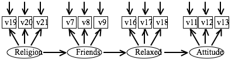

Questions about Rex Kline's book (for Tues., Dec. 3)
===============================================================================

**Take-home message: Structural Equation Modeling is not a data analysis technique that can easily handle interactions.**

> Read chapter 12 of Kline's book and be prepared to answer the questions below. Please also do the data analysis exercise described in steps 14, 15, and 16. 

```{r, warning = FALSE, message = FALSE}
library(lavaan)
library(foreign)
options(width = 100, digits = 3)
# Data for exercise 20.
covmatrix <- matrix(
  c(6.502500, 4.793490, 4.652985, 4.373760, 0.199410,
    4.793490, 5.808100, 4.521401, 4.391984, 0.221720,
    4.652985, 4.521401, 6.604900, 5.165700, 0.242351,
    4.373760, 4.391984, 5.165700, 7.182400, 0.295872,
    0.199410, 0.221720, 0.242351, 0.295872, 0.052900),
  nrow = 5, dimnames = list(
    c("sales1", "sales2", "sales3", "sales4", "region"),
    c("sales1", "sales2", "sales3", "sales4", "region")))
myDataMeans <- c(6.08, 7.22, 8.14, 9.38, 0.48)
names(myDataMeans) <- c("sales1", "sales2", "sales3", "sales4", "region")
```

Reading
-------------------------------------------------------------------------------

### 1. Kline talks about "conditional regression lines"? What are they? How do we know whether the slope of a given "conditional regression line" is statistically significant?

Conditional regression lines are the "simple regressions". These are generated by plugging in different values of a predictor, X1, into the interaction equation Y ~ X1 + X2 + X1*X2 to show how the formula and slope of X2 change at different values of X1. Dividing the simple slope by its standard error provides a z-score to test for statistical significance. Otherwise, the regions of significance technique determines the range(s) of X1 where the conditional regression Y ~ X2 is significant. Another way is to re-center variable different ways (0:1 vs -1:0 for a male-female contrast, X1 at +- 0, 1, 2 SDs) and re-run the models to examine the main effects at different levels of X2.


### 2. According to Whisman and McClelland (2005), is better to focus on standardized or unstandardized regression coefficients in moderated multiple regression? Why?

Unstandardized coefficients are preferred because the MMR equation being modeled, `z = b1*zx + b2*zw + b3*zxw`, does not accurately model the standardized interaction term `b3*zw*zx`.


### 3. Collinearity

> When we include product terms in a multiple regression analysis, we often face the problem that the product term is very highly correlated with at least one of the two variables that constitute it. What can be done about this problem of collinearity?

We can (1) mean-center our variables which can decrease the relationship between variables and their product terms. We can also (2) use residual-centering to compute a residualized product term. We do this by regressing the product term onto its factor terms `XW ~ X + W`. The residuals from this model measure the interaction effect but control for the individual main effects (orthogonal values). We then use these residuals in place of the product term in a regression `Y ~ X + W + Residualized_XW`.


### 4. According to Kenny, interactive effects can easily be confounded with curvilinear effects. Why is that?

In a curvilinear relationship, the strength of the covariation between two variables X, Y will vary at higher or lower levels of X. If W predicts X, then the curvilinear relationship between X and Y may be mistaken for interaction effect between X and W. Therefore, we should routinely test X^2 and W^2 to whenever testing XW.


### 5. Explain to a novice what "mediated moderation" is (without looking at your notes).  

Stuffing and turkey are just okay, but compliment each other really well (moderation). But no matter how well the two go together, you need gravy for a delicious thanksgiving plate (mediation). That's the whole point of Thanksgiving.

In this case, there is an interactive effect XW that is mediated by M. The direct effects of X and W on Y are not significant, and the indirect effect of XW (via M) is significant.

In all of these moderation/mediation models, the indirect effect is moderated by another variable.


### 6. Briefly describe the "indicant product approach" of SEM (the Kenny-Judd method) using the example of an interaction between two exogenous latent factors (A and B) that each has two indicators.

A latent product variable is added to the model. It is manifested by the four products of the individual indicators.

```
A =~ a1 + a2
B =~ b1 + b2
AB =~ (a1 + a2) * (b1 + b2)

# Each of the four products are expanded with the following:
a1 = A + e(a1)
a2 = lambda(a2)*A + e(a2)
b1 = B + e(b1)
b2 = lambda(b2)*B + e(b2)
```

The fully expanded equation shows a total of 9 latent product variables, including AB.


### 7. What are two major problems of the "indicant product approach" (the Kenny-Judd method)?

NB: Variables are mean-centered before products are computed.

1. It requires nonlinear constraints for the parameter estimation.
2. A product variable violates the normality assumption of ML estimation because product variables do have normal distributions.


### 8. Andreas Klein and his colleagues recently suggested new approaches to estimate interaction effects in SEM. What are these approaches called and what is their advantage over the "indicant product approach" (the Kenny-Judd method)?

**Latent moderated structural equations** modeling accounts for the non-normality of product variables. It looks at the raw data and uses a mean structure in the model. It does not create any product indicators. **Quasi-maximum likelihood estimation** uses a different algorithm for approximately similar results. A disadvantage of the approach is that model chi-square and indices for approximate fit are not applicable.


### 9. Explain to a novice what a "design effect" is (without looking at your notes).

In clustered samples, observations will not be independent. Standard formulas which assuming independent observations will underestimate the sampling error in these clusters. The difference between the increased sampling error in the complex design and the sampling error in a random independent sample with the same number of observations is the design effect. A design effect of 2 means that the complex sample has twice the sample error compared to a random sample of the same size from the population. Equivalent, a design effect of 2 means that your effective sample size is halved.


### 10. What does Kline mean when he talks about "cross-level interactions"?

These are interactions between the within-subject variable and a between-subject variable. X may predict Y within a cluster, but the X-Y effect varies between clusters as a function of W (a contextual level).


### 11. What is a "slopes-and-intercepts-as-outcomes model"?

Regression analyses are conducted within-subjects and these are fed as input data for a regression analysis at the between-subjects level. In this case, the model estimates the slopes and intercepts as population parameters.


### 12. Which hypothesis exactly is being tested in the slopes-and intercepts-as-outcomes model" shown in Figure 12.8?

School size predicts achievement between schools and moderates the effect of TV on achievement within schools.


### 13. Kline talks about three basic steps in analyzing a multilevel structural equation model. Describe these three steps.

1. Compute the unconditional intraclass correlation, the proportion of the total variability explained by the clustering variable.
2. Analyze the within-subjects model.
3. Then specify the full within-between model, and estimate the full model.


Israel Data Analysis
-------------------------------------------------------------------------------

### 14. Run analyses on the Israel dataset. 

> First, run a one-factor confirmatory factor analysis with the variables v7, v8, v9, v11, v12, v13, v16, v17, v18, v19, v20, and v21. Determine whether this model has a satisfactory fit.

```{r}
# Load data and fit model
d <- as.matrix(read.csv("../data/data_israel.csv", row.names = 1))
m1 <- "F =~ V7 + V8 + V9 + V11 + V12 + V13 + V16 + V17 + V18 + V19 + V20 + V21"
fit1 <- cfa(m1, sample.cov = d, sample.nobs = 450, likelihood = "wishart")
# Inspect the model
summary(fit1, standardized = TRUE, fit.measures = TRUE, rsquare = TRUE)
```

The model has a very unsatisfactory fit, RMSEA = 0.25, SRMR = 0.16, chi-square(54) = 1595.14, p < 0.001.


### 15. Run a confirmatory factor analysis with four factors

> "Friends" (v7, v8, v9), "Attitude" (v11, v12, v13), "Relaxed" (v16, v17, v18), and "Religion" (v19, v20, v21). Determine whether this model has a satisfactory fit.

```{r, tidy = FALSE}
m2 <- "
  Friends =~ V7 + V8 + V9 
  Attitude =~ V11 + V12 + V13
  Relaxed =~ V16 + V17 + V18 
  Religion =~ V19 + V20 + V21"
fit2 <- cfa(m2, sample.cov = d, sample.nobs = 450, likelihood = "wishart")
summary(fit2, standardized = TRUE, fit.measures = TRUE, rsquare = TRUE)
residuals(fit2, type = "standardized")$cov
# Look at the distribution of the correlation residuals
(cor_resid <- residuals(fit2, type = "cor")$cor)
cor_resid[upper.tri(cor_resid, diag = TRUE)] <- NA
stem(cor_resid)
```

The model has a much more satisfactory fit. The RMSEA equals 0.04 with a 90% confidence interval between 0.025--0.054, so the close-fit hypothesis is retained and the poor-fit hypothesis is rejected. The SRMR equals 0.04 with 5 residual correlations equaling or exceeding 0.8 in absolute value. The chi-square test for 48 degrees of freedom equals 82.44, p = 0.001, so the exact-fit hypothesis is rejected. 

### 16. Run the structural regression model depicted below



> Determine whether this model has a satisfactory fit. What conclusions would you draw from the analyses you have run in steps 14, 15, and 16?

```{r}
m3 <- "
  Friends =~ V7 + V8 + V9 
  Attitude =~ V11 + V12 + V13
  Relaxed =~ V16 + V17 + V18 
  Religion =~ V19 + V20 + V21
  Attitude ~ Relaxed
  Relaxed ~ Friends
  Friends ~ Religion"
fit3 <- cfa(m3, likelihood = "wishart", sample.cov = d, sample.nobs = 450)
summary(fit3, standardized = TRUE, fit.measures = TRUE, rsquare = TRUE)
residuals(fit3, type = "standardized")$cov
# Look at the distribution of the correlation residuals
(cor_resid2 <- residuals(fit3, type = "cor")$cor)
cor_resid2[upper.tri(cor_resid2, diag = TRUE)] <- NA
stem(cor_resid2)
anova(fit2, fit3)
```

The model is an over-simplification of the previous CFA model. The RMSEA equals 0.056 with a 90% confidence interval between 0.044--0.069, so the close-fit hypothesis is retained and the poor-fit hypothesis is rejected. However, the SRMR equals 0.08 with 23 residual correlations equaling or exceeding 0.8 in absolute value; this is a case where an acceptable average correlation residual obscures a significant number of large correlation residuals. The model is a significant oversimplification of the related model with no causal paths, chi-square-diff(3) = 40.64, p < 0.001.


### 17. Transform the covariance matrix into a correlation matrix and examine the correlations. 

> Are the variables supposed to measure the same latent construct highly (and positively) correlated with each other? Are there out-of-bounds correlations? If you think there is a problem with these correlations, say what the problem is? If not, what did you look at before concluding that these correlations are OK?

```{r}
# Prepare subsets of the correlation matrix
d_cor <- cov2cor(d)
v_friends <- c("V7", "V8", "V9")
v_attitude <- c("V11", "V12", "V13")
v_relaxed <- c("V16", "V17", "V18")
v_religion <- c("V19", "V20", "V21")
v_all <- c(v_friends, v_attitude, v_relaxed, v_religion)
# Check for out of bounds values
abs(d_cor[v_all, v_all]) > 1
# Check correlations within factors
d_cor[v_friends, v_friends]
d_cor[v_religion, v_religion]
d_cor[v_relaxed, v_relaxed]
d_cor[v_attitude, v_attitude]
```

There are no out of bounds values. However, one of the indicators (V17) for the relaxed factor is reverse-coded with respect to its counterparts. This error in coding undermines the validity of the above analyses.


Multigroup CFA
-------------------------------------------------------------------------------

### 18. Go through the R script "multigroup CFA and test of difference of factor means" I sent you last Tuesday. 

```{r, warning = FALSE}
# Load the data-sets
d_intell_fem <- read.spss("../data/Grnt_fem.sav", to.data.frame = TRUE)
d_intell_mal <- read.spss("../data/Grnt_mal.sav", to.data.frame = TRUE)
d_intell_fem$gender <- "female"
d_intell_mal$gender <- "male"
d <- rbind(d_intell_fem, d_intell_mal)
# Make a numeric version of `gender`
d <- transform(d, sex = ifelse(gender == "female", 0, 1))
```

> Redo all the analyses on your computer. In addition, obtain a large number of fit indices (and the correlation residuals) for the final model (the one with the over-identified mean structure = "m6"). Is this model satisfactory? Which parameters tell us whether there is a gender difference on each of the two factors? Are these parameters statistically significant? What conclusions can you draw from all the analyses performed on this dataset?

I already computed all of these last week, so I am going to jump ahead to the final model.

```{r}
m_factor_means <- '
  spatial =~ visperc + cubes + lozenges 
  verbal =~ paragrap + sentence + wordmean
  verbal ~ c(a, b)*1
  spatial ~ c(c, d)*1
  a == 0
  c == 0'
h_factor_means <- cfa(m_factor_means, data = d, likelihood = "wishart", 
                      group = "gender", group.equal = c("loadings", "intercepts"))
summary(h_factor_means, standardized = TRUE, fit.measures = TRUE, rsquare = TRUE)
residuals(h_factor_means, type = "cor")
residuals(h_factor_means, type = "standardized")
```

The model has an acceptable overall fit, chi-square(24) = 22.54, p = 0.55, exact-fit hyptothesis retained. The RMSEA equals 0.0, with a 90% CI of 0.00--0.09, close-fit hypothesis retained and poor-fit hypothesis rejected. 

The male subjects had a mean spatial factor 1.01 units higher than the female subjects, but this difference is not significant, z = 1.2, p = 0.23. The female subjects had a mean verbal factor 0.96 units higher than the male subjects, and this difference falls just short of achieving significance, z = 1.82, p = 0.068. 


### 19. What about the MIMIC model that is in the same R script (= "m7")? 

> Does this model come to the same conclusions as the model discussed in the previous point? Please remind me what assumption is being made in this model. Do you think this is a reasonable assumption? Why?

```{r, tidy = FALSE}
m_mimic <- '
  spatial =~ visperc + cubes + lozenges 
  verbal =~ paragrap + sentence + wordmean
  spatial ~ sex
  verbal ~ sex
  sex ~~ sex
  # Note: Correlated disturbances
  spatial ~~ verbal'
h_mimic <- cfa(m_mimic, data = d, likelihood = "wishart")
summary(h_mimic, standardized = TRUE, fit.measures = TRUE, rsquare = TRUE)
```

These estimates approximate the estimated group differences in the previous model. This model of course assumes measurement invariance across the groups. This assumption is reasonable but only because we tested and confirmed measurement invariance across the groups already.

```
Regressions:       Estimate  Std.err  Z-value  P(>|z|)   Std.lv  Std.all
  spatial ~
    sex               1.086    0.858    1.266    0.205    0.254    0.127
  verbal ~
    sex              -0.949    0.518   -1.831    0.067   -0.321   -0.161
```


### 20. Go through the R script "latent growth curve model - sales dataset" I sent you last Tuesday. 

> Redo all the analyses on your computer. In the first analysis (the one without region), interpret each of the two paths from "one" to the two latent variables? What do these parameter estimates tell us? Are they significant? 


```{r, tidy = FALSE}
m_growth <- "
  IS =~ 1*sales1 + 1*sales2 + 1*sales3 + 1*sales4
  LC =~ 0*sales1 + 1*sales2 + 2*sales3 + 3*sales4
  LC + IS ~ 1
  sales1 + sales2 + sales3 + sales4 ~ 0*1"
h_growth <- cfa(m_growth, sample.cov = covmatrix, sample.mean = myDataMeans, 
                sample.nobs = 51, likelihood = "wishart")
summary(h_growth, standardized = TRUE, fit.measures = TRUE, rsquare = TRUE)
```


The path from the constant to the Initial Status factor estimates the intercept of sales, i.e., the baseline level of sales correcting for measurement error. This value is the same as the observed mean of year-1 sales, b = 6.08. The path to the Linear Change factor estimates the linear effect of time on sales, correcting for measurement error. There is a significant linear effect of time on sales. On average, sales increase by 1.08 units annually, z = 10.53, p < 0.001.

> In the second analysis (the one with region), interpret the following five paths: the paths from "one" to "region" and to the two latent variables and the paths from "region" to the two latent variables? What do these parameter estimates tell us? Are they significant?


```{r, tidy = FALSE}
m_growth_2 <- "
  IS =~ 1*sales1 + 1*sales2 + 1*sales3 + 1*sales4
  LC =~ 0*sales1 + 1*sales2 + 2*sales3 + 3*sales4
  LC ~ region
  IS ~ region
  LC ~~ IS
  LC + IS + region ~ 1
  sales1 + sales2 + sales3 + sales4 ~ 0*1"
h_growth_2 <- cfa(m_growth_2, sample.cov = covmatrix, sample.mean = myDataMeans, 
                  sample.nobs = 51, likelihood = "wishart")
summary(h_growth_2, standardized = TRUE, fit.measures = TRUE, rsquare = TRUE)
inspect(h_growth_2, "sampstat")
```

```
                   Estimate  Std.err  Z-value  P(>|z|)   Std.lv  Std.all
Regressions:
  LC ~
    region            0.577    0.439    1.315    0.188    1.147    0.264
  IS ~
    region            3.679    1.420    2.591    0.010    1.613    0.371
Intercepts:
    LC                0.805    0.234    3.447    0.001    1.601    1.601
    IS                4.319    0.756    5.715    0.000    1.893    1.893
    region            0.480    0.033   14.757    0.000    0.480    2.087
```

1. Region ~ 1: The observed mean of the region variable, b = 0.48.
2. IS ~ 1: The intercept of Initial Status, i.e., the estimated baseline mean of sales controlling for the effect of region and correcting for measurement error, b = 4.32.
3. LC ~ 1: The intercept of Linear Change, i.e., the estimated LC mean controlling for the effect of region on LC and correcting for measurement error. Controlling for region, we predict an annual increase in sales of b = 0.81, z = 3.45, p = 0.001.
4. IS ~ Region: The indirect effect of region on Initial Status. This tells us whether the two regions had significantly different Initial Status levels, and they did, b = 3.68, z = 2.6, p = 0.01. 
5. LC ~ Region: The indirect effect of region on Linear Change. The regions did not significantly differ in their annual Linear Change in sales, b = 0.58, z = 1.32, p = 0.19. 

Paths (2) and (3) are direct effects and therefore intercepts. They are not estimated factor means because those means emerge in the total effect of the constant on the factors.

***

```{r}
sessionInfo()
```
