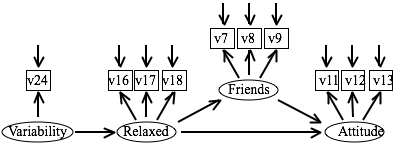
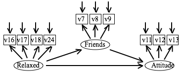

Questions about Rex Kline's book (for Tues., Dec. 10)
===============================================================================

> Read chapter 13 of Kline's book and pp. 750-772 of Tabachnick and Fidell's book. Be prepared to answer the questions below. Please also do the data analysis exercise described at the end. 

```{r, message = FALSE, warning = FALSE}
library(lavaan)
d <- as.matrix(read.csv("../data/data_israel.csv", row.names = 1))

stem_residuals <- function(model) {
  cor_resid <- residuals(model, type = "cor")$cor
  cor_resid[upper.tri(cor_resid, diag = TRUE)] <- NA
  stem(cor_resid)
}
```

Kline Reading: How to Fool Yourself with SEM
-------------------------------------------------------------------------------

> For each section, be prepared to name at least two or three of these points without looking at your notes. Identify the error (or the two errors) that you are most likely to commit. Discuss with your other group members "your error" and why you think you are particularly likely to commit this error. Then, formulate a goal and say what you are going to do in the future in order to avoid this error.


### 1. Specification

1. Specify the model after the data are collected rather than before.
1. Omit causes that are correlated with other variables in a structural model.
1. Fail to include unanalyzed associations between pairs of measured exogenous variables (path models) or exogenous factors (structural regression models).
1. Use psychometrically inadequate measures.
1. Fail to give careful consideration to the question of directionality.
1. Specify feedback effects in structural models as a way to mask uncertainty about directionality.
1. Add disturbance or measurement error correlations without substantive reason.
1. Fail to include design-driven correlated residuals.
1. Overfit the model (forget parsimony)
1. Fail to have sufficient numbers of indicators of latent variables.
1. Specify that indicators load on > 1 factors without a substantive reason.
1. Specify that a set of effect indicators with low intercorrelations loads on a common factor.
1. In a complex sampling design, assume that the within-group model and the between-group model are the same without verification.
1. Forget that the main goal of specification is test a theory, not a model.

Me:

* motivate directionality.
* Before gathering data, make sure I can express my hypotheses in an SEM model specification


### 2. Data

1. Don't check the accuracy of data input or coding.
1. Ignore whether the pattern of missing data is random or systematic.
1. Fail to examine distributional characteristics.
1. Don't screen for outliers.
1. Assume that all relations are linear.
1. Ignore lack of independence among scores.

Me:

* examine missingness
* report outliers 
* report summary statistics that include distributional information

### 3. Analysis and respecification

1. When identification status is uncertain, fail to conduct tests of solution uniqueness.
1. Fail to recognize empirical underidentification.
1. Ignore the problem of start values.
1. Fail to check accuracy of computer syntax.
1. Fail to carefully inspect the solution for admissibility.
1. Interpret results from a nonconverged solution or one where the computer imposed a zero constraint to avoid a Heywood case.
1. Respecify a model based entirely on statistical criteria.
1. Analyze a correlation matrix without standard deviations when it is clearly inappropriate.
1. Estimate a covariance structure with a correlation matrix without using proper methods.
1. Fail to check for constraint interaction when testing for equality of loadings across different factors or of direct effects on different endogenous variables.
1. Analyze variables so highly correlated (_r_ > 0.85) that a solution is unstable.
1. Estimate a complex model within a small sample.
1. Report only standardized estimates.
1. Set scales for latent variables inappropriately.
1. Fail to separately evaluate the measurement and structural portions of a structural regression model.
1. Estimate relative group mean or intercept differences on latent variables without establishing at least partial measurement invariance of the indicators.
1. Analyze parcels of items on Likert-type scales as continuous indicators without checking to see whether items in each parcel are unidimensional.

Me: 

* Examine correlations of variables

### 4. Interpretation

1. Look only at values of fit statistics; ignore other types of information about fit.
1. Ignore a failed model chi-square test.
1. Rely solely on suggested thresholds for approximate fit indexes to justify retaining the model.
1. Interpret 'closer to fit' as 'closer to truth'.
1. Interpret good fit as meaning that the endogenous variables are strongly predicted.
1. Rely solely on statistical criteria in model evaluation.
1. Rely too much on statistical tests.
1. Interpet the standardized solution in inappropriate ways.
1. Fail to consider equivalent or near-equivalent models.
1. Fail to consider (non-equivalent) alternative models.
1. Reify the factors.
1. Believe that naming a factor means that it is understood (i.e., commit the naming fallacy).
1. Believe that a strong analytic method like SEM can compensate for poor study design or slipshod ideas.
1. As the researcher, fail to report enough information so that your readers can reproduce your results.
1. Interpret estimates of relatively large direct effects in a structural model as "proof" of causality.

Me:

* Describe constructs as hypothetical or provisional
* Use "air quotes" when describing constructs so I don't take them too seriously.

Tabachnick and Fidell reading
-------------------------------------------------------------------------------

### 5. T&F claim that it is not possible to examine all pairwise scatterplots to check for linearity between all nine manifest variables. What do they do instead?

They randomly select scatterplots and check them for linearity.


### 6.It turns out that most of the variables in their example are skewed. What do T&F do to address this skew? If they apply a transformation, which transformation do they use? If not, what do they do?

They do not transform the skewed variables. They instead use the Satorra-Bentler scaled chi-square and adjusted standard errors to account for the non-normality.


### 7.Look at the fit indices reported in Table 14.19, especially at the RMSEA and its associated confidence interval. Is the close-fit hypothesis rejected? Is the non-close fit hypothesis rejected?

The close-fit is rejected and the non-close fit hypothesis is retained, RMSEA = 0.085, CI: 0.067-0.104.


### 8. T&F do a number of model modifications after the estimation of the initial model. In general, do they handle these post-hoc modifications in a satisfactory manner?

They motivate the modifications by calling them "reasonable" changes. At one point, they say that they could stop modifying paths, but "the RMSEA is somewhat high and CFI is a little too low" so they decide to inspect the correlation residuals for any "conceptually justifiable" changes. They verify the model improvements using chi-square difference tests. They then warn us to exercise caution when adding paths post hoc. They do use the phrase "post hoc" and "data fishing" in the text. Lastly, they check the bivariate correlations between parameter estimates in the initial model and the final modified model.


### 9. T&F say that when we add covariances between error terms, "we don't exactly know what we are correlating but only what we are not correlating". Why is that?

The disturbances represent all other causes not included in the model, so allowing disturbances to covary specifies that the two variables have some unknown, unmodeled cause(s) in common.


### 10. T&F say that under ideal circumstances one would re-estimate the final model (the one presented in Figure 14.13) and drop all the nonsignificant paths. What do you think about this suggestion?

I don't like this suggestion. Parsimony should be a part of the theory that specifies the model.


### 11. Is T&F's results section complete? Would you have added (or changed) anything?

Some consideration of alternative or equivalent models.


### 12.In the final model, the direct path from "age" to "health care utilization" is non significant. This is surprising. After all, we would expect older people to see doctors more often and to take more drugs, wouldn't we? Explain what is going on here.

Perceived Ill Health mediates the effect of Age on Health Care Utilization. The indirect paths from Age to Utilization via Life Change Units are also significant.


Data Analysis
-------------------------------------------------------------------------------

### 13. One-Factor CFA

> Run additional analyses on the Israel dataset. First, run a one-factor confirmatory factor analysis with the variables v7, v8, v9, v11, v12, v13, v16, v17, v18, and v24. Determine whether this model has a satisfactory fit.

```{r}
m1 <- "F =~ V7 + V8 + V9 + V11 + V12 + V13 + V16 + V17 + V18 + V24"
fit1 <- cfa(m1, sample.cov = d, sample.nobs = 450, likelihood = "wishart")
# Inspect the model
summary(fit1, standardized = TRUE, fit.measures = TRUE, rsquare = TRUE)
residuals(fit1, type = "cor")$cor
residuals(fit1, type = "standardized")$cov
stem_residuals(fit1)
```

The overall model fit is very poor, chi-square(35) = 843.15, p < 0.001. The RMSEA equals 0.23 (90% CI: 0.21, 0.24); the close-fit hypothesis is rejected and the poor fit hypothesis is retained. SRMR equals 0.12, exceeding the 0.08 rule of thumb.


### 14. Four-Factor CFA with a fixed measurement error

> Regardless of what you found in the previous step, run a confirmatory factor analysis with four factors defined as follows: "Friends" (v7, v8, v9), "Attitude" (v11, v12, v13), "Relaxed" (v16, v17, v18), and "Variability" (v24). You want to fix the variance of the measurement error of v24 to zero. Determine whether this model has a satisfactory fit.

```{r, tidy = FALSE}
m2 <- "
  Friends =~ V7 + V8 + V9
  Attitude =~ V11 + V12 + V13
  Relaxed =~ V16 + V17 + V18
  Variability =~ V24
  # Fixed measurement error
  V24 ~~ 0*V24"
fit2 <- cfa(m2, sample.cov = d, sample.nobs = 450, likelihood = "wishart")
summary(fit2, standardized = TRUE, fit.measures = TRUE, rsquare = TRUE)
residuals(fit2, type = "cor")$cor
stem_residuals(fit2)
residuals(fit2, type = "standardized")$cov
```

The overall model fit is satisfactory, chi-square(30) = 39.67, p = 0.11, Exact-Fit Hypothesis retained. The RMSEA equals 0.027 (90% CI: 0, 0.047); the close-fit hypothesis is retained and the poor fit hypothesis is rejected. SRMR equals 0.028, satisfying the 0.08 rule of thumb. Only one correlation residual exceeds 0.1 in magnitude (V18:V13).


### 15. Structural Regression model

> Regardless of what you found in the previous step, run the structural regression model depicted below (see Figure 1). Determine whether this model has a satisfactory fit (chi square, fit indices, correlation residuals...). What conclusions would you draw from the analyses you have run in steps 13, 14, and 15?



```{r, tidy = FALSE}
m3 <- "
  Friends =~ V7 + V8 + V9
  Attitude =~ V11 + V12 + V13
  Relaxed =~ V16 + V17 + V18
  Variability =~ V24

  Attitude ~ Friends + Relaxed
  Friends ~ Relaxed
  Relaxed ~ Variability

  V24 ~~ 0*V24"
fit3 <- cfa(m3, sample.cov = d, sample.nobs = 450, likelihood = "wishart")
summary(fit3, standardized = TRUE, fit.measures = TRUE, rsquare = TRUE)
residuals(fit3, type = "cor")$cor
stem_residuals(fit3)
residuals(fit3, type = "standardized")$cov
anova(fit2, fit3)
```

The overall model fit is satisfactory, chi-square(32) = 40.65, p = 0.14, Exact-Fit Hypothesis retained. The RMSEA equals 0.025 (90% CI: 0, 0.045); the close-fit hypothesis is retained and the poor fit hypothesis is rejected. SRMR equals 0.03, satisfying the 0.08 rule of thumb. Only one correlation residual exceeds 0.1 in magnitude (V18:V13). The structural model is not an oversimplification of the pure measurement model, chi-square-diff(2) = 0.88, p = 0.64. 


### 16. Conduct a power analysis of this model.

```{r}
# Load my power functions
source("../power.r")
not_close_fit(df = 32, n = 450)
close_fit(df = 32, n = 450)
```

The model has power = 0.92 to test the not-close-fit hypothesis and power = 0.94 to test the close fit hypothesis.


### 17. Test whether the direct path from the "Relaxed" factor to the "Attitude" factor is really necessary. 

> Does model fit decrease significantly if we take out this path (i.e., do a chi square difference test)?

```{r, tidy = FALSE}
m4 <- "
  Friends =~ V7 + V8 + V9
  Attitude =~ V11 + V12 + V13
  Relaxed =~ V16 + V17 + V18
  Variability =~ V24

  Attitude ~ Friends
  Friends ~ Relaxed
  Relaxed ~ Variability

  V24 ~~ 0*V24"
fit4 <- cfa(m4, sample.cov = d, sample.nobs = 450, likelihood = "wishart")
summary(fit4, standardized = TRUE, fit.measures = TRUE, rsquare = TRUE)
anova(fit3, fit4)
```

Yes, the model fit gets significantly worse if we remove this causal path, chi-square-diff(1) = 38.58, p < 0.0001.


### 18. Run the SR model depicted below and compare your output to the one obtained in step 15. Explain the differences and similarities. 



```{r}
m5 <- "
  Friends =~ V7 + V8 + V9
  Attitude =~ V11 + V12 + V13
  Relaxed =~ V16 + V17 + V18 + V24

  Attitude ~ Friends + Relaxed
  Friends ~ Relaxed"
fit5 <- cfa(m5, sample.cov = d, sample.nobs = 450, likelihood = "wishart")
summary(fit5, standardized = TRUE, fit.measures = TRUE, rsquare = TRUE)
residuals(fit5, type = "cor")$cor
stem_residuals(fit5)
residuals(fit5, type = "standardized")$cov
```

The model fit is identical to the original structural model. The three causal paths shared between the two model have the same estimates. What differs are the variances associated with the V24 indicator, the factors loaded onto by V24, as well as the fact that in the first model Relaxed is endogenous and exogenous in the second model. These differences can be attributed to the fact that the measurement error of V24 is fixed to 0 in model one and estimated in model 2.

```
                   Estimate  Std.err  Z-value  P(>|z|)   Std.lv  Std.all
M1 Regression:
  Relaxed ~
    Variability       0.125    0.040    3.160    0.002    0.159    0.159
    
M2 Factor Loading:
  Relaxed =~
    V24               0.204    0.065    3.155    0.002    0.106    0.159

M1 Factor Loading:
  Variability =~
    V24               1.000                               0.666    1.000

M1 Variances:
    V24               0.000                               0.000    0.000
    Relaxed           0.265    0.026                      0.975    0.975
    Variability       0.444    0.030                      1.000    1.000
    
M2 Variances:
    V24               0.433    0.029                      0.433    0.975
    Relaxed           0.272    0.026                      1.000    1.000    


M1 R-Square:
    V24               1.000
    Relaxed           0.025

M2 R-Square:
    V24               0.025
```

***

```{r}
sessionInfo()
```
